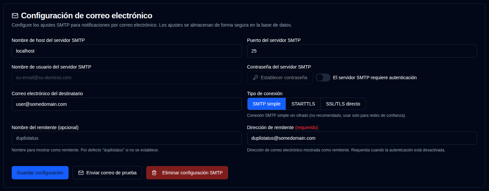

# Correo electrónico {#email}

**duplistatus** admite el envío de notificaciones por correo electrónico a través de SMTP como alternativa o complemento a las notificaciones NTFY. La configuración de correo electrónico ahora se gestiona a través de la interfaz web con almacenamiento cifrado en la base de datos para mayor seguridad.

| Configuración | Descripción |
|:------------------------|:-----------------------------------------------------------------|
| **Host del servidor SMTP** | El servidor SMTP de su proveedor de correo electrónico (p. ej., `smtp.gmail.com`). |
| **Puerto del servidor SMTP** | Número de puerto (típicamente `25` para SMTP simple, `587` para STARTTLS, o `465` para SSL/TLS directo). |
| **Tipo de conexión** | Seleccionar entre SMTP simple, STARTTLS o SSL/TLS directo. Por defecto, SSL/TLS directo para nuevas configuraciones. |
| **Autenticación SMTP** | Activar o desactivar la autenticación SMTP. Cuando está deshabilitado, los campos de nombre de usuario y contraseña no son requeridos. |
| **Nombre de usuario SMTP** | Su dirección de correo electrónico o nombre de usuario (requerido cuando la autenticación está habilitada). |
| **Contraseña SMTP** | Su contraseña de correo electrónico o contraseña específica de la aplicación (requerida cuando la autenticación está habilitada). |
| **Nombre del remitente** | Nombre mostrado como remitente en las notificaciones por correo electrónico (opcional, por defecto "duplistatus"). |
| **Dirección de remitente** | Dirección de correo electrónico mostrada como remitente. Requerida para conexiones SMTP simple o cuando la autenticación está deshabilitada. Por defecto, el nombre de usuario SMTP cuando la autenticación está habilitada. Tenga en cuenta que algunos proveedores de correo electrónico anularán la `Dirección de remitente` con el `Nombre de usuario del servidor SMTP`. |
| **Correo electrónico del destinatario** | La dirección de correo electrónico para recibir notificaciones. Debe ser un formato de dirección de correo electrónico válido. |

Un <IIcon2 icon="lucide:mail" color="green"/> icono verde junto a `Email` en la barra lateral significa que su configuración es válida. Si el icono es <IIcon2 icon="lucide:mail" color="yellow"/> amarillo, su configuración no es válida o no está configurada.

El icono se muestra en verde cuando todos los campos requeridos están configurados: Host del servidor SMTP, Puerto del servidor SMTP, Correo electrónico del destinatario, y ya sea (Nombre de usuario SMTP + Contraseña cuando la autenticación es requerida) o (Dirección de remitente cuando la autenticación no es requerida).

Cuando la configuración no está completamente configurada, se muestra un cuadro de alerta amarillo informándole que no se enviarán correos electrónicos hasta que la Configuración de correo electrónico se complete correctamente. Las casillas de verificación de Correo electrónico en la pestaña [`Backup Notifications`](backup-notifications-settings.md) también estarán deshabilitadas y mostrarán etiquetas "(Deshabilitado)".

 

## Acciones disponibles {#available-actions}

| Botón                                                            | Descripción                                                  |
|:-----------------------------------------------------------------|:-------------------------------------------------------------|
| <IconButton label="Guardar configuración" />                     | Guardar los cambios realizados en la configuración de NTFY.  |
| <IconButton icon="lucide:mail" label="Enviar correo de prueba"/> | Envía un mensaje de correo de prueba utilizando la configuración SMTP. El correo de prueba muestra el nombre de host del servidor SMTP, puerto, tipo de conexión, estado de autenticación, nombre de usuario (si aplica), correo electrónico del destinatario, dirección de remitente, nombre del remitente y marca de tiempo de la prueba. |
| <IconButton icon="lucide:trash-2" label="Eliminar configuración SMTP"/> | Eliminar / Limpiar la configuración SMTP.                   |

 

:::info[IMPORTANTE]
  Debe utilizar el botón <IconButton icon="lucide:mail" label="Enviar correo de prueba"/> para asegurarse de que su configuración de correo electrónico funciona antes de depender de ella para las notificaciones.

 Incluso si ve un icono <IIcon2 icon="lucide:mail" color="green"/> verde y todo parece estar configurado, es posible que los correos electrónicos no se envíen.
 
 `duplistatus` solo verifica si su configuración SMTP está completa, no si los correos electrónicos se pueden entregar realmente.
:::

 

## Proveedores SMTP comunes {#common-smtp-providers}

**Gmail:**

- Host: `smtp.gmail.com`
- Puerto: `587` (STARTTLS) o `465` (SSL/TLS directo)
- Tipo de conexión: STARTTLS para el puerto 587, SSL/TLS directo para el puerto 465
- Nombre de usuario: Su dirección de Gmail
- Contraseña: Utilice una contraseña de aplicación (no su contraseña habitual). Genere una en https://myaccount.google.com/apppasswords
- Autenticación: Requerido

**Outlook/Hotmail:**

- Host: `smtp-mail.outlook.com`
- Puerto: `587`
- Tipo de conexión: STARTTLS
- Nombre de usuario: Su dirección de correo electrónico de Outlook
- Contraseña: Su contraseña de cuenta
- Autenticación: Requerido

**Correo de Yahoo:**

- Host: `smtp.mail.yahoo.com`
- Puerto: `587`
- Tipo de conexión: STARTTLS
- Nombre de usuario: Su dirección de correo electrónico de Yahoo
- Contraseña: Utilice una contraseña de aplicación
- Autenticación: Requerido

### Prácticas Recomendadas de Seguridad {#security-best-practices}

- Considere usar una cuenta de correo electrónico dedicada para notificaciones
 - Pruebe su configuración usando el botón "Enviar correo de prueba"
 - La configuración se cifra y se almacena de forma segura en la base de datos
 - **Use conexiones cifradas** - STARTTLS y SSL/TLS directo se recomiendan para uso en producción
 - Las conexiones SMTP simple (puerto 25) están disponibles para redes locales de confianza, pero no se recomiendan para uso en producción en redes no confiables
