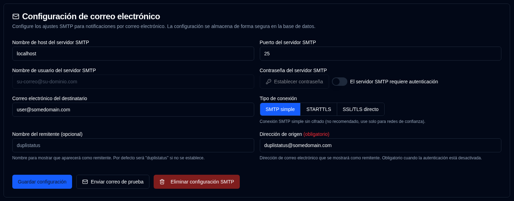

# Correo electrónico {#email}

**duplistatus** admite el envío de notificaciones por correo electrónico a través de SMTP como alternativa o complemento a las notificaciones NTFY. La configuración de correo electrónico ahora se gestiona a través de la interfaz web con almacenamiento cifrado en la base de datos para mayor seguridad.

| Configuración                 | Descripción                                                      |
|:------------------------|:-----------------------------------------------------------------|
| **Nombre de host del servidor SMTP**    | El servidor SMTP de tu proveedor de correo (por ejemplo, `smtp.gmail.com`).      |
| **Puerto del servidor SMTP**    | Número de puerto (típicamente `25` para SMTP plano, `587` para STARTTLS o `465` para SSL/TLS directo). |
| **Tipo de conexión**     | Selecciona entre SMTP plano, STARTTLS o SSL/TLS directo. Por defecto, se usa SSL/TLS directo para nuevas configuraciones. |
| **Autenticación SMTP** | Activa o desactiva la autenticación SMTP. Cuando está desactivada, no se requieren los campos de nombre de usuario ni contraseña. |
| **Nombre de usuario SMTP**       | Tu dirección de correo o nombre de usuario (requerido si la autenticación está habilitada). |
| **Contraseña SMTP**       | Tu contraseña de correo o una contraseña específica para aplicaciones (requerida si la autenticación está habilitada). |
| **Nombre del remitente**         | Nombre que se muestra como remitente en las notificaciones por correo (opcional, por defecto es "duplistatus"). |
| **Dirección de origen**        | Dirección de correo que se muestra como remitente. Requerida para conexiones SMTP planas o cuando la autenticación está deshabilitada. Por defecto, usa el nombre de usuario SMTP si la autenticación está habilitada. Ten en cuenta que algunos proveedores de correo reemplazarán `From Address` con `SMTP Server Username`. |
| **Correo electrónico del destinatario**     | Dirección de correo que recibirá las notificaciones. Debe tener un formato válido. |

Un icono <IIcon2 icon="lucide:mail" color="green"/> verde junto a **Correo electrónico** en la barra lateral significa que su configuración es válida. Si el icono es <IIcon2 icon="lucide:mail" color="yellow"/> amarillo, su configuración no es válida o no está configurada.

El icono se muestra en verde cuando todos los campos requeridos están configurados: Host del servidor SMTP, Puerto del servidor SMTP, Correo electrónico del destinatario, y ya sea (Nombre de usuario SMTP + Contraseña cuando la autenticación es requerida) o (Dirección de remitente cuando la autenticación no es requerida).

Cuando la configuración no está completamente configurada, se muestra un cuadro de alerta amarillo informándole que no se enviarán correos electrónicos hasta que la Configuración de correo electrónico se complete correctamente. Las casillas de verificación de Correo electrónico en la pestaña [Notificaciones de backup](backup-notifications-settings.md) también estarán deshabilitadas y mostrarán etiquetas "(Deshabilitado)".

 

## Acciones disponibles {#available-actions}

| Botón                                                           | Descripción                                              |
|:-----------------------------------------------------------------|:---------------------------------------------------------|
| <IconButton label="Guardar configuración" />                             | Guarda los cambios realizados en la configuración de NTFY.              |
| <IconButton icon="lucide:mail" label="Enviar correo de prueba"/>         | Envía un correo de prueba usando la configuración SMTP. El correo de prueba muestra el nombre de host del servidor SMTP, puerto, tipo de conexión, estado de autenticación, nombre de usuario (si corresponde), correo del destinatario, dirección de origen, nombre del remitente y marca de tiempo de la prueba. |
| <IconButton icon="lucide:trash-2" label="Eliminar configuración SMTP"/> | Eliminar / Borrar la configuración SMTP.                   |

 

:::info[IMPORTANT]
  Debe utilizar el botón <IconButton icon="lucide:mail" label="Enviar correo de prueba"/> para asegurarse de que su configuración de correo electrónico funciona antes de depender de ella para las notificaciones.

 Incluso si ve un icono <IIcon2 icon="lucide:mail" color="green"/> verde y todo parece estar configurado, es posible que no se envíen correos electrónicos.
 
 **duplistatus** solo verifica si su configuración SMTP está completa, no si los correos electrónicos se pueden entregar realmente.
:::

 

## Proveedores SMTP comunes {#common-smtp-providers}

**Gmail:**

- Host: `smtp.gmail.com`
- Puerto: `587` (STARTTLS) o `465` (SSL/TLS directo)
- Tipo de conexión: STARTTLS para el puerto 587, SSL/TLS directo para el puerto 465
- Nombre de usuario: Tu dirección de Gmail
- Contraseña: Usa una contraseña de aplicación (no tu contraseña habitual). Genera una en https://myaccount.google.com/apppasswords
- Autenticación: Requerida

**Outlook/Hotmail:**

- Host: `smtp-mail.outlook.com`
- Puerto: `587`
- Tipo de conexión: STARTTLS
- Nombre de usuario: Tu dirección de correo de Outlook
- Contraseña: Tu contraseña de cuenta
- Autenticación: Requerida

**Correo de Yahoo:**

- Host: `smtp.mail.yahoo.com`
- Puerto: `587`
- Tipo de conexión: STARTTLS
- Nombre de usuario: Tu dirección de correo de Yahoo
- Contraseña: Usa una contraseña de aplicación
- Autenticación: Requerida

### Prácticas Recomendadas de Seguridad {#security-best-practices}

- Considere usar una cuenta de correo electrónico dedicada para las notificaciones
 - Pruebe su configuración usando el botón "Enviar correo de prueba"
 - La configuración está cifrada y almacenada de forma segura en la base de datos
 - **Use conexiones cifradas** - Se recomienda usar STARTTLS y SSL/TLS directo para uso en producción
 - Las conexiones SMTP planas (puerto 25) están disponibles para redes locales de confianza, pero no se recomiendan para uso en producción sobre redes no confiables
