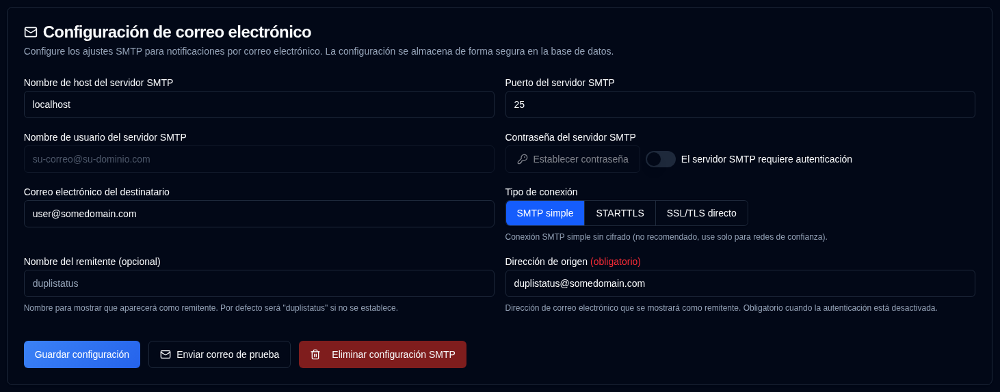

# Correo electrónico {/* #email */}

**duplistatus** admite el envío de notificaciones por correo electrónico a través de SMTP como alternativa o complemento a las notificaciones NTFY. La configuración de correo electrónico ahora se gestiona a través de la interfaz web con almacenamiento cifrado en la base de datos para mejorar la seguridad.

| Configuración           | Descripción                                                      |
|:------------------------|:-----------------------------------------------------------------|
| **Servidor SMTP**       | Servidor SMTP de su proveedor de correo electrónico (por ejemplo, `smtp.gmail.com`).      |
| **Puerto del servidor SMTP** | Número de puerto (típicamente `25` para SMTP simple, `587` para STARTTLS, o `465` para SSL/TLS directo). |
| **Tipo de conexión**     | Seleccione entre SMTP simple, STARTTLS o SSL/TLS directo. Por defecto es SSL/TLS directo para nuevas configuraciones. |
| **Autenticación SMTP** | Alternar para activar o desactivar la autenticación SMTP. Cuando está desactivada, los campos de nombre de usuario y contraseña no son obligatorios. |
| **Nombre de usuario SMTP** | Su dirección de correo electrónico o nombre de usuario (obligatorio cuando la autenticación está activada). |
| **Contraseña SMTP**       | Su contraseña de correo electrónico o contraseña específica de aplicación (obligatoria cuando la autenticación está activada). |
| **Nombre del remitente**         | Nombre mostrado como remitente en las notificaciones por correo electrónico (opcional, por defecto es "duplistatus"). |
| **Dirección de origen**        | Dirección de correo electrónico mostrada como remitente. Obligatorio para conexiones SMTP simples o cuando la autenticación está desactivada. Por defecto es el nombre de usuario SMTP cuando la autenticación está activada. Tenga en cuenta que algunos proveedores de correo electrónico sustituirán la `From Address` por la `SMTP Server Username`. |
| **Correo electrónico del destinatario**     | La dirección de correo electrónico para recibir notificaciones. Debe tener un formato de dirección de correo electrónico válido. |

Un icono <IIcon2 icon="lucide:mail" color="green"/> verde junto a **Correo electrónico** en la barra lateral significa que su configuración es válida. Si el icono es <IIcon2 icon="lucide:mail" color="yellow"/> amarillo, su configuración no es válida o no está configurada.

El icono se muestra en verde cuando todos los campos obligatorios están establecidos: Servidor SMTP, Puerto del servidor SMTP, Correo electrónico del destinatario, y ya sea (Nombre de usuario SMTP + Contraseña cuando la autenticación es obligatoria) o (Dirección de origen cuando la autenticación no es obligatoria).

Cuando la configuración no está completamente configurada, se muestra un cuadro de alerta amarillo informando que no se enviarán correos electrónicos hasta que la configuración de correo electrónico se complete correctamente. Las casillas de verificación de Correo electrónico en la pestaña [Notificaciones de copia de seguridad](backup-notifications-settings.md) también estarán atenuadas y mostrarán etiquetas "(desactivado)".

 

## Acciones Disponibles {/* #available-actions */}

| Botón                                                            | Descripción                                              |
|:-----------------------------------------------------------------|:---------------------------------------------------------|
| <IconButton label="Save Settings" />                             | Guardar los cambios realizados en la configuración de NTFY.              |
| <IconButton icon="lucide:mail" label="Send Test Email"/>         | Envía un mensaje de correo electrónico de prueba usando la configuración SMTP. El correo electrónico de prueba muestra el nombre de host del servidor SMTP, puerto, tipo de conexión, estado de autenticación, nombre de usuario (si corresponde), correo electrónico del destinatario, dirección de origen, nombre del remitente y marca de tiempo de la prueba. |
| <IconButton icon="lucide:trash-2" label="Delete SMTP Settings"/> | Eliminar / Borrar la configuración SMTP. Deshabilitado mientras [Resumen diario](daily-summary-settings.md) esté activado, porque ese modo requiere correo electrónico. |

 

:::info[IMPORTANTE]
  Debe utilizar el botón <IconButton icon="lucide:mail" label="Enviar prueba de correo electrónico"/> para asegurarse de que la configuración de correo electrónico funciona correctamente antes de usarla para las notificaciones.

 Incluso si ve un icono verde <IIcon2 icon="lucide:mail" color="green"/> y todo parece configurado, es posible que los correos electrónicos no se envíen.
 
 **duplistatus** solo comprueba si la configuración SMTP está completa, no si los correos electrónicos pueden entregarse correctamente.

 Si la entrega falla más adelante, los administradores verán una sirena roja en la barra de herramientas. Consulte [Errores de entrega](../delivery-failures.md).
:::

 

## Proveedores SMTP comunes {/* #common-smtp-providers */}

**Gmail:**

- Host: `smtp.gmail.com`
- Puerto: `587` (STARTTLS) o `465` (SSL/TLS directo)
- Tipo de conexión: STARTTLS para puerto 587, SSL/TLS directo para puerto 465
- Nombre de usuario: Su dirección de Gmail
- Contraseña: Utilice una contraseña de aplicación (no su contraseña habitual). Genere una en https://myaccount.google.com/apppasswords
- Autenticación: Requerida

**Outlook/Hotmail:**

- Host: `smtp-mail.outlook.com`
- Puerto: `587`
- Tipo de conexión: STARTTLS
- Nombre de usuario: Su dirección de correo electrónico de Outlook
- Contraseña: Contraseña de su cuenta
- Autenticación: Requerida

**Yahoo Mail:**

- Host: `smtp.mail.yahoo.com`
- Puerto: `587`
- Tipo de conexión: STARTTLS
- Nombre de usuario: Su dirección de correo electrónico de Yahoo
- Contraseña: Utilice una contraseña de aplicación
- Autenticación: Requerida

### Buenas prácticas de seguridad {/* #security-best-practices */}

- Considere utilizar una cuenta de correo electrónico dedicada para notificaciones
 - Pruebe su configuración mediante el botón "Enviar correo de prueba"
 - La configuración se cifra y almacena de forma segura en la base de datos
 - **Utilice conexiones cifradas** - Se recomienda STARTTLS y SSL/TLS directo para uso en producción
 - Las conexiones SMTP simples (puerto 25) están disponibles para redes locales confiables pero no se recomiendan para uso en producción a través de redes no confiables
