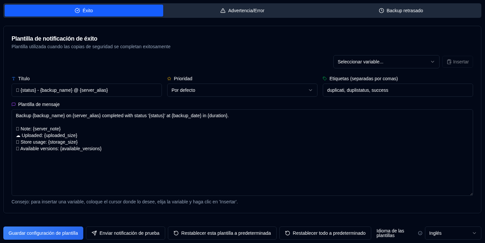

# Plantillas {#templates}

**duplistatus** utiliza tres plantillas para mensajes de notificación. Estas plantillas se utilizan tanto para notificaciones NTFY como para notificaciones por correo electrónico.

La página incluye un selector de **Idioma de Plantilla** que establece la configuración regional para las plantillas predeterminadas. Cambiar el idioma actualiza la configuración regional para los nuevos valores predeterminados, pero NO cambia el texto de las plantillas existentes. Para aplicar un nuevo idioma a sus plantillas, puede editarlas manualmente o usar **Restablecer esta plantilla a valores predeterminados** (para la pestaña actual) o **Restablecer todo a valores predeterminados** (para las tres plantillas).

| Plantilla          | Descripción                                              |
| :----------------- | :------------------------------------------------------- |
| **Éxito**          | Se utiliza cuando los backups se completan exitosamente. |
| **Advertencia/Error** | Se utiliza cuando los backups se completan con advertencias o errores. |
| **Backup retrasado** | Se utiliza cuando los backups están retrasados.          |

 

## Idioma de Plantilla {#template-language}

Un selector de **Idioma de Plantilla** en la parte superior de la página le permite elegir el idioma para las plantillas predeterminadas (inglés, alemán, francés, español, portugués de Brasil). Cambiar el idioma actualiza la configuración regional para los valores predeterminados, pero las plantillas personalizadas existentes mantienen su texto actual hasta que las actualice o use uno de los botones de restablecimiento.

 

## Acciones disponibles {#available-actions}

| Botón | Descripción |
|:--------------------------------------------------------------------|:----------------------------------------------------------------------------------------------------|
| <IconButton label="Guardar configuración de plantilla" /> | Guarda la configuración al cambiar la plantilla. El botón guarda la plantilla que se está mostrando (Éxito, Advertencia/Error o Backup retrasado). |
| <IconButton icon="lucide:send" label="Enviar notificación de prueba"/> | Comprueba la plantilla después de actualizarla. Las variables se reemplazarán con sus nombres para la prueba. Para notificaciones por correo electrónico, el título de la plantilla se convierte en la línea de asunto del correo electrónico. |
| <IconButton icon="lucide:rotate-ccw" label="Restablecer esta plantilla a valores predeterminados"/> | Restaura la plantilla predeterminada para la **plantilla seleccionada** (la pestaña actual). Recuerde guardar después de restablecer. |
| <IconButton icon="lucide:rotate-ccw" label="Restablecer todo a valores predeterminados"/> | Restaura las tres plantillas (Éxito, Advertencia/Error, Backup retrasado) a los valores predeterminados para el Idioma de Plantilla seleccionado. Recuerde guardar después de restablecer. |

 

## Variables {#variables}

Todas las plantillas admiten variables que se reemplazarán con valores reales. La siguiente tabla muestra las variables disponibles:

| Variable               | Descripción                                     | Disponible en   |
|:-----------------------|:------------------------------------------------|:-----------------|
| `{server_name}`        | Nombre del servidor.                            | Todas las plantillas    |
| `{server_alias}`       | Alias del servidor.                            | Todas las plantillas    |
| `{server_note}`        | Nota del servidor.                            | Todas las plantillas    |
| `{server_url}`         | URL de la configuración web del servidor Duplicati   | Todas las plantillas    |
| `{backup_name}`        | Nombre del backup.                             | Todas las plantillas    |
| `{status}`             | Estado del backup (Éxito, Advertencia, Error, Fatal). | Éxito, Advertencia |
| `{backup_date}`        | Fecha y hora del backup.                    | Éxito, Advertencia |
| `{duration}`           | Duración del backup.                         | Éxito, Advertencia |
| `{uploaded_size}`      | Cantidad de datos enviados.                        | Éxito, Advertencia |
| `{storage_size}`       | Información de uso de almacenamiento.                      | Éxito, Advertencia |
| `{available_versions}` | Número de versiones de backup disponibles.            | Éxito, Advertencia |
| `{file_count}`         | Número de archivos procesados.                      | Éxito, Advertencia |
| `{file_size}`          | Tamaño total de archivos respaldados.                  | Éxito, Advertencia |
| `{messages_count}`     | Número de mensajes.                             | Éxito, Advertencia |
| `{warnings_count}`     | Número de advertencias.                             | Éxito, Advertencia |
| `{errors_count}`       | Número de errores.                               | Éxito, Advertencia |
| `{log_text}`           | Mensajes de registro (advertencias y errores)              | Éxito, Advertencia |
| `{last_backup_date}`   | Fecha del último backup.                        | Retrasado          |
| `{last_elapsed}`       | Tiempo transcurrido desde el último backup.             | Retrasado          |
| `{expected_date}`      | Fecha de backup esperada.                           | Retrasado          |
| `{expected_elapsed}`   | Tiempo transcurrido desde la fecha esperada.           | Retrasado          |
| `{backup_interval}`    | Cadena de intervalo (p. ej., "1D", "2W", "1M").       | Retrasado          |
| `{overdue_tolerance}`  | Configuración de tolerancia de retraso.                      | Retrasado          |
