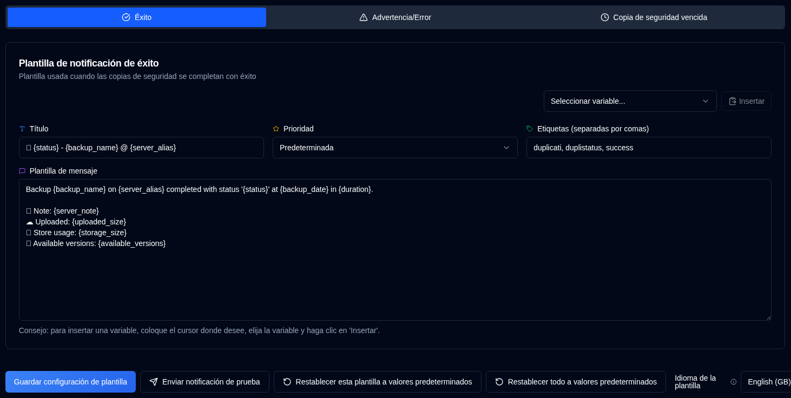

# Plantillas {#templates}

**duplistatus** utiliza tres plantillas para mensajes de notificación. Estas plantillas se utilizan tanto para notificaciones NTFY como para notificaciones por correo electrónico.

La página incluye un selector de **Idioma de las plantillas** que establece la configuración regional para las plantillas por defecto. Cambiar el idioma actualiza la configuración regional para los nuevos valores por defecto, pero **no** cambia el texto de las plantillas existentes. Para aplicar un nuevo idioma a sus plantillas, edítelas manualmente o utilice **Restablecer esta plantilla a predeterminada** (para la pestaña actual) o **Restablecer todo a predeterminado** (para las tres plantillas).

| Plantilla           | Descripción                                         |
| :----------------- | :-------------------------------------------------- |
| **Éxito**        | Se utiliza cuando las copias de seguridad finalizan correctamente.            |
| **Advertencia/Error**  | Se utiliza cuando las copias de seguridad finalizan con advertencias o errores. |
| **Copia de seguridad retrasada** | Se utiliza cuando las copias de seguridad están retrasadas.                      |

 

## Idioma de Plantilla {#template-language}

Un selector de **Idioma de las plantillas** en la parte superior de la página le permite elegir el idioma para las plantillas por defecto (Inglés, Alemán, Francés, Español, Portugués). Cambiar el idioma actualiza la configuración regional para los valores por defecto, pero las plantillas personalizadas existentes mantienen su texto actual hasta que las actualice o utilice uno de los botones de restablecimiento.

 

## Acciones disponibles {#available-actions}

| Botón                                                              | Descripción                                                                                         |
|:--------------------------------------------------------------------|:----------------------------------------------------------------------------------------------------|
| <IconButton label="Guardar configuración de plantilla" />                      | Guarda la configuración al cambiar la plantilla. El botón guarda la plantilla que se está mostrando (Éxito, Advertencia/Error o Copia de seguridad retrasada). |
| <IconButton icon="lucide:send" label="Enviar notificación de prueba"/>     | Comprueba la plantilla después de actualizarla. Las variables se sustituirán por sus nombres para la prueba. Para las notificaciones por correo, el título de la plantilla se convierte en la línea de asunto del correo. |
| <IconButton icon="lucide:rotate-ccw" label="Restablecer esta plantilla a los valores predeterminados"/> | Restablece la plantilla predeterminada para la **plantilla seleccionada** (la pestaña actual). Recuerde guardar después de restablecer. |
| <IconButton icon="lucide:rotate-ccw" label="Restablecer todo a los valores predeterminados"/> | Restablece las tres plantillas (Éxito, Advertencia/Error, Copia de seguridad retrasada) a los valores predeterminados para el Idioma de plantilla seleccionado. Recuerde guardar después de restablecer. |

 

## Variables {#variables}

Todas las plantillas admiten variables que se reemplazarán con valores reales. La siguiente tabla muestra las variables disponibles:

| Variable               | Descripción                                     | Disponible en     |
|:-----------------------|:------------------------------------------------|:-----------------|
| `{server_name}`        | Nombre del servidor.                             | Todas las plantillas    |
| `{server_alias}`       | Alias del servidor.                            | Todas las plantillas    |
| `{server_note}`        | Nota para el servidor.                            | Todas las plantillas    |
| `{server_url}`         | URL de la configuración web del servidor Duplicati   | Todas las plantillas    |
| `{backup_name}`        | Nombre de la copia de seguridad.                             | Todas las plantillas    |
| `{status}`             | Estado de la copia de seguridad (Éxito, Advertencia, Error, Fatal). | Éxito, Advertencia |
| `{backup_date}`        | Fecha y hora de la copia de seguridad.                    | Éxito, Advertencia |
| `{duration}`           | Duración de la copia de seguridad.                         | Éxito, Advertencia |
| `{uploaded_size}`      | Cantidad de datos subidos.                        | Éxito, Advertencia |
| `{storage_size}`       | Información sobre el uso del almacenamiento.                      | Éxito, Advertencia |
| `{available_versions}` | Número de versiones de respaldo disponibles.            | Éxito, Advertencia |
| `{file_count}`         | Número de archivos procesados.                      | Éxito, Advertencia |
| `{file_size}`          | Tamaño total de los archivos respaldados.                  | Éxito, Advertencia |
| `{messages_count}`     | Número de mensajes.                             | Éxito, Advertencia |
| `{warnings_count}`     | Número de advertencias.                             | Éxito, Advertencia |
| `{errors_count}`       | Número de errores.                               | Éxito, Advertencia |
| `{log_text}`           | Mensajes de registro (advertencias y errores)              | Éxito, Advertencia |
| `{last_backup_date}`   | Fecha de la última copia de seguridad.                        | Retrasado          |
| `{last_elapsed}`       | Tiempo transcurrido desde la última copia de seguridad.             | Retrasado          |
| `{expected_date}`      | Fecha esperada de la copia de seguridad.                           | Retrasado          |
| `{expected_elapsed}`   | Tiempo transcurrido desde la fecha esperada.           | Retrasado          |
| `{backup_interval}`    | Cadena de intervalo (por ejemplo, "1D", "2S", "1M").       | Retrasado          |
| `{overdue_tolerance}`  | Configuración de tolerancia retrasada.                      | Retrasado          |
