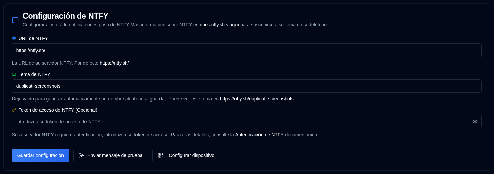

# NTFY {#ntfy}

[NTFY](https://github.com/binwiederhier/ntfy) es un servicio de notificaciones simple que puede enviar notificaciones push a su teléfono o escritorio. Esta sección le permite configurar la conexión del servidor de notificaciones y la autenticación.

| Configuración               | Descripción                                                                                                                                   |
|:----------------------|:----------------------------------------------------------------------------------------------------------------------------------------------|
| **URL de NTFY**          | La URL de tu servidor NTFY (por defecto, el `https://ntfy.sh/` público).                                                                      |
| **Tema NTFY**        | Un identificador único para tus notificaciones. El sistema generará automáticamente un tema aleatorio si se deja vacío, o puedes especificar uno propio. |
| **Token de acceso NTFY** | Un token de acceso opcional para servidores NTFY autenticados. Deja este campo en blanco si tu servidor no requiere autenticación.               |

 

Un icono <IIcon2 icon="lucide:message-square" color="green"/> verde junto a **NTFY** en la barra lateral significa que su configuración es válida. Si el icono es <IIcon2 icon="lucide:message-square" color="yellow"/> amarillo, su configuración no es válida.
Cuando la configuración no es válida, las casillas de verificación de NTFY en la pestaña [`Notificaciones de backup`](backup-notifications-settings.md) también estarán deshabilitadas.

## Acciones disponibles {#available-actions}

| Botón                                                                | Descripción                                                                                                  |
|:----------------------------------------------------------------------|:-------------------------------------------------------------------------------------------------------------|
| <IconButton label="Guardar configuración" />                                  | Guardar cualquier cambio realizado en la configuración de NTFY.                                                                  |
| <IconButton icon="lucide:send-horizontal" label="Enviar mensaje de prueba"/> | Enviar un mensaje de prueba a tu servidor NTFY para verificar tu configuración.                                         |
| <IconButton icon="lucide:qr-code" label="Configurar dispositivo"/>          | Mostrar un código QR que te permite configurar rápidamente tu dispositivo móvil o escritorio para recibir notificaciones NTFY. |

## Configuración del dispositivo {#device-configuration}

Debe instalar la aplicación NTFY en su dispositivo antes de configurarlo ([consulte aquí](https://ntfy.sh/)). Al hacer clic en el botón <IconButton icon="lucide:qr-code" label="Configurar dispositivo"/> o hacer clic derecho en el icono <SvgButton svgFilename="ntfy.svg" /> en la barra de herramientas de la aplicación, se mostrará un código QR. Al escanear este código QR, su dispositivo se configurará automáticamente con el tema NTFY correcto para las notificaciones.

 

 

:::caution
Si utiliza el servidor público **ntfy.sh** sin un token de acceso, cualquier persona que conozca el nombre de su tema puede ver sus notificaciones.

Para proporcionar un grado de privacidad, se genera un tema aleatorio de 12 caracteres, ofreciendo más de 3 sextillones (3.000.000.000.000.000.000.000) de combinaciones posibles, lo que dificulta su adivinación.

Para mejorar la seguridad, considere utilizar [autenticación por token de acceso](https://docs.ntfy.sh/config/#access-tokens) y [listas de control de acceso](https://docs.ntfy.sh/config/#access-control-list-acl) para proteger sus temas, u [alojar NTFY por su cuenta](https://docs.ntfy.sh/install/#docker) para tener control total.

⚠️ **Usted es responsable de asegurar sus temas de NTFY. Por favor, utilice este servicio bajo su propio criterio.**
:::

 
 

:::note
Todos los nombres de productos, logotipos y marcas registradas son propiedad de sus respectivos propietarios. Los iconos y nombres se utilizan únicamente con fines de identificación y no implican respaldo.
:::
