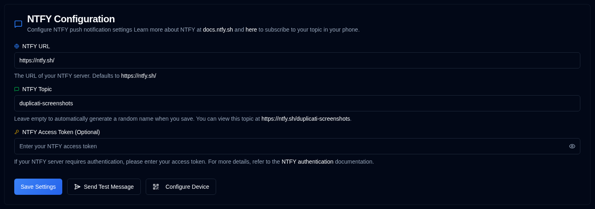

# NTFY {/* #ntfy */}

[NTFY](https://github.com/binwiederhier/ntfy) es un servicio de notificaciones sencillo que puede enviar notificaciones push a su teléfono o escritorio. Esta sección le permite configurar la conexión y autenticación con su servidor de notificaciones.

| Configuración         | Descripción                                                                                                                                                             |
|:----------------------|:------------------------------------------------------------------------------------------------------------------------------------------------------------------------|
| **URL de NTFY**       | La URL de su servidor NTFY (por defecto el público `https://ntfy.sh/`).                                                                                                    |
| **Tema de NTFY**      | Un identificador único para sus notificaciones. El sistema generará automáticamente un tema aleatorio si se deja vacío, o puede especificar el suyo propio.             |
| **Token de acceso NTFY** | Un token de acceso opcional para servidores NTFY autenticados. Deje este campo en blanco si su servidor no requiere autenticación.                                        |

 

Un icono verde <IIcon2 icon="lucide:message-square" color="green"/> junto a **NTFY** en la barra lateral significa que su configuración es válida. Si el icono es amarillo <IIcon2 icon="lucide:message-square" color="yellow"/>, su configuración no es válida.
Cuando la configuración no es válida, las casillas de verificación NTFY en la pestaña [`Backup Notifications`](backup-notifications-settings.md) también estarán deshabilitadas.

## Acciones Disponibles {/* #available-actions */}

| Botón                                                                 | Descripción                                                                                                    |
|:----------------------------------------------------------------------|:---------------------------------------------------------------------------------------------------------------|
| <IconButton label="Guardar configuración" />                                  | Guardar cualquier cambio realizado en la configuración de NTFY.                                                |
| <IconButton icon="lucide:send-horizontal" label="Enviar mensaje de prueba"/> | Enviar un mensaje de prueba a su servidor NTFY para comprobar su configuración.                                |
| <IconButton icon="lucide:qr-code" label="Configurar dispositivo"/>          | Mostrar un código QR que le permite configurar rápidamente su dispositivo móvil o escritorio para notificaciones NTFY. |

Si falla una entrega posterior de ntfy, los administradores verán una sirena roja en la barra de herramientas. Consulte [Errores de entrega](../overview.md#delivery-failures).

## Configuración del dispositivo {/* #device-configuration */}

Debe instalar la aplicación NTFY en su dispositivo antes de configurarlo ([ver aquí](https://ntfy.sh/)). Al hacer clic en el botón <IconButton icon="lucide:qr-code" label="Configurar dispositivo"/>, o al hacer clic derecho en el icono <SvgButton svgFilename="ntfy.svg" /> en la barra de herramientas de la aplicación, se mostrará un código QR. Escanear este código QR configurará automáticamente su dispositivo con el tema NTFY correcto para las notificaciones.

 

 

:::caution
Si utiliza el servidor público **ntfy.sh** sin un token de acceso, cualquiera con su nombre de tema podrá ver sus
notificaciones. 
 
Para proporcionar cierto grado de privacidad, se genera un tema aleatorio de 12 caracteres, ofreciendo más de
3 sextillones (3,000,000,000,000,000,000,000) combinaciones posibles, lo que dificulta adivinarlo.

Para mejorar la seguridad, considere utilizar [autenticación con token de acceso](https://docs.ntfy.sh/config/#access-tokens) y [listas de control de acceso](https://docs.ntfy.sh/config/#access-control-list-acl) para proteger sus temas, o [alojar NTFY usted mismo](https://docs.ntfy.sh/install/#docker) para tener control total.

⚠️ **Usted es responsable de asegurar sus temas NTFY. Por favor, utilice este servicio bajo su propia responsabilidad.**
:::

 
 

:::note
 Todos los nombres de productos, logotipos y marcas comerciales son propiedad de sus respectivos dueños. Los iconos y nombres se utilizan únicamente con fines de identificación y no implican respaldo.
:::
