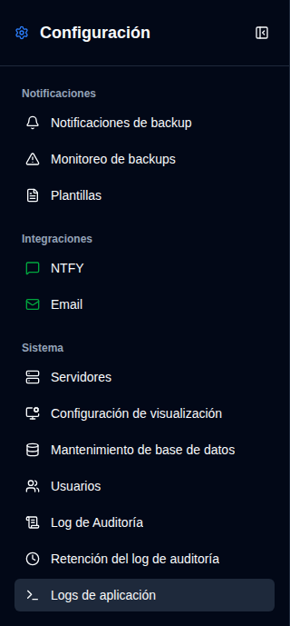
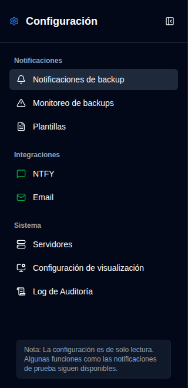

# Resumen {#overview}

La página de Configuración ofrece una interfaz unificada para configurar todos los aspectos de **duplistatus**. Puede acceder a ella haciendo clic en el botón <IconButton icon="lucide:settings" /> `Configuración` en la [Barra de herramientas de la aplicación](../overview#application-toolbar). Tenga en cuenta que los usuarios regulares verán un menú simplificado con menos opciones en comparación con los administradores.

## Vista de Administrador {#administrator-view}

Los administradores ven todas las configuraciones disponibles.

<table>
  <tr>
    <td>
      
    </td>
    <td>
      <ul>
        <li>
          <strong>Notificaciones</strong>
          <ul>
            <li><a href="backup-notifications-settings.md">Notificaciones de Backup</a>: Configurar ajustes de notificación por backup</li>
            <li><a href="overdue-settings.md">Monitoreo de Retrasados</a>: Configurar detección y alertas de backup retrasado</li>
            <li><a href="notification-templates.md">Plantillas</a>: Personalizar plantillas de mensajes de notificación</li>
          </ul>
        </li> 
        <li>
          <strong>Integraciones</strong>
          <ul>
            <li><a href="ntfy-settings.md">NTFY</a>: Configurar servicio de notificaciones push NTFY</li>
            <li><a href="email-settings.md">Correo electrónico</a>: Configurar notificaciones por correo electrónico SMTP</li>
          </ul>
        </li> 
        <li>
          <strong id="system">Sistema</strong>
          <ul>
            <li><a href="server-settings.md">Servidores</a>: Administrar configuraciones del servidor Duplicati</li>
            <li><a href="display-settings.md">Pantalla</a>: Configurar preferencias de visualización</li>
            <li><a href="database-maintenance.md">Mantenimiento de Base de Datos</a>: Realizar limpieza de base de datos (solo admin)</li>
            <li><a href="user-management-settings.md">Usuarios</a>: Administrar cuentas de usuario (solo admin)</li>
            <li><a href="audit-logs-viewer.md">Log de Auditoría</a>: Ver logs de auditoría del sistema</li>
            <li><a href="audit-logs-retention.md">Retención del Log de Auditoría</a>: Configurar retención de logs de auditoría (solo admin)</li>
            <li><a href="application-logs-settings.md">Logs de Aplicación</a>: Ver y exportar logs de aplicación (solo admin)</li>
          </ul>
        </li>
      </ul>
    </td>
  </tr>
</table>

## Vista de No Administrador {#non-administrator-view}

Los usuarios regulares ven un conjunto limitado de configuraciones.

<table>
  <tr>
    <td>
      
    </td>
    <td>
      <ul>
        <li>
          <strong>Notificaciones</strong>
          <ul>
            <li><a href="backup-notifications-settings.md">Notificaciones de Backup</a>: Ver ajustes de notificación por backup (solo lectura)</li>
            <li><a href="overdue-settings.md">Monitoreo de Retrasados</a>: Ver ajustes de backup retrasado (solo lectura)</li>
            <li><a href="notification-templates.md">Plantillas</a>: Ver plantillas de notificación (solo lectura)</li>
          </ul>
        </li> 
        <li>
          <strong>Integraciones</strong>
          <ul>
            <li><a href="ntfy-settings.md">NTFY</a>: Ver configuraciones de NTFY (solo lectura)</li>
            <li><a href="email-settings.md">Correo electrónico</a>: Ver configuraciones de correo electrónico (solo lectura)</li>
          </ul>
        </li> 
        <li>
          <strong id="system">Sistema</strong>
          <ul>
            <li><a href="server-settings.md">Servidores</a>: Ver configuraciones de servidor (solo lectura)</li>
            <li><a href="display-settings.md">Pantalla</a>: Configurar preferencias de visualización</li>
            <li><a href="audit-logs-viewer.md">Log de Auditoría</a>: Ver logs de auditoría del sistema (solo lectura)</li>
          </ul>
        </li>
      </ul>
    </td>
  </tr>
</table>

## Iconos de Estado {#status-icons}

La barra lateral muestra iconos de estado junto a las configuraciones de integración **NTFY** y **Correo electrónico**:
- <IIcon2 icon="lucide:message-square" color="green"/> <IIcon2 icon="lucide:mail" color="green"/> **Icono verde**: Sus configuraciones son válidas y están configuradas correctamente
- <IIcon2 icon="lucide:message-square" color="yellow"/> <IIcon2 icon="lucide:mail" color="yellow"/> **Icono amarillo**: Sus configuraciones no son válidas o no están configuradas

Cuando la configuración no es válida, las casillas correspondientes en la pestaña [`Notificaciones de Backup`](backup-notifications-settings.md) estarán desactivadas y en gris. Para más detalles, consulte las páginas de [Configuración de NTFY](ntfy-settings.md) y [Configuración de Correo Electrónico](email-settings.md).

 

:::important
Un icono verde no significa necesariamente que las notificaciones estén funcionando correctamente. Utilice siempre las funciones de prueba disponibles para confirmar que sus notificaciones están funcionando antes de depender de ellas.
:::

 
