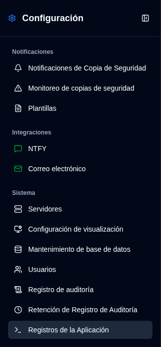
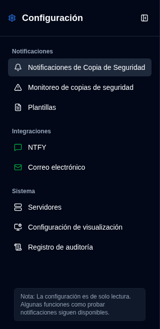

# Resumen {#overview}

La página de Configuración ofrece una interfaz unificada para configurar todos los aspectos de **duplistatus**. Puedes acceder a ella haciendo clic en el botón **Configuración** <IconButton icon="lucide:settings" /> en la [Barra de herramientas de la aplicación](../overview.md#application-toolbar). Ten en cuenta que los usuarios regulares verán un menú simplificado con menos opciones en comparación con los administradores.

## Vista de Administrador {#administrator-view}

Los administradores ven todas las configuraciones disponibles.

<table>
  <tr>
    <td>
      
    </td>
    <td>
      <ul>
        <li>
          <strong>Notificaciones</strong>
          <ul>
            <li><a href="backup-notifications-settings.md">Notificaciones de Copia de Seguridad</a>: Configurar ajustes de notificación por copia de seguridad</li>
            <li><a href="backup-monitoring-settings.md">Monitoreo de copias de seguridad</a>: Configurar detección y alertas de copias de seguridad vencidas</li>
            <li><a href="notification-templates.md">Plantillas</a>: Personalizar plantillas de mensajes de notificación</li>
          </ul>
        </li> 
        <li>
          <strong>Integraciones</strong>
          <ul>
            <li><a href="ntfy-settings.md">NTFY</a>: Configurar servicio de notificaciones push NTFY</li>
            <li><a href="email-settings.md">Correo electrónico</a>: Configurar notificaciones por correo electrónico SMTP</li>
          </ul>
        </li> 
        <li>
          <strong id="system">Sistema</strong>
          <ul>
            <li><a href="server-settings.md">Servidores</a>: Administrar configuraciones de servidores Duplicati</li>
            <li><a href="display-settings.md">Configuración de visualización</a>: Configurar tema, rango de tiempo de gráfico, estilo de gráfico, configuración regional, intervalo de actualización automática, orden de clasificación de tarjetas y inicio de semana</li>
            <li><a href="database-maintenance.md">Mantenimiento de base de datos</a>: Realizar limpieza de base de datos (solo administrador)</li>
            <li><a href="user-management-settings.md">Usuarios</a>: Administrar cuentas de usuario (solo administrador)</li>
            <li><a href="audit-logs-viewer.md">Registro de auditoría</a>: Ver registros de auditoría del sistema</li>
            <li><a href="audit-logs-retention.md">Retención de Registro de Auditoría</a>: Configurar retención de registro de auditoría (solo administrador)</li>
            <li><a href="application-logs-settings.md">Registros de la Aplicación</a>: Ver y exportar registros de la aplicación (solo administrador)</li>
          </ul>
        </li>
      </ul>
    </td>
  </tr>
</table>

## Vista de No Administrador {#non-administrator-view}

Los usuarios regulares ven un conjunto limitado de configuraciones.

<table>
  <tr>
    <td>
      
    </td>
    <td>
      <ul>
        <li>
          <strong>Notificaciones</strong>
          <ul>
            <li><a href="backup-notifications-settings.md">Notificaciones de Copia de Seguridad</a>: Ver ajustes de notificación por copia de seguridad (solo lectura)</li>
            <li><a href="backup-monitoring-settings.md">Monitoreo de copias de seguridad</a>: Ver configuración de copias de seguridad vencidas (solo lectura)</li>
            <li><a href="notification-templates.md">Plantillas</a>: Ver plantillas de notificación (solo lectura)</li>
          </ul>
        </li> 
        <li>
          <strong>Integraciones</strong>
          <ul>
            <li><a href="ntfy-settings.md">NTFY</a>: Ver configuración de NTFY (solo lectura)</li>
            <li><a href="email-settings.md">Correo electrónico</a>: Ver configuración de correo electrónico (solo lectura)</li>
          </ul>
        </li> 
        <li>
          <strong id="system">Sistema</strong>
          <ul>
            <li><a href="server-settings.md">Servidores</a>: Ver configuraciones de servidores (solo lectura)</li>
            <li><a href="display-settings.md">Visualización</a>: Configurar tema, rango de tiempo de gráfico, estilo de gráfico, configuración regional, intervalo de actualización automática, orden de clasificación de tarjetas y inicio de semana</li>
            <li><a href="audit-logs-viewer.md">Registro de auditoría</a>: Ver registros de auditoría del sistema (solo lectura)</li>
          </ul>
        </li>
      </ul>
    </td>
  </tr>
</table>

## Iconos de Estado {#status-icons}

La barra lateral muestra iconos de estado junto a las configuraciones de integración **NTFY** y **Correo electrónico**:
- <IIcon2 icon="lucide:message-square" color="green"/> <IIcon2 icon="lucide:mail" color="green"/> **Icono verde**: Sus configuraciones son válidas y están configuradas correctamente
- <IIcon2 icon="lucide:message-square" color="yellow"/> <IIcon2 icon="lucide:mail" color="yellow"/> **Icono amarillo**: Sus configuraciones no son válidas o no están configuradas

Cuando la configuración no es válida, las casillas de verificación correspondientes en la pestaña [Notificaciones de backup](backup-notifications-settings.md) aparecerán atenuadas y deshabilitadas. Para más detalles, consulte las páginas [Configuración de NTFY](ntfy-settings.md) y [Configuración de correo electrónico](email-settings.md).

 

:::important
Un icono verde no significa necesariamente que las notificaciones estén funcionando correctamente. Utilice siempre las funciones de prueba disponibles para confirmar que sus notificaciones están funcionando antes de depender de ellas.
:::

 
