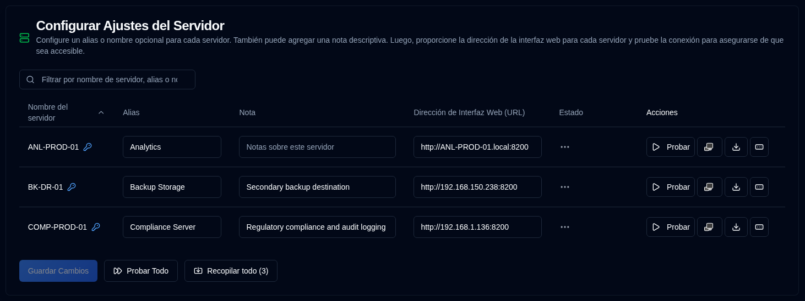

# Servidor {#server}

Puede configurar un nombre alternativo (alias) para sus servidores, una nota para describir su función y las direcciones web de sus servidores Duplicati aquí.

| Configuración                         | Descripción                                                                                                                                                                                  |
|:--------------------------------|:---------------------------------------------------------------------------------------------------------------------------------------------------------------------------------------------|
| **Nombre del servidor**                 | Nombre del servidor configurado en el servidor Duplicati. Aparecerá un <IIcon2 icon="lucide:key-round" color="#42A5F5"/> si se establece una contraseña para el servidor.                                         |
| **Alias**                       | Un apodo o nombre legible para humanos de tu servidor. Al pasar el ratón sobre un alias, mostrará su nombre; en algunos casos, para mayor claridad, mostrará el alias y el nombre entre paréntesis. |
| **Nota**                        | Texto libre para describir la funcionalidad del servidor, lugar de instalación o cualquier otra información. Cuando se configura, se mostrará junto al nombre o alias del servidor.                 |
| **Dirección de interfaz web (URL)** | Configura la URL para acceder a la interfaz de usuario del servidor Duplicati. Se admiten URLs `HTTP` y `HTTPS`.                                                                                           |
| **Estado**                      | Muestra los resultados de la prueba o de la recopilación de registros de copia de seguridad                                                                                                                                              |
| **Acciones**                     | Puedes probar, abrir la interfaz de Duplicati, recopilar registros y establecer una contraseña; consulta a continuación para obtener más detalles.                                                                                         |

 

:::note
Si la Dirección de interfaz web (URL) no está configurada, el botón <SvgIcon svgFilename="duplicati_logo.svg" /> 
estará deshabilitado en todas las páginas y el servidor no se mostrará en la lista de [Configuración de Duplicati](../duplicati-configuration.md) <SvgButton svgFilename="duplicati_logo.svg" href="../duplicati-configuration"/>.
:::

 

## Acciones disponibles para cada servidor {#available-actions-for-each-server}

| Botón                                                                                                      | Descripción                                                             |
|:------------------------------------------------------------------------------------------------------------|:------------------------------------------------------------------------|
| <IconButton icon="lucide:play" label="Probar"/>                                                               | Probar la conexión con el servidor Duplicati.                            |
| <SvgButton svgFilename="duplicati_logo.svg" />                                                              | Abrir la interfaz web del servidor Duplicati en una nueva pestaña del navegador.         |
| <IconButton icon="lucide:download" />                                                                       | Recopilar registros de copia de seguridad del servidor Duplicati.                          |
| <IconButton icon="lucide:rectangle-ellipsis" /> &nbsp; o <IIcon2 icon="lucide:key-round" color="#42A5F5"/> | Cambiar o establecer una contraseña para el servidor Duplicati para recopilar copias de seguridad. |

 

:::info[IMPORTANTE]

Para proteger su seguridad, solo puede realizar las siguientes acciones:
- Establecer una contraseña para el servidor
- Eliminar (borrar) la contraseña completamente
 
La contraseña se almacena cifrada en la base de datos y nunca se muestra en la interfaz de usuario.
:::

 

## Acciones disponibles para todos los servidores {#available-actions-for-all-servers}

| Botón                                                     | Descripción                                     |
|:-----------------------------------------------------------|:------------------------------------------------|
| <IconButton label="Guardar cambios" />                        | Guardar los cambios realizados en la configuración del servidor.   |
| <IconButton icon="lucide:fast-forward" label="Probar todo"/>  | Probar la conexión con todos los servidores Duplicati.   |
| <IconButton icon="lucide:import" label="Recopilar todo (#)"/> | Recopilar registros de copia de seguridad de todos los servidores Duplicati. |

 
