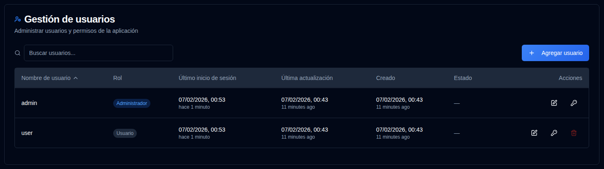

# Usuarios {#users}

Administre cuentas de usuario, permisos y control de acceso para **duplistatus**. Esta sección permite a los administradores crear, modificar y eliminar cuentas de usuario.

>[!TIP] 
>La cuenta `admin` por defecto puede ser eliminada. Para hacerlo, primero cree un nuevo usuario administrador, inicie sesión con esa cuenta, 
> y luego elimine la cuenta `admin`.
>
> La contraseña por defecto para la cuenta `admin` es `Duplistatus09`. Se le requerirá cambiarla en el primer inicio de sesión.

## Acceso a la Gestión de usuarios {#accessing-user-management}

Puede acceder a la sección Gestión de usuarios de dos formas:

1. **Desde el Menú de Usuario**: Haga clic en <IconButton icon="lucide:user" label="nombre de usuario" />   en la [Barra de herramientas de la aplicación](../overview.md#application-toolbar) y seleccione "Usuarios Admin".

2. **Desde Configuración**: Haz clic en <IconButton icon="lucide:settings"/> y `Users` en la barra lateral de configuración

## Crear un Nuevo Usuario {#creating-a-new-user}

1. Haga clic en el botón <IconButton icon="lucide:plus" label="Agregar usuario"/>
2. Ingrese los detalles del usuario:
   - **Nombre de usuario**: Debe tener 3-50 caracteres, ser único, sin distinción de mayúsculas y minúsculas
   - **Admin**: Verificar para otorgar privilegios de administrador
   - **Requerir cambio de contraseña**: Verificar para forzar el cambio de contraseña en el primer inicio de sesión
   - **Contraseña**: 
     - Opción 1: Verificar "Generar contraseña automáticamente" para crear una contraseña temporal segura
     - Opción 2: Desmarcar e ingresar una contraseña personalizada
3. Haga clic en <IconButton icon="lucide:user-plus" label="Crear usuario" />.

## Edición de un Usuario {#editing-a-user}

1. Haga clic en el icono <IconButton icon="lucide:edit" /> editar junto al usuario
2. Modifique cualquiera de los siguientes:
   - **Nombre de usuario**: Cambie el nombre de usuario (debe ser único)
   - **Admin**: Alterne los privilegios de administrador
   - **Require Password Change**: Alterne el requisito de cambio de contraseña
3. Haga clic en <IconButton icon="lucide:check" label="Guardar cambios" />.

## Restablecimiento de Contraseña de Usuario {#resetting-a-user-password}

1. Haga clic en el icono <IconButton icon="lucide:key-round" /> de clave junto al usuario
2. Confirmar el restablecimiento de contraseña
3. Se generará una contraseña temporal y se mostrará
4. Copiar la contraseña y proporcionarla al usuario de forma segura

## Eliminación de un Usuario {#deleting-a-user}

1. Haga clic en el icono <IconButton icon="lucide:trash-2" /> eliminar junto al usuario
2. Confirme la eliminación en el cuadro de diálogo. **La eliminación del usuario es permanente y no se puede deshacer.**

## Bloqueo de Cuenta {#account-lockout}

Las cuentas se bloquean automáticamente después de múltiples intentos fallidos de inicio de sesión:
- **Umbral de bloqueo**: 5 intentos fallidos
- **Duración del bloqueo**: 15 minutos
- Las cuentas bloqueadas no pueden iniciar sesión hasta que expire el período de bloqueo

## Recuperación del Acceso Admin {#recovering-admin-access}

Si ha perdido su contraseña de admin o ha sido bloqueado de su cuenta, puede recuperar el acceso utilizando el script de recuperación de admin. Consulte la guía [Admin Account Recovery](../admin-recovery.md) para obtener instrucciones detalladas sobre cómo recuperar el acceso de administrador en entornos Docker.
