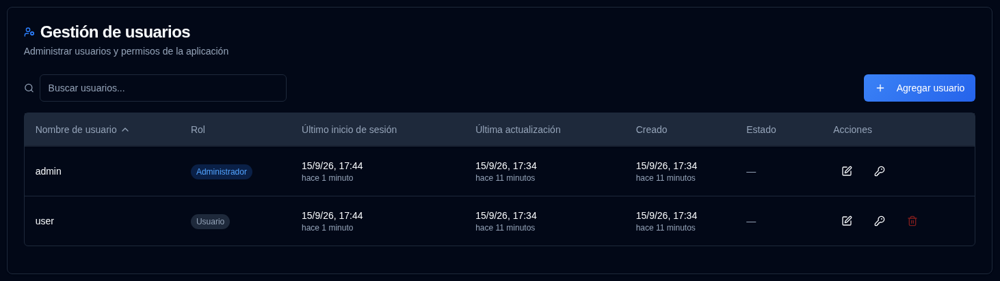

# Usuarios {/* #users */}

Gestiona cuentas de usuario, permisos y control de acceso para **duplistatus**. Esta sección permite a los administradores crear, modificar y eliminar cuentas de usuario.

>[!TIP] 
>La cuenta `admin` predeterminada puede eliminarse. Para ello, primero crea un nuevo usuario administrador, inicia sesión con esa cuenta
> y luego elimina la cuenta `admin`.
>
> La contraseña predeterminada para la cuenta `admin` es `Duplistatus09`. Se te pedirá que la cambies al iniciar sesión por primera vez.

## Accediendo a la gestión de usuarios {/* #accessing-user-management */}

Puedes acceder a la sección de gestión de usuarios de dos formas:

1. **Desde el menú de usuario**: Haz clic en el <IconButton icon="lucide:user" label="nombre de usuario" /> en la [barra de herramientas de la aplicación](../overview.md#application-toolbar) y selecciona "Usuarios administradores".

2. **Desde la configuración**: Haz clic en <IconButton icon="lucide:settings"/> y **Usuarios** en la barra lateral de configuración

## Creando un nuevo usuario {/* #creating-a-new-user */}

1. Haz clic en el botón <IconButton icon="lucide:plus" label="Añadir usuario"/>
2. Introduce los detalles del usuario:
   - **Nombre de usuario**: Debe tener entre 3 y 50 caracteres, ser único y no distinguir mayúsculas de minúsculas
   - **Administrador**: Marca para conceder privilegios de administrador
   - **Requiere cambio de contraseña**: Marca para obligar al usuario a cambiar la contraseña al iniciar sesión por primera vez
   - **Contraseña**: 
     - Opción 1: Marca "Generar contraseña automáticamente" para crear una contraseña temporal segura
     - Opción 2: Desmarca y introduce una contraseña personalizada
3. Haz clic en <IconButton icon="lucide:user-plus" label="Crear usuario" />.

## Editando un usuario {/* #editing-a-user */}

1. Haz clic en el icono de edición <IconButton icon="lucide:edit" /> junto al usuario
2. Modifica cualquiera de los siguientes:
   - **Nombre de usuario**: Cambia el nombre de usuario (debe ser único)
   - **Administrador**: Activa o desactiva los privilegios de administrador
   - **Requiere cambio de contraseña**: Activa o desactiva la obligación de cambiar la contraseña
3. Haz clic en <IconButton icon="lucide:check" label="Guardar cambios" />.

## Restableciendo la contraseña de un usuario {/* #resetting-a-user-password */}

1. Haz clic en el icono de clave <IconButton icon="lucide:key-round" /> junto al usuario
2. Confirma el restablecimiento de la contraseña
3. Se generará y mostrará una nueva contraseña temporal
4. Copia la contraseña y proporciónala al usuario de forma segura

## Eliminando un usuario {/* #deleting-a-user */}

1. Haz clic en el icono de eliminación <IconButton icon="lucide:trash-2" /> junto al usuario
2. Confirma la eliminación en el cuadro de diálogo. **La eliminación de usuarios es permanente y no se puede deshacer.**

## Bloqueo de cuenta {/* #account-lockout */}

Las cuentas se bloquean automáticamente después de varios intentos de inicio de sesión fallidos:
- **Umbral de bloqueo**: 5 intentos fallidos
- **Duración del bloqueo**: 15 minutos
- Las cuentas bloqueadas no pueden iniciar sesión hasta que expire el período de bloqueo

## Recuperación de acceso de administrador {/* #recovering-admin-access */}

Si has perdido tu contraseña de administrador o has sido bloqueado de tu cuenta, puedes recuperar el acceso usando el script de recuperación de administrador. Consulta la guía [Recuperación de cuenta de administrador](../admin-recovery.md) para obtener instrucciones detalladas sobre cómo recuperar el acceso de administrador en entornos Docker.

Si el navegador muestra **Acceso denegado** (HTTP 403) antes del formulario de inicio de sesión, recupera el acceso con [Bloqueado por Lista de IPs permitidas](../troubleshooting.md#locked-out-by-ip-allowlist) en su lugar.
