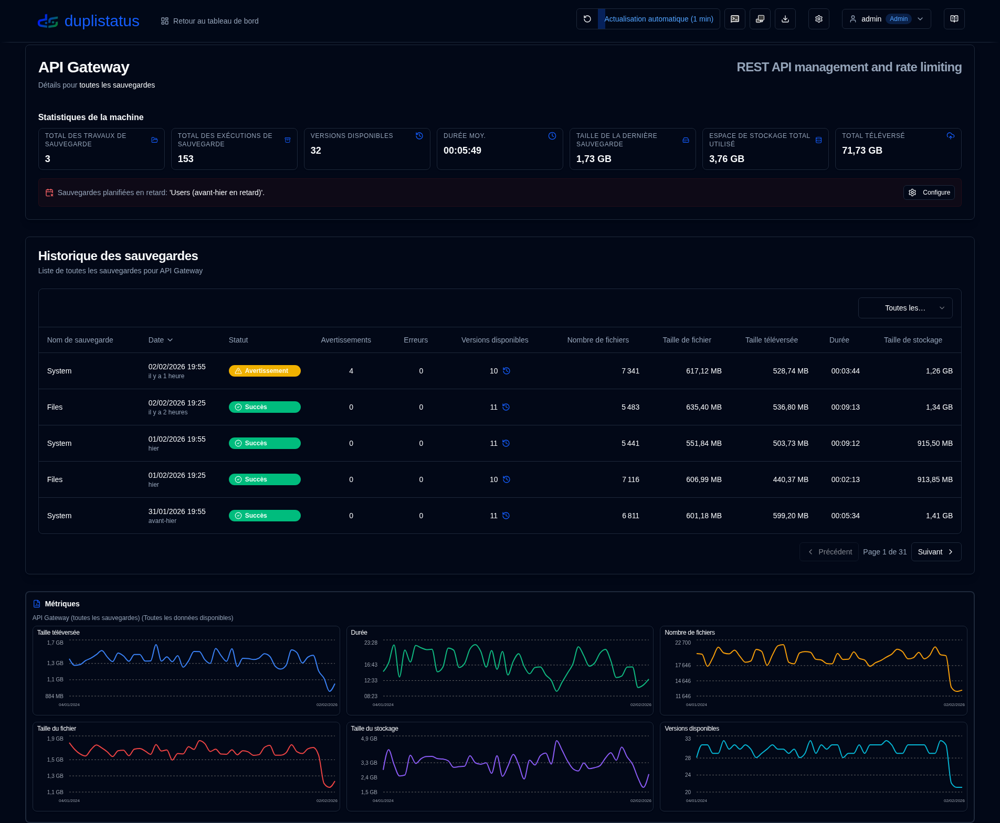
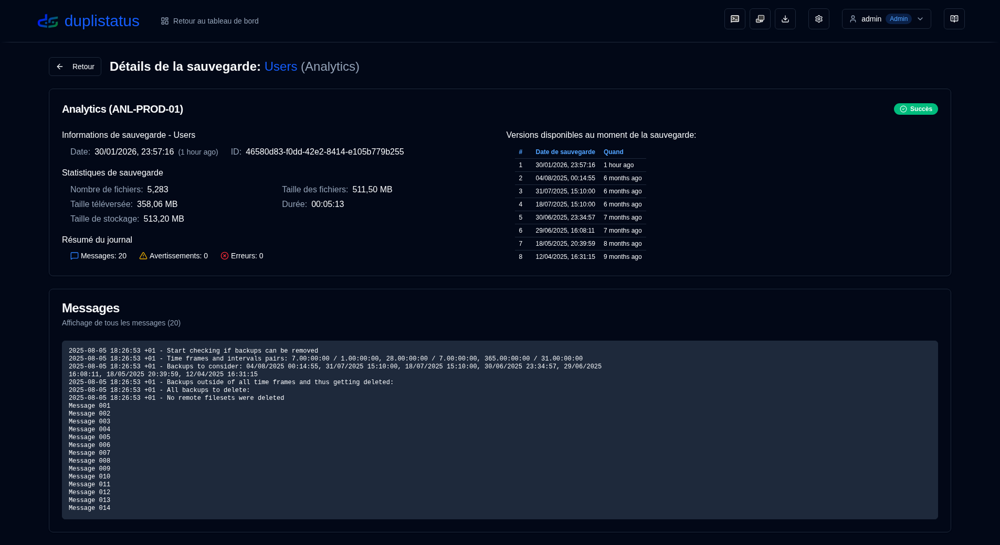

# Bienvenue sur duplistatus {#welcome-to-duplistatus}

**duplistatus** - Surveiller plusieurs [serveurs de Duplicati](https://github.com/duplicati/duplicati) à partir d'un seul tableau de bord

## Fonctionnalités {#features}

- **Configuration Rapide** : Déploiement conteneurisé simple, avec des images disponibles sur Docker Hub et GitHub.
- **Tableau de bord Unifié** : Visualisez le statut, l'historique et les détails des sauvegardes pour tous les serveurs en un seul endroit.
- **Surveillance des Sauvegardes en Retard** : Vérification et alerte automatiques pour les sauvegardes planifiées en retard.
- **Visualisation de Données et Journaux** : Graphiques interactifs et collecte automatique des journaux à partir des serveurs Duplicati.
- **Notifications et Alertes** : Prise en charge intégrée de NTFY et des e-mails SMTP pour les alertes de sauvegarde, y compris les notifications de sauvegardes en retard.
- **Contrôle d'Accès et Sécurité des Utilisateurs** : Système d'authentification sécurisé avec contrôle d'accès basé sur les rôles (rôles Admin/Utilisateur), politiques de mot de passe configurables, protection contre le verrouillage de compte et gestion complète des utilisateurs.
- **Journalisation d'Audit** : Piste d'audit complète de tous les changements système et actions utilisateur avec filtrage avancé, capacités d'exportation et périodes de conservation configurables.
- **Visualiseur de Journaux d'Application** : Interface réservée à l'admin pour visualiser, rechercher et exporter les journaux d'application directement depuis l'interface web avec des capacités de surveillance en temps réel.
- **Support Multilingue** : Interface et documentation disponibles en anglais, français, allemand, espagnol et portugais brésilien.

## Installation {#installation}

L'application peut être déployée via Docker, Portainer Stacks ou Podman. Consultez les détails dans le [guide d'installation](installation/installation.md).

- Si vous mettez à jour depuis une version antérieure, votre base de données sera automatiquement [migrée](migration/version_upgrade.md) vers le nouveau schéma pendant le processus de mise à jour.

- Lors de l'utilisation de Podman (en tant que conteneur autonome ou dans un pod), et si vous avez besoin de paramètres DNS personnalisés (comme pour Tailscale MagicDNS, réseaux d'entreprise, ou autres configurations DNS personnalisées), vous pouvez spécifier manuellement les serveurs DNS et les domaines de recherche. Consultez le guide d'installation pour plus de détails.

## Configuration des serveurs Duplicati (obligatoire) {#duplicati-servers-configuration-required}

Une fois votre serveur **duplistatus** en marche, vous devez configurer vos serveurs **Duplicati** pour envoyer les journaux de sauvegarde à **duplistatus**, comme indiqué dans la [section de configuration de Duplicati](installation/duplicati-server-configuration.md) du guide d'installation. Sans cette configuration, le tableau de bord ne recevra pas les données de sauvegarde de vos serveurs Duplicati.

## Guide utilisateur {#user-guide}

Consultez le [guide utilisateur](user-guide/overview.md) pour des instructions détaillées sur la configuration et l'utilisation de **duplistatus**, y compris la mise en place initiale, la configuration des fonctionnalités et la résolution des problèmes.

## Captures d'écran {#screenshots}

### Tableau de bord {#dashboard}

### Historique des sauvegardes {#backup-history}

### Détails de la sauvegarde {#backup-details}

### Sauvegardes en retard {#overdue-backups}

### Notifications sur votre téléphone {#overdue-notifications-on-your-phone}

## Référence API {#api-reference}

Consultez la [documentation des points de terminaison API](api-reference/overview.md) pour obtenir des informations sur les endpoints disponibles, les formats de requête/réponse et des exemples.

## Développement {#développement}

Pour obtenir des instructions sur le téléchargement, la modification ou l'exécution du code, consultez [Mise en place du développement](development/setup.md).

Ce projet a été principalement développé avec l'aide de l'IA. Pour en savoir plus, consultez [Comment j'ai construit cette application en utilisant des outils d'IA](development/how-i-build-with-ai).

## Crédits {#crédits}

- Avant tout, merci à Kenneth Skovhede pour la création de Duplicati— cet outil de sauvegarde remarquable. Merci également à tous les contributeurs.

💙 Si vous trouvez [Duplicati](https://www.duplicati.com) utile, veuillez envisager de soutenir le développeur. Plus de détails sont disponibles sur leur site web ou leur page GitHub.

- Icône SVG Duplicati de https://dashboardicons.com/icons/duplicati
- Icône SVG ntfy de https://dashboardicons.com/icons/ntfy
- Icône SVG GitHub de https://github.com/logos

:::note
 Tous les noms de produits, logos et marques sont la propriété de leurs propriétaires respectifs. Les icônes et les noms sont utilisés à des fins d'identification uniquement et n'impliquent pas d'approbation.
 :::

## Licence {#license}

Le projet est sous licence [Apache License 2.0](LICENSE.md).   

**Droits d'auteur © 2025 Waldemar Scudeller Jr.**
