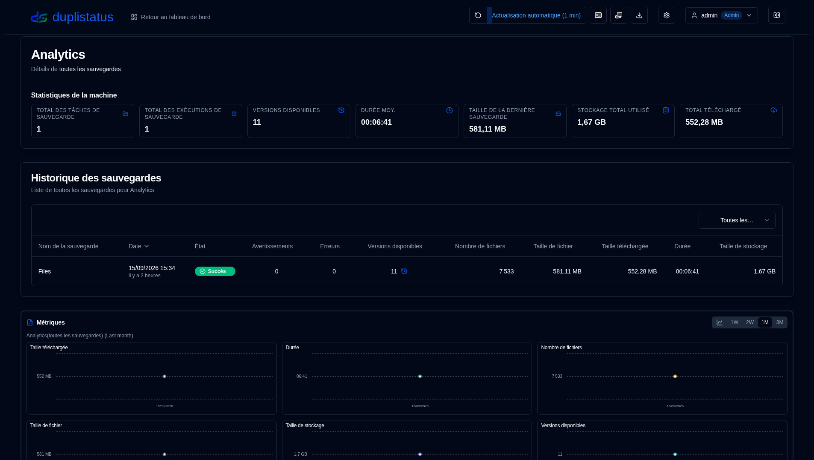

# Bienvenue sur duplistatus {/* #welcome-to-duplistatus */}

**duplistatus** - Surveiller plusieurs [serveurs de Duplicati](https://github.com/duplicati/duplicati) à partir d'un seul tableau de bord

## Fonctionnalités {/* #features */}

- **Configuration rapide** : Déploiement conteneurisé simple, avec des images disponibles sur Docker Hub et GitHub.
- **Tableau de bord unifié** : Visualisez l'état des sauvegardes, l'historique, la version de Duplicati et les détails de tous les serveurs en un seul endroit.
- **Surveillance des sauvegardes** : Vérification automatisée et alertes pour les sauvegardes planifiées en retard.
- **Visualisation des données et journaux** : Graphiques interactifs et collecte automatique des journaux des serveurs Duplicati.
- **Notifications & Alertes** : Prise en charge intégrée de NTFY et de SMTP pour les e-mails de sauvegarde, y compris les notifications de sauvegarde en retard.
- **Gestion des utilisateurs** : Connexion avec les rôles Admin et Utilisateur, politiques de mot de passe configurables, verrouillage de compte et administration des utilisateurs.
- **Renforcement de la sécurité** : Protection supplémentaire optionnelle, clés API pour les téléchargements Duplicati et les widgets Homepage (avec limites de taille et de débit de téléchargement), listes d'adresses IP autorisées indépendantes pour l'interface d'administration et les API externes, protection anti-spoofing et conseils pour le reverse-proxy HTTPS.
- **Journalisation d'audit** : Trace complète de toutes les modifications du système et des actions des utilisateurs avec filtrage avancé, capacités d'exportation et périodes de rétention configurables.
- **Visionneuse de journaux d'application** : Interface réservée aux administrateurs pour visualiser, rechercher et exporter les journaux d'application directement depuis l'interface web avec des capacités de surveillance en temps réel.
- **Prise en charge multilingue** : Interface et documentation disponibles en anglais, français, allemand, espagnol, portugais brésilien, hindi et chinois simplifié.

## Installation {/* #installation */}

L'application peut être déployée via Docker, Portainer Stacks ou Podman. Consultez les détails dans le [guide d'installation](installation/installation.md).

- Si vous mettez à jour depuis une version antérieure, votre base de données sera automatiquement [migrée](migration/version_upgrade.md) vers le nouveau schéma pendant le processus de mise à jour.

- Lors de l'utilisation de Podman (en tant que conteneur autonome ou dans un pod), et si vous avez besoin de paramètres DNS personnalisés (comme pour Tailscale MagicDNS, réseaux d'entreprise, ou autres configurations DNS personnalisées), vous pouvez spécifier manuellement les serveurs DNS et les domaines de recherche. Consultez le guide d'installation pour plus de détails.

## Configuration des serveurs duplicati (requis) {/* #duplicati-servers-configuration-required */}

Une fois votre serveur **duplistatus** en marche, vous devez configurer vos serveurs **Duplicati** pour envoyer les journaux de sauvegarde à **duplistatus**, comme indiqué dans la [section de configuration de Duplicati](installation/duplicati-server-configuration.md) du guide d'installation. Sans cette configuration, le tableau de bord ne recevra pas les données de sauvegarde de vos serveurs Duplicati.

## Guide de l'utilisateur {/* #user-guide */}

Consultez le [guide utilisateur](user-guide/overview.md) pour des instructions détaillées sur la configuration et l'utilisation de **duplistatus**, y compris la mise en place initiale, la configuration des fonctionnalités et la résolution des problèmes.

## Captures d'écran {/* #screenshots */}

### Tableau de bord {/* #dashboard */}

### Historique des sauvegardes {/* #backup-history */}

### Détails de la sauvegarde {/* #backup-details */}

### Sauvegardes en retard {/* #overdue-backups */}

### Notifications en retard sur votre téléphone {/* #overdue-notifications-on-your-phone */}

## Référence API {/* #api-reference */}

Consultez la [documentation des points de terminaison API](api-reference/overview.md) pour obtenir des informations sur les endpoints disponibles, les formats de requête/réponse et des exemples.

## Développement {/* #development */}

Pour obtenir des instructions sur le téléchargement, la modification ou l'exécution du code, consultez [Mise en place du développement](development/setup.md).

Ce projet a été principalement développé avec l'aide de l'IA. Pour en savoir plus, consultez [Comment j'ai construit cette application en utilisant des outils d'IA](development/how-i-build-with-ai).

## Crédits {/* #credits */}

- Avant tout, merci à Kenneth Skovhede pour la création de Duplicati— cet outil de sauvegarde remarquable. Merci également à tous les contributeurs.

💙 Si vous trouvez [Duplicati](https://www.duplicati.com) utile, veuillez envisager de soutenir le développeur. Plus de détails sont disponibles sur leur site web ou leur page GitHub.

- Idée/Implémentation des clés API et des listes d'adresses IP autorisées par `henmohr` dans l'issue [#79](https://github.com/wsj-br/duplistatus/issues/79)
- Icône SVG Duplicati de https://dashboardicons.com/icons/duplicati
- Icône SVG ntfy de https://dashboardicons.com/icons/ntfy
- Icône SVG GitHub de https://github.com/logos

:::note
Tous les noms de produits, logos et marques déposées sont la propriété de leurs propriétaires respectifs. Les icônes et les noms sont utilisés à des fins d'identification uniquement et n'impliquent pas d'approbation.
:::

## Licence {/* #license */}

Le projet est sous [Apache License 2.0](LICENSE.md).

**Copyright © 2026 Waldemar Scudeller Jr.**

<small>

> **Note sur les traductions de l'interface et de la documentation:** Toutes les langues de l'interface et de la documentation, sauf l'anglais (Royaume-Uni), ont été traduites avec l'IA à l'aide de [ai-i18n-tools](https://wsj-br.github.io/ai-i18n-tools/); le vocabulaire peut être imprécis ou contenir des erreurs.

</small>
