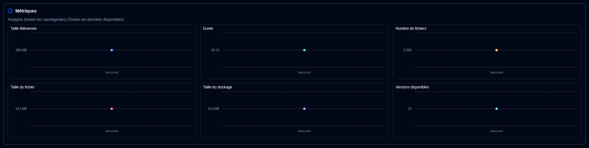

# Métriques de sauvegarde {#backup-metrics}

Un graphique des métriques de sauvegarde au fil du temps s'affiche à la fois sur le Tableau de bord (vue tableau) et sur la page Détails du Serveur.

- **Tableau de bord**, le graphique affiche le nombre total de sauvegardes enregistrées dans la base de données **duplistatus**. Si vous utilisez la disposition Cartes, vous pouvez sélectionner un serveur pour voir ses métriques consolidées (quand le panneau latéral affiche les métriques).
- Page **Détails du serveur**, le graphique affiche les métriques du serveur sélectionné (pour toutes ses sauvegardes) ou pour une sauvegarde spécifique unique.

- **Taille téléversée** : Quantité totale de données téléversées/transmises lors des sauvegardes depuis le serveur Duplicati vers la destination (stockage local, FTP, fournisseur cloud, ...) par jour.
- **Durée** : La durée totale de toutes les sauvegardes reçues par jour en HH:MM.
- **Nombre de fichiers** : La somme du compteur de nombre de fichiers reçu pour toutes les sauvegardes par jour.
- **Taille des fichiers** : La somme de la taille des fichiers rapportée par le serveur Duplicati pour toutes les sauvegardes reçues par jour.
- **Taille de stockage** : La somme de la taille de stockage utilisée sur la destination de sauvegarde rapportée par le serveur Duplicati par jour.
- **Versions disponibles** : La somme de toutes les versions disponibles pour toutes les sauvegardes par jour.

:::note
Vous pouvez utiliser le contrôle [Paramètres d'affichage](settings/display-settings.md) pour configurer la plage horaire du graphique.
:::
