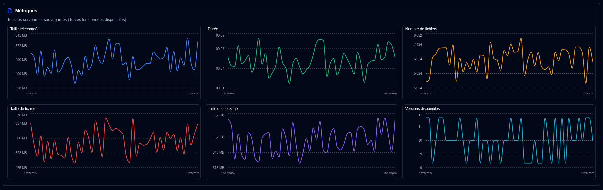

# Métriques de sauvegarde {#backup-metrics}

Un graphique des métriques de sauvegarde au fil du temps est affiché à la fois sur le tableau de bord (vue tableau) et sur la page de détails du serveur.

- **Tableau de bord**, le graphique affiche le nombre total de sauvegardes enregistrées dans la base de données **duplistatus**. Si vous utilisez la disposition Cartes, vous pouvez sélectionner un serveur pour voir ses métriques consolidées (quand le panneau latéral affiche les métriques).
- **Page Détails du serveur**, le graphique affiche les métriques du serveur sélectionné (pour toutes ses sauvegardes) ou pour une sauvegarde spécifique unique.

## Commandes de graphique en ligne {#inline-chart-controls}

Des commandes d'accès rapide sont disponibles directement sur les en-têtes de panneau de graphique pour une configuration facile sans naviguer vers les Paramètres d'affichage :

### Sélecteur de plage horaire {#time-range-selector}

Des boutons à pilule apparaissent dans l'en-tête du graphique pour une sélection rapide de la plage horaire : **1S | 2S | 1M | 3M**

- **1S** : 7 derniers jours (fenêtre glissante)
- **2S** : 14 derniers jours (fenêtre glissante)
- **1M** : 30 derniers jours (fenêtre glissante, par défaut)
- **3M** : 90 derniers jours (fenêtre glissante)

Les modifications effectuées ici se synchronisent avec vos Paramètres d'affichage, de sorte que votre préférence est mémorisée entre les actualisations de page.

### Bascule de style de graphique {#chart-style-toggle}

Un bouton de bascule dans l'en-tête du graphique vous permet de basculer entre :

- **Lignes lissées** : Afficher les points de données reliés par des courbes lisses
- **Graphique à barres** : Afficher les données sous forme de barres discrètes pour chaque période

Les deux modes utilisent l'agrégation par intervalles de temps pour un affichage optimal. Les périodes vides en mode barre n'affichent aucune barre. Votre préférence persiste entre les actualisations de page et est synchronisée avec les Paramètres d'affichage.

## Consolidation des données de graphique {#chart-data-consolidation}

Lorsque plusieurs sauvegardes se produisent le même jour, **duplistatus** consolide les données avant de les afficher sur les graphiques :

- **SUM** : Utilisé pour les métriques cumulatives (Durée, Nombre de fichiers, Taille de fichier, Taille téléchargée)
- **LAST** : Utilisé pour la Taille de stockage (la valeur la plus récente de la journée)
- **MAX** : Utilisé pour les Versions disponibles (le nombre le plus élevé de la journée)

Cette consolidation a lieu avant l'application du regroupement par intervalles de temps, garantissant des métriques agrégées précises. Par exemple, deux sauvegardes le 5/12/26 produiront un seul point de données consolidé sur le graphique.

## Définitions des métriques {#metric-definitions}

- **Taille téléchargée** : Quantité totale de données téléchargées/transmises lors des sauvegardes depuis le serveur Duplicati vers la destination (stockage local, FTP, fournisseur de cloud, etc.) par jour.
- **Durée** : Durée totale de toutes les sauvegardes reçues par jour au format HH:MM.
- **Nombre de fichiers** : Somme du compteur du nombre de fichiers reçu pour toutes les sauvegardes par jour.
- **Taille du fichier** : Somme de la taille des fichiers signalée par le serveur Duplicati pour toutes les sauvegardes reçues par jour.
- **Taille du stockage** : Somme de l'espace de stockage utilisé sur la destination de sauvegarde signalé par le serveur Duplicati par jour.
- **Versions disponibles** : Somme de toutes les versions disponibles pour toutes les sauvegardes par jour.

:::note
Vous pouvez utiliser le contrôle [Paramètres d'affichage](settings/display-settings.md) pour configurer la plage horaire du graphique.
:::
