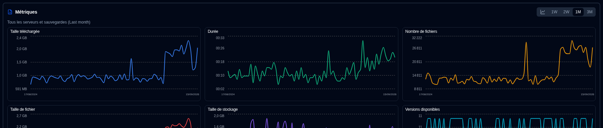

# Métriques de sauvegarde {/* #backup-metrics */}

Un graphique des métriques de sauvegarde au fil du temps est affiché sur le tableau de bord (vue tableau) et sur la page des détails du serveur.

- **Tableau de bord**, le graphique montre le nombre total de sauvegardes enregistrées dans la base de données **duplistatus**. Si vous utilisez la disposition Cartes, vous pouvez sélectionner un serveur pour voir ses métriques consolidées (lorsque le panneau latéral affiche les métriques).
- Page **Détails du serveur**, le graphique affiche les métriques pour le serveur sélectionné (pour toutes ses sauvegardes) ou pour une sauvegarde unique et spécifique.

## Contrôles intégrés du graphique {/* #inline-chart-controls */}

Des contrôles d'accès rapide sont disponibles directement sur les en-têtes des panneaux de graphique pour une configuration facile sans avoir à accéder aux paramètres d'affichage :

### Sélecteur de plage horaire {/* #time-range-selector */}

Des boutons pilules apparaissent dans l'en-tête du graphique pour une sélection rapide de la plage horaire : **1W | 2W | 1M | 3M**

- **1W** : Les 7 derniers jours (fenêtre glissante)
- **2W** : Les 14 derniers jours (fenêtre glissante)
- **1M** : Les 30 derniers jours (fenêtre glissante, par défaut)
- **3M** : Les 90 derniers jours (fenêtre glissante)

Les modifications effectuées ici sont synchronisées avec vos paramètres d'affichage, afin que votre préférence soit mémorisée lors des actualisations de page.

### Bouton bascule du style de graphique {/* #chart-style-toggle */}

Un bouton de basculement dans l'en-tête du graphique vous permet de basculer entre :

- **Lignes lissées** : Afficher les points de données connectés avec des courbes lisses
- **Graphique à barres** : Afficher les données sous forme de barres discrètes pour chaque période

Les deux modes utilisent l'agrégation par intervalles temporels pour un affichage optimal. Les périodes vides en mode barres ne produisent aucune barre. Votre préférence persiste lors des actualisations de page et est synchronisée avec les paramètres d'affichage.

## Consolidation des données du graphique {/* #chart-data-consolidation */}

Lorsque plusieurs sauvegardes ont lieu le même jour, **duplistatus** consolide les données avant de les afficher sur les graphiques :

- **SUM** : Utilisé pour les métriques cumulatives (Durée, Nombre de fichiers, Taille de fichier, Taille téléchargée)
- **LAST** : Utilisé pour la taille de stockage (la valeur la plus récente de la journée)
- **MAX** : Utilisé pour les versions disponibles (le nombre le plus élevé de la journée)

Cette consolidation se produit avant l'application du regroupement par intervalles temporels, garantissant des métriques agrégées précises. Par exemple, deux sauvegardes le 5/12/26 produiront un seul point de données consolidé sur le graphique.

## Définitions des métriques {/* #metric-definitions */}

- **Taille téléchargée** : Quantité totale de données envoyées/transmises pendant les sauvegardes depuis le serveur Duplicati vers la destination (stockage local, FTP, fournisseur cloud, ...) par jour.
- **Durée** : La durée totale de toutes les sauvegardes reçues par jour au format HH:MM.
- **Nombre de fichiers** : La somme du compteur de nombre de fichiers reçus pour toutes les sauvegardes par jour.
- **Taille de fichier** : La somme de la taille de fichier signalée par le serveur Duplicati pour toutes les sauvegardes reçues par jour.
- **Taille de stockage** : La somme de l'espace de stockage utilisé sur la destination de sauvegarde indiquée par le serveur Duplicati par jour.
- **Versions disponibles** : La somme de toutes les versions disponibles pour toutes les sauvegardes par jour.

:::note
Vous pouvez utiliser le contrôle [Paramètres d'affichage](settings/display-settings.md) pour configurer la plage horaire du graphique.
:::
