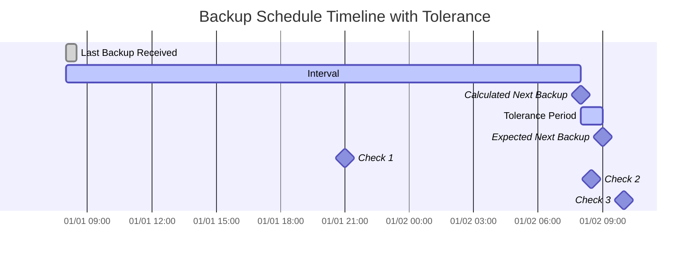

import { ZoomMermaid } from '@site/src/components/ZoomMermaid';

# Surveillance des sauvegardes {/* #backup-monitoring */}

La fonctionnalité de surveillance des sauvegardes vous permet de suivre et d'alerter sur les sauvegardes en retard. Les notifications peuvent être envoyées via NTFY ou E-mail.

Dans l'interface utilisateur, les sauvegardes en retard sont affichées avec une icône d'avertissement. En survolant l'icône, les détails de la sauvegarde en retard s'affichent, y compris l'heure de la dernière sauvegarde, l'heure de la sauvegarde attendue, la période de tolérance et l'heure de la prochaine sauvegarde attendue.

## Processus de vérification des sauvegardes en retard {/* #overdue-check-process */}

**Fonctionnement :**

| **Étape** | **Valeur**                  | **Description**                                   | **Exemple**        |
|:--------:|:---------------------------|:--------------------------------------------------|:-------------------|
|    1     | **Dernière sauvegarde**            | L'horodatage de la dernière sauvegarde réussie.      | `2024-01-01 08:00` |
|    2     | **Intervalle attendu**      | La fréquence de sauvegarde configurée.                  | `1 day`            |
|    3     | **Prochaine sauvegarde calculée** | `Last Backup` + `Expected Interval`               | `2024-01-02 08:00` |
|    4     | **Tolérance**              | La période de grâce configurée (temps supplémentaire autorisé). | `1 hour`           |
|    5     | **Prochaine sauvegarde attendue**   | `Calculated Next Backup` + `Tolerance`            | `2024-01-02 09:00` |

Une sauvegarde est considérée comme **en retard** si l'heure actuelle est postérieure à l'heure de `Expected Next Backup`.

<ZoomMermaid>

</ZoomMermaid>

**Exemples basés sur la chronologie ci-dessus :**

- À `2024-01-01 21:00` (🔹Vérification 1), la sauvegarde est **à l'heure**.
- À `2024-01-02 08:30` (🔹Vérification 2), la sauvegarde est **à l'heure**, car elle est encore dans la période de tolérance.
- À `2024-01-02 10:00` (🔹Vérification 3), la sauvegarde est **en retard**, car elle est postérieure à l'heure de `Expected Next Backup`.

## Vérifications périodiques {/* #periodic-checks */}

**duplistatus** effectue des vérifications périodiques des sauvegardes en retard à intervalles configurables. L'intervalle par défaut est de 20 minutes, mais vous pouvez le configurer dans [Paramètres → Surveillance des sauvegardes](settings/backup-monitoring-settings.md).

## Configuration automatique {/* #automatic-configuration */}

Lorsque vous collectez les journaux de sauvegarde d'un serveur Duplicati, **duplistatus** effectue automatiquement :

- Extrait le calendrier de sauvegarde de la configuration Duplicati
- Met à jour les intervalles de surveillance des sauvegardes pour qu'ils correspondent exactement
- Synchronise les jours autorisés et les heures programmées
- Préserve vos préférences de notification

:::tip
Pour de meilleurs résultats, collectez les journaux de sauvegarde après avoir modifié les intervalles de travail de sauvegarde dans votre serveur Duplicati. Cela garantit que **duplistatus** reste synchronisé avec votre configuration actuelle.
:::

Consultez la section [Paramètres de surveillance des sauvegardes](settings/backup-monitoring-settings.md) pour des options de configuration détaillées.
