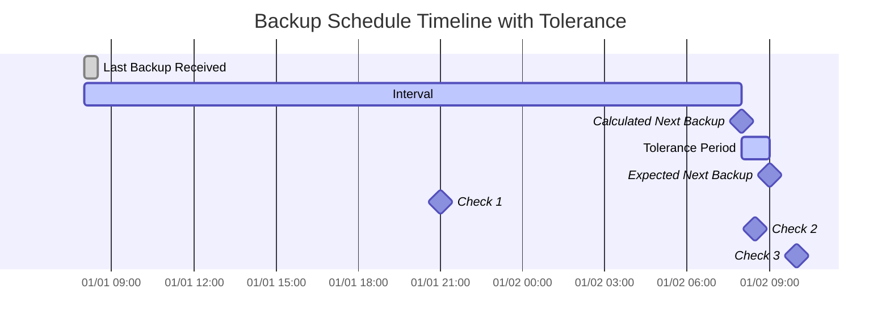

import { ZoomMermaid } from '@site/src/components/ZoomMermaid';

# Surveillance des sauvegardes {/* #backup-monitoring */}

La fonctionnalité de surveillance des sauvegardes vous permet de suivre et d'être alerté sur les sauvegardes qui sont en retard. Les notifications peuvent être envoyées via NTFY ou par e-mail.

Dans l'interface utilisateur, les sauvegardes en retard sont affichées avec une icône d'avertissement . En survolant l'icône, les détails de la sauvegarde en retard s'affichent, notamment l'heure de la dernière sauvegarde, l'heure de sauvegarde prévue, la période de tolérance et l'heure prévue pour la prochaine sauvegarde.

## Processus de vérification des retards {/* #overdue-check-process */}

**Comment cela fonctionne :**

| **Étape** | **Valeur**                  | **Description**                                   | **Exemple**        |
|:---------:|:----------------------------|:--------------------------------------------------|:-------------------|
|     1     | **Dernière sauvegarde**     | L'horodatage de la dernière sauvegarde réussie.   | `2024-01-01 08:00` |
|     2     | **Intervalle attendu**      | La fréquence configurée de la sauvegarde.         | `1 day`            |
|     3     | **Prochaine sauvegarde calculée** | `Last Backup` + `Expected Interval`               | `2024-01-02 08:00` |
|     4     | **Tolérance**               | La période de grâce configurée (temps supplémentaire autorisé). | `1 hour`           |
|     5     | **Prochaine sauvegarde attendue** | `Calculated Next Backup` + `Tolerance`            | `2024-01-02 09:00` |

Une sauvegarde est considérée comme **en retard** si l'heure actuelle est postérieure à l'heure `Expected Next Backup`.

<ZoomMermaid>

</ZoomMermaid>

**Exemples basés sur la chronologie ci-dessus :**

- À `2024-01-01 21:00` (🔹Vérification 1), la sauvegarde est **à l'heure**.
- À `2024-01-02 08:30` (🔹Vérification 2), la sauvegarde est **à l'heure**, car elle est encore dans la période de tolérance.
- À `2024-01-02 10:00` (🔹Vérification 3), la sauvegarde est **en retard**, car c'est après l'heure `Expected Next Backup`.

## Vérifications périodiques {/* #periodic-checks */}

**duplistatus** effectue des vérifications périodiques des sauvegardes en retard à des intervalles configurables. L'intervalle par défaut est de 20 minutes, mais vous pouvez le configurer dans [Paramètres → Surveillance des sauvegardes](settings/backup-monitoring-settings.md).

## Configuration automatique {/* #automatic-configuration */}

Lorsque vous collectez les journaux de sauvegarde depuis un serveur Duplicati, **duplistatus** effectue automatiquement :

- L'extraction de la planification de sauvegarde à partir de la configuration de Duplicati
- La mise à jour des intervalles de surveillance des sauvegardes pour correspondre exactement
- La synchronisation des jours autorisés et des heures programmées
- La préservation de vos préférences de notification

:::tip
Pour de meilleurs résultats, collectez les journaux de sauvegarde après avoir modifié les intervalles des tâches de sauvegarde dans votre serveur Duplicati. Cela garantit que **duplistatus** reste synchronisé avec votre configuration actuelle.
:::

Consultez la section [Paramètres de surveillance des sauvegardes](settings/backup-monitoring-settings.md) pour obtenir des options de configuration détaillées.
