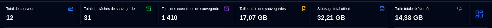
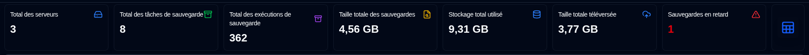
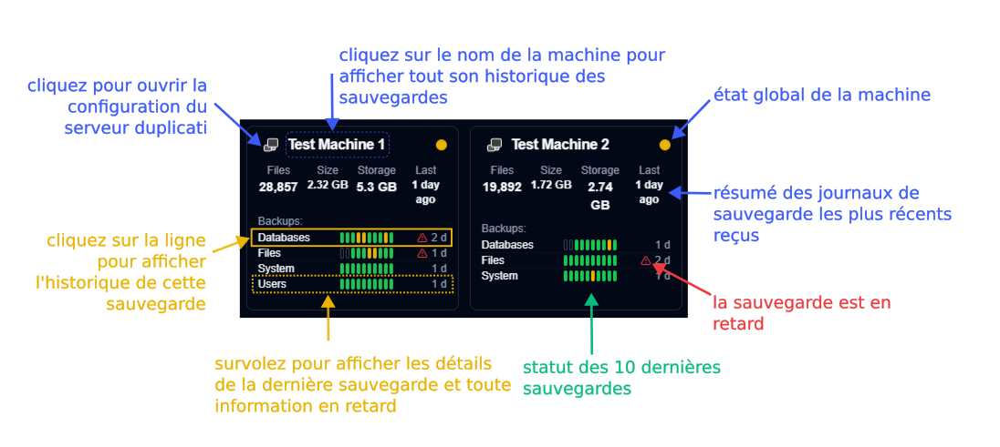
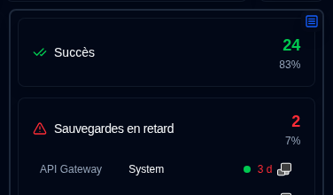
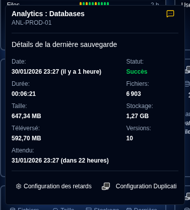
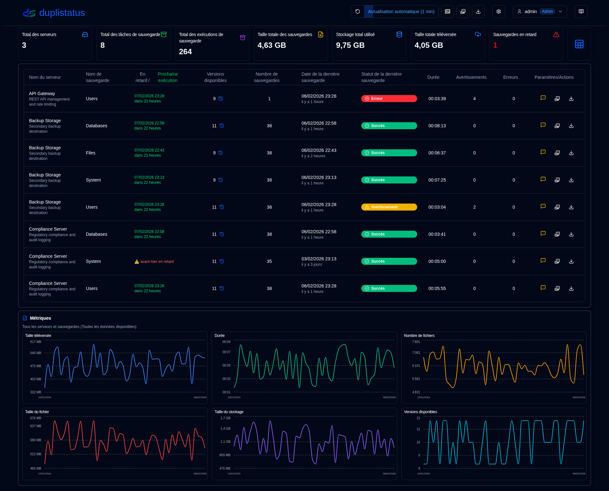
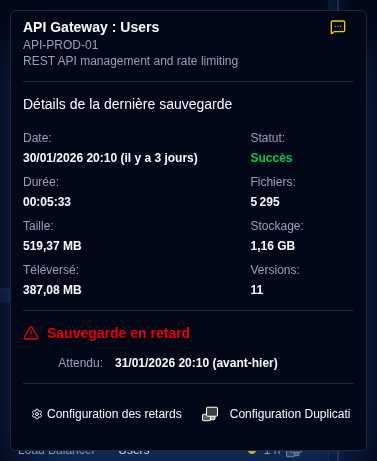
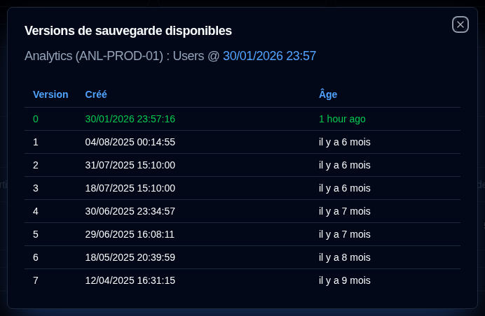

# Tableau de bord {#dashboard}

:::tip
**Accès rapide aux Paramètres d'affichage** : Cliquez avec le bouton droit sur le bouton d'actualisation automatique dans la barre d'outils de l'application pour ouvrir rapidement la page [Paramètres d'affichage](settings/display-settings.md).
:::

## Tableau de bord {#dashboard-summary}

Cette section affiche les statistiques agrégées pour toutes les sauvegardes.

- **Total des serveurs** : Le nombre de serveurs en cours de surveillance.
- **Total des tâches de sauvegarde** : Le nombre total de tâches de sauvegarde (types) configurées pour tous les serveurs.
- **Total des exécutions de sauvegarde** : Le nombre total de journaux de sauvegarde provenant des exécutions reçus ou collectés pour tous les serveurs.
- **Taille totale des sauvegardes** : La taille combinée de toutes les données source, basée sur les derniers journaux de sauvegarde reçus.
- **Stockage total utilisé** : L'espace de stockage total utilisé par les sauvegardes sur la destination de sauvegarde (par exemple, stockage cloud, serveur FTP, lecteur local), basé sur les derniers journaux de sauvegarde.
- **Taille totale téléversée** : La quantité totale de données téléversées du serveur Duplicati vers la destination (par exemple, stockage local, FTP, fournisseur cloud).
- **Sauvegardes en retard** (tableau) : Le nombre de sauvegardes en retard. Voir [Paramètres des notifications de sauvegarde](settings/backup-notifications-settings.md)
- **Basculement de disposition** : Bascule entre la disposition Cartes (par défaut) et la disposition Tableau.

## Disposition des cartes {#cards-layout}

La disposition des cartes affiche le statut du journal de sauvegarde le plus récent reçu pour chaque sauvegarde.

- **Nom du serveur** : Nom du serveur Duplicati (ou l'alias)
  - Le survol du **Nom du serveur** affichera le nom du serveur et la note
- **Statut global** : Le statut du serveur. Les sauvegardes en retard s'afficheront avec un statut `Avertissement`
- **Informations récapitulatives** : Le nombre consolidé de fichiers, la taille et le stockage utilisé pour toutes les sauvegardes de ce serveur. Affiche également le temps écoulé de la sauvegarde la plus récente reçue (survolez pour afficher l'horodatage)
- **Liste des sauvegardes** : Un tableau avec toutes les sauvegardes configurées pour ce serveur, avec 3 colonnes :
  - **Nom de sauvegarde** : Nom de la sauvegarde sur le serveur Duplicati
  - **Historique du statut** : Statut des 10 dernières sauvegardes reçues.
  - **Dernière sauvegarde reçue** : Le temps écoulé depuis l'heure actuelle du dernier journal reçu. Un icône d'avertissement s'affichera si la sauvegarde est en retard.
    - L'heure est affichée en format abrégé : `m` pour minutes, `h` pour heures, `d` pour jours, `w` pour semaines, `mo` pour mois, `y` pour années.

:::note
Vous pouvez utiliser les [Paramètres d'affichage](settings/display-settings.md) pour configurer l'ordre de tri des cartes. Les options disponibles sont `Nom du serveur (a-z)`, `Statut (erreur > avertissement > succès)` et `Dernière sauvegarde reçue (nouvelle > ancienne)`.
:::

Vous pouvez basculer le bouton en haut à droite du panneau latéral pour modifier l'affichage du panneau :

- Statut : Afficher les statistiques des tâches de sauvegarde par statut, avec une liste des sauvegardes en retard et des tâches de sauvegarde avec un statut d'avertissements/erreurs.

- Métriques : Afficher des graphiques avec la Durée, la Taille des fichiers et la Taille de stockage au fil du temps pour le serveur agrégé ou sélectionné.

### Détails de la sauvegarde {#backup-details}

Survoler une sauvegarde dans la liste affiche les détails du dernier journal de sauvegarde reçu et toute information en retard.

- **Nom du serveur : Sauvegarde** : Le nom ou l'alias du serveur Duplicati et de la sauvegarde, affichera également le nom du serveur et la note.
  - L'alias et la note peuvent être configurés à `Paramètres → Paramètres du serveur`.
- **Notifications** : Une icône affichant le paramètre de [notification configuré](#notifications-icons) pour les nouveaux journaux de sauvegarde.
- **Date** : L'horodatage de la sauvegarde et le temps écoulé depuis la dernière actualisation de l'écran.
- **Statut** : Le statut de la dernière sauvegarde reçue (Succès, Avertissement, Erreur, Fatal).
- **Durée, Nombre de fichiers, Taille des fichiers, Taille de stockage, Taille téléversée** : Valeurs telles que rapportées par le serveur Duplicati.
- **Versions disponibles** : Le nombre de versions de sauvegarde stockées sur la destination de sauvegarde au moment de la sauvegarde.

Si cette sauvegarde est en retard, l'infobulle affiche également :

- **Sauvegarde attendue** : L'heure à laquelle la sauvegarde était attendue, incluant le délai de grâce configuré (temps supplémentaire autorisé avant de marquer comme en retard).

Vous pouvez également cliquer sur les boutons en bas pour ouvrir `Paramètres → Notifications de sauvegarde` afin de configurer les paramètres en retard ou ouvrir l'interface web du Serveur Duplicati.

## Disposition de tableau {#table-layout}

La disposition du tableau répertorie les journaux de sauvegarde les plus récents reçus pour tous les serveurs et sauvegardes.

- **Nom du serveur** : Le nom du serveur Duplicati (ou alias)
  - Sous le nom se trouve la note du serveur
- **Nom de sauvegarde** : Le nom de la sauvegarde dans le serveur Duplicati.
- **Versions disponibles** : Le nombre de versions de sauvegarde stockées sur la destination de sauvegarde. Si l'icône est grisée, les informations détaillées n'ont pas été reçues dans le journal. Consultez les [instructions de configuration Duplicati](../installation/duplicati-server-configuration.md) pour plus de détails.
- **Nombre de sauvegardes** : Le nombre de sauvegardes signalées par le serveur Duplicati.
- **Date de la dernière sauvegarde** : L'horodatage du dernier journal de sauvegarde reçu et le temps écoulé depuis la dernière actualisation de l'écran.
- **Statut de la dernière sauvegarde** : Le statut de la dernière sauvegarde reçue (Succès, Avertissement, Erreur, Fatal).
- **Durée** : La durée de la sauvegarde en HH:MM:SS.
- **Avertissements/Erreurs** : Le nombre d'avertissements/erreurs signalés dans le journal de sauvegarde.
- **Paramètres** :
  - **Notification** : Une icône affichant le paramètre de notification configuré pour les nouveaux journaux de sauvegarde.
  - **Configuration Duplicati** : Un bouton pour ouvrir l'interface web du serveur Duplicati

### Icônes de Notifications {#notifications-icons}

| Icon                                                                                                                                    | Option de Notification | Description                                                                                         |
| --------------------------------------------------------------------------------------------------------------------------------------- | ------------------- | --------------------------------------------------------------------------------------------------- |
| <IconButton icon="lucide:message-square-off" style={{border: 'none', padding: 0, color: '#9ca3af', background: 'transparent'}} />     | Désactivé                 | Aucune notification ne sera envoyée quand un nouveau journal de sauvegarde est reçu                                     |
| <IconButton icon="lucide:message-square-more" style={{border: 'none', padding: 0, color: '#60a5fa', background: 'transparent'}} />     | Tous                 | Les notifications seront envoyées pour chaque nouveau journal de sauvegarde, quel que soit son statut.                      |
| <IconButton icon="lucide:message-square-more" style={{border: 'none', padding: 0, color: '#fbbf24', background: 'transparent'}} />    | Avertissements            | Les notifications seront envoyées uniquement pour les journaux de sauvegarde avec un statut d'Avertissement, Inconnu, Erreur ou Fatal. |
| <IconButton icon="lucide:message-square-more" style={{border: 'none', padding: 0, color: '#f87171', background: 'transparent'}} />    | Erreurs              | Les notifications seront envoyées uniquement pour les journaux de sauvegarde avec un statut d'Erreur ou Fatal.                    |

:::note
Ce paramètre de notification s'applique uniquement quand **duplistatus** reçoit un nouveau journal de sauvegarde d'un serveur Duplicati. Les notifications en retard sont configurées séparément et seront envoyées indépendamment de ce paramètre.
:::

### Détails des retards {#overdue-details}

Survoler l'icône d'avertissement de sauvegarde en retard affiche les détails à propos de la sauvegarde en retard.

- **Vérifié** : Quand la dernière vérification en retard a été effectuée. Configurez la fréquence dans [Paramètres de notifications de sauvegarde](settings/backup-notifications-settings.md).
- **Dernière sauvegarde** : Quand le dernier journal de sauvegarde a été reçu.
- **Sauvegarde attendue** : L'heure à laquelle la sauvegarde était attendue, y compris le délai de grâce configuré (temps supplémentaire autorisé avant de marquer comme en retard).
- **Dernière notification** : Quand la dernière notification en retard a été envoyée.

### Versions de sauvegarde disponibles {#available-backup-versions}

Cliquer sur l'icône d'horloge bleue ouvre une liste des versions de sauvegarde disponibles au moment de la sauvegarde, telle que rapportée par le serveur Duplicati.

- **Détails de la sauvegarde** : Affiche le nom du serveur et l'alias, la note du serveur, le nom de sauvegarde, et quand la sauvegarde a été exécutée.
- **Détails de la version** : Affiche le numéro de version, la date de création et l'âge.

:::note
Si l'icône est grisée, cela signifie qu'aucune information détaillée n'a été reçue dans les journaux des messages.
Consultez les [instructions de Configuration Duplicati](../installation/duplicati-server-configuration.md) pour plus de détails.
:::
