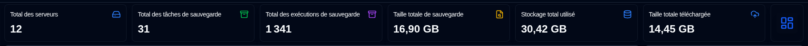
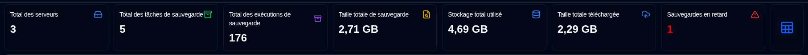
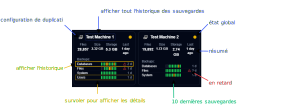
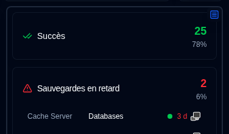
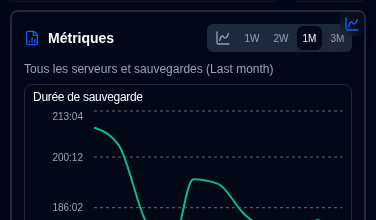
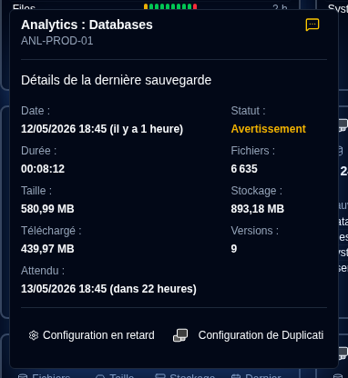
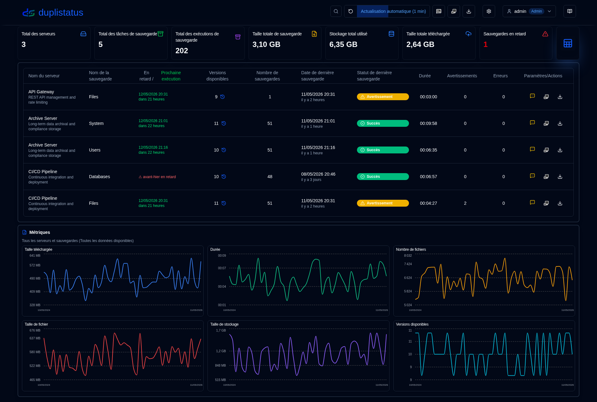
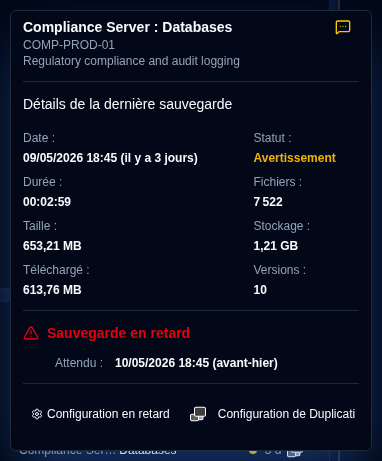
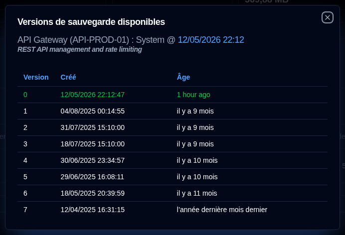

# Tableau de bord {#dashboard}

## Tableau de bord {#dashboard-summary}

Cette section affiche les statistiques agrégées pour toutes les sauvegardes.

- **Total Servers** : Le nombre de serveurs surveillés.                                                                                                             
- **Total Backup Jobs** : Le nombre total de tâches de sauvegarde (types) configurées pour tous les serveurs.                                                                                
- **Total Backup Runs** : Le nombre total de journaux de sauvegarde provenant des exécutions reçus ou collectés pour tous les serveurs.                                                                   
- **Total Backup Size** : La taille combinée de toutes les données sources, basée sur les derniers journaux de sauvegarde reçus.                                                                    
- **Total Storage Used** : L'espace de stockage total utilisé par les sauvegardes sur la destination de sauvegarde (par exemple, stockage cloud, serveur FTP, disque local), basé sur les derniers journaux de sauvegarde reçus. 
- **Total Uploaded Size** : La quantité totale de données téléchargées depuis le serveur Duplicati vers la destination (par exemple, stockage local, FTP, fournisseur cloud).                       
- **Overdue Backups** (tableau) : Le nombre de sauvegardes en retard. Voir [Paramètres des notifications de sauvegarde](settings/backup-notifications-settings.md)                          
- **Layout Toggle** : Permet de basculer entre la disposition Cartes (par défaut) et la disposition Tableau.

## Disposition des cartes {#cards-layout}

La disposition des cartes affiche le statut du journal de sauvegarde le plus récent reçu pour chaque sauvegarde.

- **Server Name** : Nom du serveur Duplicati (ou alias)
  - Passer la souris sur le **Server Name** affiche le nom du serveur et la note
- **Overall Status** : Statut du serveur. Les sauvegardes en retard sont indiquées avec un statut **Avertissement**
- **Summary information** : Nombre consolidé de fichiers, taille et stockage utilisé pour toutes les sauvegardes de ce serveur. Affiche également la durée écoulée depuis la dernière sauvegarde reçue (passez la souris pour afficher l'horodatage)
- **Backups list** : Un tableau avec toutes les sauvegardes configurées pour ce serveur, comprenant 3 colonnes :
  - **Backup Name** : Nom de la sauvegarde sur le serveur Duplicati
  - **Status history** : Statut des 10 dernières sauvegardes reçues.
  - **Last backup received** : Temps écoulé depuis l'heure actuelle et la date du dernier journal reçu. Un icône d'avertissement s'affiche si la sauvegarde est en retard.
    - Le temps est affiché en format abrégé : `m` pour les minutes, `h` pour les heures, `d` pour les jours, `w` pour les semaines, `mo` pour les mois, `y` pour les années.

L'ordre de tri des cartes et d'autres configurations peuvent être définis dans les [Paramètres d'affichage](settings/display-settings.md).

L'affichage du panneau offre deux affichages informationnels, accessibles en cliquant sur le bouton en haut à droite du panneau latéral :

- Statut : Afficher les statistiques des tâches de sauvegarde par statut, avec une liste des sauvegardes en retard et des tâches de sauvegarde avec un statut d'avertissements/erreurs.

- Métriques : Afficher des graphiques avec la Durée, la Taille des fichiers et la Taille de stockage au fil du temps pour le serveur agrégé ou sélectionné.

### Détails de la sauvegarde {#backup-details}

Survoler une sauvegarde dans la liste affiche les détails du dernier journal de sauvegarde reçu et toute information en retard.

- **Nom du serveur : Sauvegarde** : Le nom ou l'alias du serveur Duplicati et de la sauvegarde, affiche également le nom du serveur et la note.
  - L'alias et la note peuvent être configurés dans [Paramètres → Paramètres du serveur](settings/server-settings.md).
- **Notifications** : Une icône indiquant le paramètre de [notification configuré](#notifications-icons) pour les nouveaux journaux de sauvegarde.
- **Date** : L'horodatage de la sauvegarde et le temps écoulé depuis le dernier rafraîchissement de l'écran.
- **Status** : Statut de la dernière sauvegarde reçue (Succès, Avertissement, Erreur, Fatal).
- **Duration, File Count, File Size, Storage Size, Uploaded Size** : Valeurs telles que signalées par le serveur Duplicati.
- **Available Versions** : Nombre de versions de sauvegarde stockées sur la destination de sauvegarde au moment de la sauvegarde.

Si cette sauvegarde est en retard, l'infobulle affiche également :

- **Sauvegarde attendue** : L'heure à laquelle la sauvegarde était attendue, incluant le délai de grâce configuré (temps supplémentaire autorisé avant de marquer comme en retard).

Vous pouvez également cliquer sur les boutons en bas pour ouvrir [Paramètres → Notifications de sauvegarde](settings/backup-notifications-settings.md) afin de configurer les paramètres de surveillance ou ouvrir l'interface web du serveur Duplicati.

## Disposition de tableau {#table-layout}

La disposition du tableau répertorie les journaux de sauvegarde les plus récents reçus pour tous les serveurs et sauvegardes.

- **Server Name** : Nom du serveur Duplicati (ou alias)
  - Sous le nom figure la note du serveur
- **Backup Name** : Nom de la sauvegarde sur le serveur Duplicati.
- **Available Versions** : Nombre de versions de sauvegarde stockées sur la destination de sauvegarde. Si l'icône est grisée, les informations détaillées n'ont pas été reçues dans le journal. Voir les [instructions de configuration Duplicati](../installation/duplicati-server-configuration.md) pour plus de détails.
- **Backup Count** : Nombre de sauvegardes signalées par le serveur Duplicati.
- **Last Backup Date** : Horodatage du dernier journal de sauvegarde reçu et temps écoulé depuis le dernier rafraîchissement de l'écran.
- **Last Backup Status** : Statut de la dernière sauvegarde reçue (Succès, Avertissement, Erreur, Fatal).
- **Duration** : Durée de la sauvegarde au format HH:MM:SS.
- **Avertissements/Erreurs** : Le nombre d'avertissements/d'erreurs signalés dans le journal de sauvegarde.
- **Paramètres** :
  - **Notifications** : Une icône indiquant le paramètre de notification configuré pour les nouveaux journaux de sauvegarde.
  - **Configuration Duplicati** : Un bouton permettant d'ouvrir l'interface web du serveur Duplicati

Vous pouvez utiliser les [Paramètres d'affichage](settings/display-settings.md) pour configurer la taille du tableau et d'autres configurations.

### Icônes de Notifications {#notifications-icons}

| Icône                                                                                                                               | Option de notification | Description                                                                                         |
|------------------------------------------------------------------------------------------------------------------------------------|------------------------|-----------------------------------------------------------------------------------------------------|
| <IconButton icon="lucide:message-square-off" style={{border: 'none', padding: 0, color: '#9ca3af', background: 'transparent'}} />  | Désactivé                 | Aucune notification ne sera envoyée lorsqu'un nouveau journal de sauvegarde est reçu                                     |
| <IconButton icon="lucide:message-square-more" style={{border: 'none', padding: 0, color: '#60a5fa', background: 'transparent'}} /> | Tout                 | Des notifications seront envoyées pour chaque nouveau journal de sauvegarde, quel que soit son statut.                      |
| <IconButton icon="lucide:message-square-more" style={{border: 'none', padding: 0, color: '#fbbf24', background: 'transparent'}} /> | Avertissements            | Des notifications seront envoyées uniquement pour les journaux de sauvegarde dont le statut est Avertissement, Inconnu, Erreur ou Fatal. |
| <IconButton icon="lucide:message-square-more" style={{border: 'none', padding: 0, color: '#f87171', background: 'transparent'}} /> | Erreurs              | Des notifications seront envoyées uniquement pour les journaux de sauvegarde dont le statut est Erreur ou Fatal.                    |

:::note
Ce paramètre de notification s'applique uniquement quand **duplistatus** reçoit un nouveau journal de sauvegarde d'un serveur Duplicati. Les notifications en retard sont configurées séparément et seront envoyées indépendamment de ce paramètre.
:::

### Détails des retards {#overdue-details}

Survoler l'icône d'avertissement de sauvegarde en retard affiche les détails à propos de la sauvegarde en retard.

- **Vérifié** : Quand la dernière vérification en retard a été effectuée. Configurez la fréquence dans [Paramètres de notifications de sauvegarde](settings/backup-notifications-settings.md).
- **Dernière sauvegarde** : Quand le dernier journal de sauvegarde a été reçu.
- **Sauvegarde attendue** : L'heure à laquelle la sauvegarde était attendue, y compris le délai de grâce configuré (temps supplémentaire autorisé avant de marquer comme en retard).
- **Dernière notification** : Quand la dernière notification en retard a été envoyée.

### Versions de sauvegarde disponibles {#available-backup-versions}

Cliquer sur l'icône d'horloge bleue ouvre une liste des versions de sauvegarde disponibles au moment de la sauvegarde, telle que rapportée par le serveur Duplicati.

- **Détails de la sauvegarde** : Affiche le nom du serveur et l'alias, la note du serveur, le nom de sauvegarde, et quand la sauvegarde a été exécutée.
- **Détails de la version** : Affiche le numéro de version, la date de création et l'âge.

:::note
Si l'icône est grisée, cela signifie qu'aucune information détaillée n'a été reçue dans les journaux des messages.
Consultez les [instructions de Configuration Duplicati](../installation/duplicati-server-configuration.md) pour plus de détails.
:::
