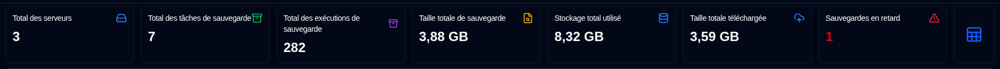
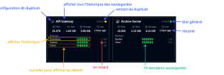
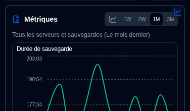
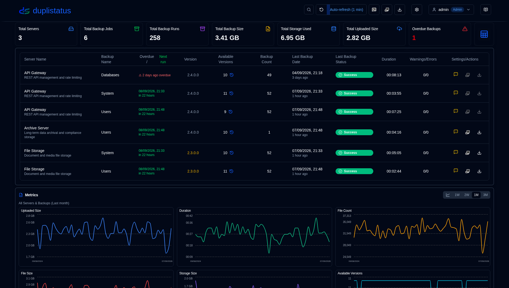
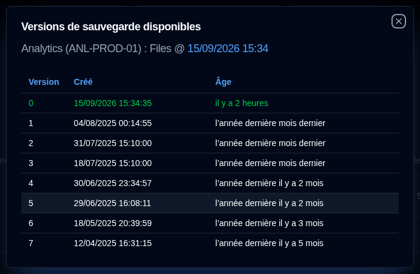

# Tableau de bord {#dashboard}

## Tableau de bord {#dashboard-summary}

Cette section affiche les statistiques agrégées pour toutes les sauvegardes.

- **Total Servers** : Le nombre de serveurs surveillés.                                                                                                             
- **Total Backup Jobs** : Le nombre total de tâches de sauvegarde (types) configurées pour tous les serveurs.                                                                                
- **Total Backup Runs** : Le nombre total de journaux de sauvegarde provenant des exécutions reçus ou collectés pour tous les serveurs.                                                                   
- **Total Backup Size** : La taille combinée de toutes les données sources, basée sur les derniers journaux de sauvegarde reçus.                                                                    
- **Total Storage Used** : L'espace de stockage total utilisé par les sauvegardes sur la destination de sauvegarde (par exemple, stockage cloud, serveur FTP, disque local), basé sur les derniers journaux de sauvegarde reçus. 
- **Total Uploaded Size** : La quantité totale de données téléchargées depuis le serveur Duplicati vers la destination (par exemple, stockage local, FTP, fournisseur cloud).                       
- **Overdue Backups** (tableau) : Le nombre de sauvegardes en retard. Voir [Paramètres des notifications de sauvegarde](settings/backup-notifications-settings.md)                          
- **Layout Toggle** : Permet de basculer entre la disposition Cartes (par défaut) et la disposition Tableau.

:::tip Des serveurs en double s'affichent ?
Si le même serveur apparaît plusieurs fois sur le tableau de bord, utilisez [Paramètres → Maintenance de la base de données → Fusionner les serveurs en double](settings/database-maintenance.md#merge-duplicate-servers) pour les consolider. Des doublons peuvent apparaître lorsque vous réinstallez ou mettez à jour Duplicati, car le `machine_id` du serveur peut changer et **duplistatus** le considère alors comme un nouveau serveur.
:::

## Filtrage des serveurs {#server-filtering}

Vous pouvez filtrer les serveurs et sauvegardes affichés sur le tableau de bord en utilisant le champ de recherche dans la barre d'outils de l'application. Cliquez sur l'icône de filtre <IconButton icon="lucide:search" /> pour afficher le champ de recherche.

**Correspondances de filtre :**
- ID du serveur
- URL du serveur
- Noms des tâches de sauvegarde

**Portée :**
- Filtre les vues en carte et en tableau sur le tableau de bord
- L'état de session est maintenu via le fournisseur de filtres de serveurs du tableau de bord
- Effacé quand vous actualisez ou quittez le tableau de bord

Cela permet de localiser rapidement des serveurs ou des sauvegardes spécifiques parmi de nombreux systèmes surveillés.

## Disposition des cartes {#cards-layout}

La disposition des cartes affiche le statut du journal de sauvegarde le plus récent reçu pour chaque sauvegarde.

- **Nom du serveur** : Nom du serveur Duplicati (ou l'alias)
  - Le survol du **Nom du serveur** affichera le nom du serveur et la note
- **État général** : L'état du serveur. Les sauvegardes en retard s'afficheront avec un statut d'**Avertissement**
- **Version** : La version de Duplicati issue du dernier journal de sauvegarde, affichée à gauche de l'indicateur d'état. Voir [Duplicati Server Version](#duplicati-server-version).
- **Informations récapitulatives** : Le nombre consolidé de fichiers, la taille et le stockage utilisés pour toutes les sauvegardes de ce serveur. Affiche également le temps écoulé depuis la sauvegarde la plus récente reçue (survolez pour afficher l'horodatage)
- **Liste des sauvegardes** : Un tableau avec toutes les sauvegardes configurées pour ce serveur, comprenant 3 colonnes :
  - **Nom de la sauvegarde** : Nom de la sauvegarde dans le serveur Duplicati
  - **Historique de l'état** : État des 10 dernières sauvegardes reçues.
  - **Dernière sauvegarde reçue** : Le temps écoulé depuis l'heure actuelle de la dernière log reçue. Une icône d'avertissement s'affichera si la sauvegarde est en retard.
    - Le temps est affiché au format abrégé : `m` pour les minutes, `h` pour les heures, `d` pour les jours, `w` pour les semaines, `mo` pour les mois, `y` pour les années.

L'ordre de tri des cartes et d'autres configurations peuvent être définis dans les [Paramètres d'affichage](settings/display-settings.md).

L'affichage du panneau offre deux affichages informationnels, accessibles en cliquant sur le bouton en haut à droite du panneau latéral :

- Statut : Afficher les statistiques des tâches de sauvegarde par statut, avec une liste des sauvegardes en retard et des tâches de sauvegarde avec un statut d'avertissements/erreurs.

- Métriques : Afficher des graphiques avec la Durée, la Taille des fichiers et la Taille de stockage au fil du temps pour le serveur agrégé ou sélectionné.

### Détails de la sauvegarde {#backup-details}

Survoler une sauvegarde dans la liste affiche les détails du dernier journal de sauvegarde reçu et toute information en retard.

- **Nom du serveur : Sauvegarde** : Le nom ou l'alias du serveur Duplicati et de la sauvegarde, affiche également le nom du serveur et la note.
  - L'alias et la note peuvent être configurés dans [Paramètres → Paramètres du serveur](settings/server-settings.md).
- **Notifications** : Une icône indiquant le paramètre de [notification configuré](#notifications-icons) pour les nouveaux journaux de sauvegarde.
- **Date** : L'horodatage de la sauvegarde et le temps écoulé depuis le dernier rafraîchissement de l'écran.
- **Status** : Statut de la dernière sauvegarde reçue (Succès, Avertissement, Erreur, Fatal).
- **Duration, File Count, File Size, Storage Size, Uploaded Size** : Valeurs telles que signalées par le serveur Duplicati.
- **Available Versions** : Nombre de versions de sauvegarde stockées sur la destination de sauvegarde au moment de la sauvegarde.

Si cette sauvegarde est en retard, l'infobulle affiche également :

- **Sauvegarde attendue** : L'heure à laquelle la sauvegarde était attendue, incluant le délai de grâce configuré (temps supplémentaire autorisé avant de marquer comme en retard).

Vous pouvez également cliquer sur les boutons en bas pour ouvrir [Paramètres → Notifications de sauvegarde](settings/backup-notifications-settings.md) afin de configurer les paramètres de surveillance ou ouvrir l'interface web du serveur Duplicati.

## Disposition de tableau {#table-layout}

La disposition du tableau répertorie les journaux de sauvegarde les plus récents reçus pour tous les serveurs et sauvegardes.

- **Nom du serveur** : Le nom du serveur Duplicati (ou l'alias)
  - Sous le nom se trouve la note du serveur
- **Nom de la sauvegarde** : Le nom de la sauvegarde dans le serveur Duplicati.
- **Version** : La version de Duplicati issue du dernier journal de sauvegarde pour ce job de sauvegarde. Voir [Duplicati Server Version](#duplicati-server-version).
- **Versions disponibles** : Le nombre de versions de sauvegarde stockées sur la destination de sauvegarde. Si l'icône est grisée, les informations détaillées n'ont pas été reçues dans le journal. Voir les [instructions de Configuration de Duplicati](../installation/duplicati-server-configuration.md) pour plus de détails.
- **Nombre de sauvegardes** : Le nombre de sauvegardes rapporté par le serveur Duplicati.
- **Date de dernière sauvegarde** : L'horodatage du dernier journal de sauvegarde reçu et le temps écoulé depuis la dernière actualisation de l'écran.
- **Statut de dernière sauvegarde** : L'état de la dernière sauvegarde reçue (Succès, Avertissement, Erreur, Fatal).
- **Durée** : La durée de la sauvegarde en HH:MM:SS.
- **Avertissements/Erreurs** : Le nombre d'avertissements et d'erreurs rapportés dans le journal de sauvegarde, affiché sous la forme `warnings/errors` (par exemple `0/0`).
- **Paramètres**:
  - **Notification** : Une icône indiquant le paramètre de notification configuré pour les nouveaux journaux de sauvegarde.
  - **Configuration de Duplicati** : Un bouton pour ouvrir l'interface web du serveur Duplicati

Vous pouvez utiliser les [Paramètres d'affichage](settings/display-settings.md) pour configurer la taille du tableau et d'autres configurations.

### Icônes de Notifications {#notifications-icons}

| Icône                                                                                                                               | Option de notification | Description                                                                                         |
|------------------------------------------------------------------------------------------------------------------------------------|------------------------|-----------------------------------------------------------------------------------------------------|
| <IconButton icon="lucide:message-square-off" style={{border: 'none', padding: 0, color: '#9ca3af', background: 'transparent'}} />  | Désactivé                 | Aucune notification ne sera envoyée lorsqu'un nouveau journal de sauvegarde est reçu                                     |
| <IconButton icon="lucide:message-square-more" style={{border: 'none', padding: 0, color: '#60a5fa', background: 'transparent'}} /> | Tout                 | Des notifications seront envoyées pour chaque nouveau journal de sauvegarde, quel que soit son statut.                      |
| <IconButton icon="lucide:message-square-more" style={{border: 'none', padding: 0, color: '#fbbf24', background: 'transparent'}} /> | Avertissements            | Des notifications seront envoyées uniquement pour les journaux de sauvegarde dont le statut est Avertissement, Inconnu, Erreur ou Fatal. |
| <IconButton icon="lucide:message-square-more" style={{border: 'none', padding: 0, color: '#f87171', background: 'transparent'}} /> | Erreurs              | Des notifications seront envoyées uniquement pour les journaux de sauvegarde dont le statut est Erreur ou Fatal.                    |

:::note
Ce paramètre de notification s'applique uniquement quand **duplistatus** reçoit un nouveau journal de sauvegarde d'un serveur Duplicati. Les notifications en retard sont configurées séparément et seront envoyées indépendamment de ce paramètre.
:::

### Détails des retards {#overdue-details}

Survoler l'icône d'avertissement de sauvegarde en retard affiche les détails à propos de la sauvegarde en retard.

- **Vérifié** : Quand la dernière vérification en retard a été effectuée. Configurez la fréquence dans [Paramètres de notifications de sauvegarde](settings/backup-notifications-settings.md).
- **Dernière sauvegarde** : Quand le dernier journal de sauvegarde a été reçu.
- **Sauvegarde attendue** : L'heure à laquelle la sauvegarde était attendue, y compris le délai de grâce configuré (temps supplémentaire autorisé avant de marquer comme en retard).
- **Dernière notification** : Quand la dernière notification en retard a été envoyée.

## Duplicati Server Version {#duplicati-server-version}

Le tableau de bord affiche la version de Duplicati rapportée dans le dernier journal de sauvegarde pour chaque serveur (vue carte) ou job de sauvegarde (vue tableau).

- **Où elle apparaît** : À gauche de l'indicateur d'état sur les cartes, et dans la colonne **Version** du tableau (après **En retard / Prochaine exécution**).
- **Couleur** : Un texte atténué signifie que la version correspond à la dernière version disponible pour ce canal (ou que la comparaison est indisponible). Le jaune d'avertissement signifie que la version est plus ancienne que la dernière version disponible pour ce canal.
- **Info-bulle** : Survolez ou cliquez sur le numéro de version pour voir le canal de mise à jour (`stable`, `beta`, `experimental`, ou `canary`), la version du serveur et la dernière version disponible pour ce canal.

**duplistatus** compare la version du journal de sauvegarde avec les dernières versions de Duplicati publiées sur GitHub. Les dernières versions par canal sont actualisées une fois par jour (et au démarrage si le cache date de plus de 24 heures).

:::important
**duplistatus** n'interroge pas le serveur Duplicati pour connaître la version qui est actuellement en cours d'exécution. Il utilise la version stockée dans le dernier journal de sauvegarde qui a été reçu ou [collecté](collect-backup-logs.md). Après avoir mis à jour Duplicati, le tableau de bord continue d'afficher la version précédente jusqu'à ce qu'un nouveau journal de sauvegarde arrive.
:::

### Versions de sauvegarde disponibles {#available-backup-versions}

Cliquer sur l'icône d'horloge bleue ouvre une liste des versions de sauvegarde disponibles au moment de la sauvegarde, telle que rapportée par le serveur Duplicati.

- **Détails de la sauvegarde** : Affiche le nom du serveur et l'alias, la note du serveur, le nom de sauvegarde, et quand la sauvegarde a été exécutée.
- **Détails de la version** : Affiche le numéro de version, la date de création et l'âge.

:::note
Si l'icône est grisée, cela signifie qu'aucune information détaillée n'a été reçue dans les journaux des messages.
Consultez les [instructions de Configuration Duplicati](../installation/duplicati-server-configuration.md) pour plus de détails.
:::
