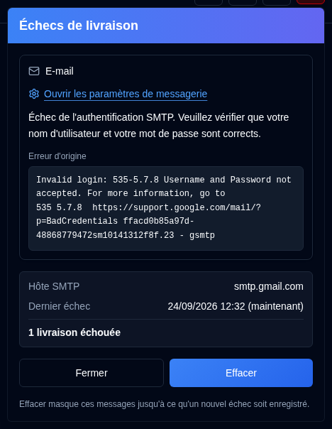

# Échecs de livraison {/* #delivery-failures */}

Un bouton <IconButton icon="lucide:siren" tone="alert" /> avec une teinte rouge clair apparaît dans la [Barre d'application](overview.md#application-toolbar) pour les administrateurs lorsque la livraison par e-mail ou ntfy échoue. Il reste masqué lorsque les deux chaînes sont opérationnelles, et il n'est pas affiché sur la page de connexion. Les utilisateurs réguliers ne le voient pas.

Ouvrir le bouton pour afficher une carte par chaîne en échec (E-mail, ntfy), et non une ligne par entrée d'audit. Chaque carte affiche :

- L'erreur, ainsi qu'une **Erreur d'origine** en police monospace lorsque la réponse SMTP a été enregistrée
- L'hôte SMTP ou le topic ntfy
- L'heure du dernier échec
- Le nombre de livraisons ayant échoué depuis le dernier succès, ou depuis que vous avez effacé cette chaîne

**Ouvrir les paramètres de messagerie** redirige vers [Paramètres → E-mail](settings/email-settings.md). **Ouvrir les paramètres NTFY** redirige vers [Paramètres → NTFY](settings/ntfy-settings.md).

**Fermer** ne fait que masquer le panneau. **Effacer** masque les chaînes répertoriées jusqu'à ce qu'un nouvel échec soit enregistré, même si le texte de l'erreur est identique. Une livraison réussie par la suite maintient le bouton masqué. Cela inclut `email_sent`, `notification_sent` et l'envoi réussi d'un [Résumé quotidien](settings/daily-summary-settings.md) pour cette chaîne.
