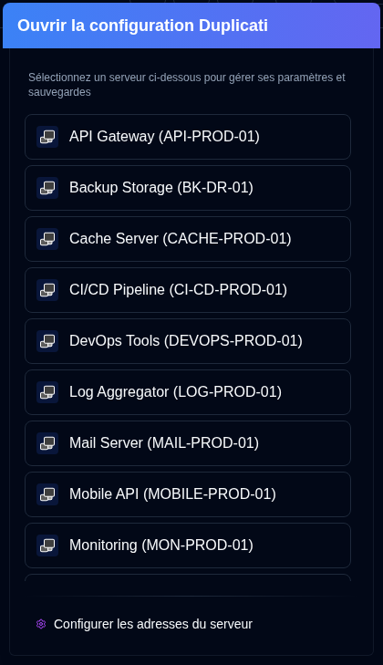

# Configuration Duplicati {#duplicati-configuration}

Le bouton <SvgButton svgFilename="duplicati_logo.svg" /> de la [Barre d'outils de l'application](overview#application-toolbar) ouvre l'interface web du Serveur Duplicati dans un nouvel onglet.

Vous pouvez sélectionner un serveur dans la liste déroulante. Si vous avez déjà sélectionné un serveur (en cliquant sur sa carte) ou consultez ses détails, le bouton ouvrira directement la Configuration Duplicati de ce serveur spécifique.

- La liste des serveurs affichera le `nom du serveur` ou `alias du serveur (nom du serveur)`.
- Les adresses des serveurs sont configurées dans [`Paramètres → Serveur`](settings/server-settings.md).
- L'application enregistre automatiquement l'URL d'un serveur quand vous utilisez la fonctionnalité <IconButton icon="lucide:download" height="16" href="collect-backup-logs" /> [`Collecter les journaux de sauvegarde`](collect-backup-logs.md).
- Les serveurs n'apparaîtront pas dans la liste des serveurs si leur adresse n'a pas été configurée.

## Accès à l'ancienne interface utilisateur de Duplicati {#accessing-the-old-duplicati-ui}

Si vous rencontrez des problèmes de connexion avec la nouvelle interface web Duplicati (`/ngclient/`), vous pouvez faire un clic droit sur le bouton <SvgButton svgFilename="duplicati_logo.svg" /> ou sur n'importe quel élément serveur dans le popover de sélection du serveur pour ouvrir l'ancienne interface utilisateur Duplicati (`/ngax/`) dans un nouvel onglet.

  

:::note
Tous les noms de produits, marques commerciales et marques déposées sont la propriété de leurs propriétaires respectifs. Les icônes et les noms sont utilisés à titre d'identification uniquement et n'impliquent pas une approbation.
:::
