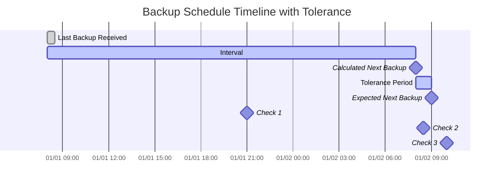

import { ZoomMermaid } from '@site/src/components/ZoomMermaid';

# Surveillance des sauvegardes en retard {#overdue-monitoring}

La fonctionnalité de surveillance des sauvegardes en retard vous permet de suivre et d'alerter sur les sauvegardes en retard. Les notifications peuvent être via NTFY ou E-mail.

Dans l'interface utilisateur, les sauvegardes en retard sont affichées avec une icône d'avertissement . Le survol de l'icône affiche les détails de la sauvegarde en retard, notamment la dernière heure de sauvegarde, l'heure de sauvegarde attendue, la période de tolérance et l'heure de la prochaine sauvegarde attendue.

## Processus de Vérification en Retard {#overdue-check-process}

**Fonctionnement :**

| **Étape** | **Valeur**                  | **Description**                                   | **Exemple**        |
|:--------:|:---------------------------|:--------------------------------------------------|:-------------------|
|    1     | **Dernière sauvegarde**            | L'horodatage de la dernière sauvegarde réussie.      | `2024-01-01 08:00` |
|    2     | **Intervalle attendu**      | La fréquence de sauvegarde configurée.                  | `1 day`            |
|    3     | **Prochaine sauvegarde calculée** | `Dernière sauvegarde` + `Intervalle attendu`               | `2024-01-02 08:00` |
|    4     | **Tolérance**              | La période de grâce configurée (temps supplémentaire autorisé). | `1 hour`           |
|    5     | **Prochaine sauvegarde attendue**   | `Prochaine sauvegarde calculée` + `Tolérance`            | `2024-01-02 09:00` |

Une sauvegarde est considérée comme **en retard** si l'heure actuelle est ultérieure à l'heure de la `Sauvegarde Suivante Attendue`.

<ZoomMermaid>

</ZoomMermaid>

**Exemples basés sur la chronologie ci-dessus :**

- À `2024-01-01 21:00` (🔹Vérification 1), la sauvegarde est **à l'heure**.
- À `2024-01-02 08:30` (🔹Vérification 2), la sauvegarde est **à l'heure**, car elle se situe toujours dans la période de tolérance.
- À `2024-01-02 10:00` (🔹Vérification 3), la sauvegarde est **en retard**, car cela dépasse l'heure de la `Sauvegarde Suivante Attendue`.

## Vérifications Périodiques {#periodic-checks}

**duplistatus** effectue des vérifications périodiques des sauvegardes en retard à des intervalles configurables. L'intervalle par défaut est de 20 minutes, mais vous pouvez le configurer dans [Paramètres → Surveillance des sauvegardes en retard](settings/overdue-settings.md).

## Configuration Automatique {#automatic-configuration}

Quand vous collectez les journaux de sauvegarde à partir d'un serveur Duplicati, **duplistatus** effectue automatiquement :

- Extrait la planification de sauvegarde de la Configuration Duplicati
- Met à jour les intervalles de Surveillance des sauvegardes en retard pour correspondre exactement
- Synchronise les Jours de la semaine autorisés et les heures planifiées
- Préserve vos préférences de notification

:::tip
Pour obtenir les meilleurs résultats, collectez les journaux de sauvegarde après avoir modifié les intervalles de travaux de sauvegarde dans votre serveur Duplicati. Cela garantit que **duplistatus** reste synchronisé avec votre configuration actuelle.
:::

Consultez la section [Paramètres en retard](settings/overdue-settings.md) pour connaître les options de configuration détaillées.
