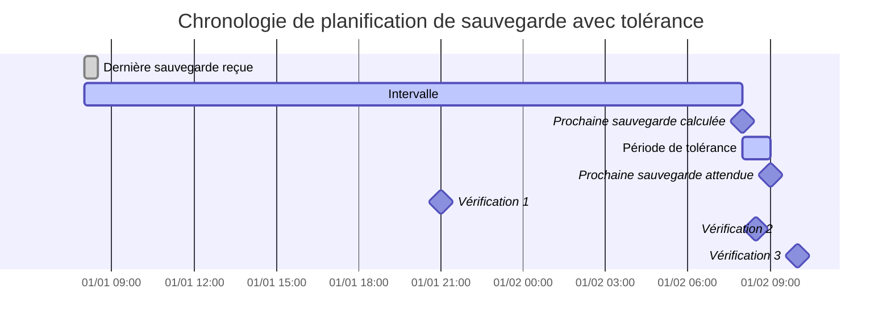

importer { ZoomMermaid } de '@site/src/components/ZoomMermaid';

# Surveillance des sauvegardes en retard {#overdue-monitoring}

La fonctionnalité de surveillance des sauvegardes en retard vous permet de suivre et d'alerter sur les sauvegardes qui sont en retard. Les notifications peuvent être envoyées via NTFY ou E-mail.

Dans l'interface utilisateur, les sauvegardes en retard sont affichées avec une icône d'avertissement . Le survol de l'icône affiche les détails de la sauvegarde en retard, y compris l'heure de la dernière sauvegarde, l'heure de sauvegarde attendue, la période de tolérance et l'heure de la prochaine sauvegarde attendue.

## Processus de vérification des sauvegardes en retard {#overdue-check-process}

**Fonctionnement :**

| **Étape** | **Valeur**                        | **Description**                                                                                    | **Exemple**        |
| :-------: | :-------------------------------- | :------------------------------------------------------------------------------------------------- | :----------------- |
|     1     | **Dernière sauvegarde**           | L'horodatage de la dernière sauvegarde réussie.                                    | `2024-01-01 08:00` |
|     2     | **Intervalle attendu**            | La fréquence de sauvegarde configurée.                                             | `1 jour`           |
|     3     | **Prochaine sauvegarde calculée** | `Dernière sauvegarde` + `Intervalle attendu`                                                       | `2024-01-02 08:00` |
|     4     | **Tolérance**                     | La période de grâce configurée (temps supplémentaire autorisé). | `1 heure`          |
|     5     | **Prochaine sauvegarde attendue** | `Prochaine sauvegarde calculée` + `Tolérance`                                                      | `2024-01-02 09:00` |

Une sauvegarde est considérée comme **en retard** si l'heure actuelle est ultérieure à l'heure de la `Prochaine sauvegarde attendue`.

<ZoomMermaid>

</ZoomMermaid>

**Exemples basés sur la chronologie ci-dessus :**

- À `2024-01-01 21:00` (🔹Vérification 1), la sauvegarde est **à l'heure**.
- À `2024-01-02 08:30` (🔹Vérification 2), la sauvegarde est **à l'heure**, car elle est toujours dans la période de tolérance.
- À `2024-01-02 10:00` (🔹Vérification 3), la sauvegarde est **en retard**, car c'est après l'heure de la `Prochaine sauvegarde attendue`.

## Vérifications périodiques {#periodic-checks}

**duplistatus** effectue des vérifications périodiques des sauvegardes en retard à des intervalles configurables. L'intervalle par défaut est de 20 minutes, mais vous pouvez le configurer dans [Paramètres → Surveillance des sauvegardes en retard](settings/overdue-settings.md).

## Configuration automatique {#automatic-configuration}

Lorsque vous collectez les journaux de sauvegarde d'un serveur Duplicati, **duplistatus** effectue automatiquement :

- L'extraction de la planification de sauvegarde à partir de la configuration Duplicati
- La mise à jour des intervalles de surveillance des sauvegardes en retard pour correspondre exactement
- La synchronisation des jours de la semaine autorisés et des heures planifiées
- La préservation de vos préférences de notification

:::tip
Pour de meilleurs résultats, collectez les journaux de sauvegarde après avoir modifié les intervalles des tâches de sauvegarde sur votre serveur Duplicati. Cela garantit que **duplistatus** reste synchronisé avec votre configuration actuelle.
:::

Consultez la section [Paramètres de surveillance des sauvegardes en retard](settings/overdue-settings.md) pour les options de configuration détaillées.
```

