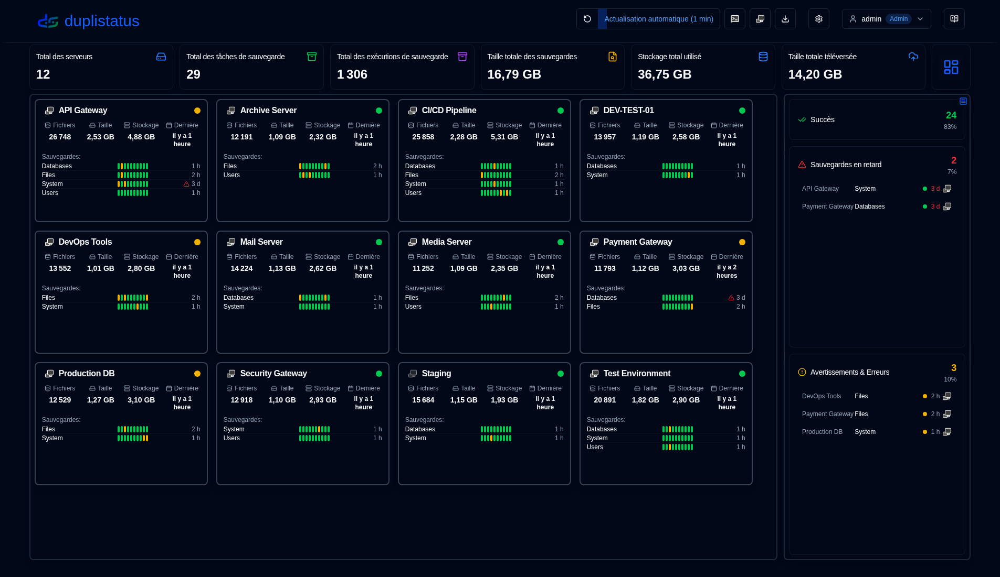
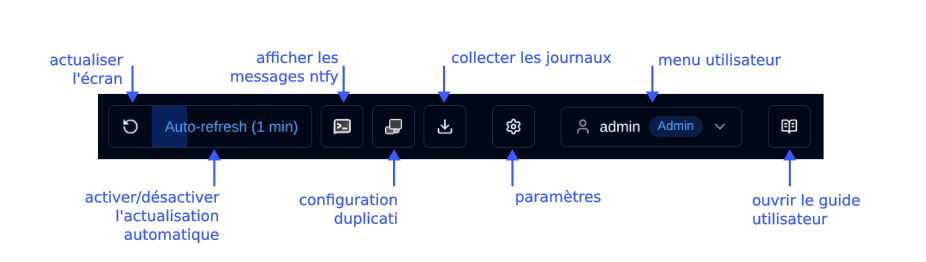

# Vue d'ensemble {#overview}

Bienvenue dans le guide utilisateur duplistatus. Ce document complet fournit des instructions détaillées pour utiliser duplistatus afin de surveiller et gérer vos opérations de sauvegarde Duplicati sur plusieurs serveurs.

## Qu'est-ce que duplistatus ? {#what-is-duplistatus}

duplistatus est un puissant tableau de bord de surveillance conçu spécifiquement pour les systèmes de sauvegarde Duplicati. Il fournit :

- Surveillance centralisée de plusieurs serveurs Duplicati depuis une interface unique
- Suivi en temps réel du statut de toutes les opérations de sauvegarde
- Détection automatique des sauvegardes en retard avec des alertes configurables
- Métriques complètes et visualisation des performances de sauvegarde
- Système de notification flexible via NTFY et e-mail
- Support multilingue (anglais, français, allemand, espagnol et portugais brésilien).

## Installation {#installation}

Pour les prérequis et les instructions d'installation détaillées, veuillez consulter le [Guide d'installation](../installation/installation.md).

## Accès au Tableau de bord {#accessing-the-dashboard}

Après une installation réussie, accédez à l'interface web duplistatus en suivant ces étapes :

1. Ouvrez votre navigateur web préféré
2. Accédez à `http://your-server-ip:9666`
   - Remplacez `your-server-ip` par l'adresse IP réelle ou le nom d'hôte de votre serveur duplistatus
   - Le port par défaut est `9666`
3. Une page de connexion vous sera présentée.

Utilisez ces identifiants pour la première utilisation (ou après une mise à niveau à partir de versions antérieures à 0.9.x) :
    - nom d'utilisateur : `admin`
    - mot de passe : `Duplistatus09`

Sélectionnez la langue de l'interface utilisateur dans le coin supérieur droit <IconButton icon="lucide:languages" label="Langue" />, ou dans <IconButton icon="lucide:user" label="nom d'utilisateur" /> après la connexion (voir ci-dessous).

4. Après la connexion, le tableau de bord principal s'affichera automatiquement (sans données lors de la première utilisation)

## Vue d'ensemble de l'interface utilisateur {#user-interface-overview}

duplistatus fournit un tableau de bord intuitif pour surveiller les opérations de sauvegarde Duplicati dans l'ensemble de votre infrastructure.

L'interface utilisateur est organisée en plusieurs sections clés pour offrir une expérience de surveillance claire et complète :

1. [Barre d'outils de l'application](#application-toolbar): Accès rapide aux fonctions et configurations essentielles
2. [Résumé du tableau de bord](dashboard.md#dashboard-summary): Statistiques de vue d'ensemble pour tous les serveurs surveillés
3. Vue d'ensemble des serveurs : [Disposition en cartes](dashboard.md#cards-layout) ou [disposition en tableau](dashboard.md#table-layout) affichant le statut le plus récent de toutes les sauvegardes
4. [Détails des retards](dashboard.md#overdue-details): Avertissements visuels pour les sauvegardes en retard avec informations détaillées au survol
5. [Versions de sauvegarde disponibles](dashboard.md#available-backup-versions): Cliquez sur l'icône bleue pour afficher les versions de sauvegarde disponibles à la destination
6. [Métriques de sauvegarde](backup-metrics.md): Graphiques interactifs affichant les performances de sauvegarde au fil du temps
7. [Détails du serveur](server-details.md): Liste complète des sauvegardes enregistrées pour des serveurs spécifiques, incluant des statistiques détaillées
8. [Détails de la sauvegarde](server-details.md#backup-details): Informations approfondies pour les sauvegardes individuelles, incluant les journaux d'exécution, les avertissements et les erreurs

## Barre d'outils de l'application {#application-toolbar}

La barre d'outils de l'application fournit un accès pratique aux fonctions et paramètres clés, organisés pour un flux de travail efficace.

| Bouton                                                                                                                                           | Description                                                                                                                                                                  |
|--------------------------------------------------------------------------------------------------------------------------------------------------|------------------------------------------------------------------------------------------------------------------------------------------------------------------------------|
| <IconButton icon="lucide:rotate-ccw" /> &nbsp; Actualiser l'écran                                                                                    | Exécuter une actualisation manuelle immédiate de toutes les données                                                                                                                       |
| <IconButton label="Actualisation auto" />                                                                                                              | Activer ou désactiver la fonctionnalité d'actualisation automatique. Configurer dans [Paramètres d'affichage](settings/display-settings.md)   _Clic droit_ pour ouvrir la page des paramètres d'affichage           |
| <SvgButton svgFilename="ntfy.svg" /> &nbsp; Ouvrir NTFY                                                                                            | Accéder au site web ntfy.sh pour votre sujet de notification configuré.   _Clic droit_ pour afficher un code QR permettant de configurer votre appareil pour recevoir des notifications de duplistatus. |
| <SvgButton svgFilename="duplicati_logo.svg" href="duplicati-configuration" /> &nbsp; [Configuration Duplicati](duplicati-configuration.md)       | Ouvrir l'interface web du serveur Duplicati sélectionné   _Clic droit_ pour ouvrir l'interface utilisateur Duplicati legacy (`/ngax`) dans un nouvel onglet                                                                                                                           |
| <IconButton icon="lucide:download" href="collect-backup-logs" /> &nbsp; [Collecter les journaux](collect-backup-logs.md)                                   | Se connecter aux serveurs Duplicati et récupérer les journaux de sauvegarde   _Clic droit_ pour collecter les journaux de tous les serveurs configurés                                                         |
| <IconButton icon="lucide:settings" href="settings/backup-notifications-settings" /> &nbsp; [Paramètres](settings/backup-notifications-settings.md) | Configurer les notifications, la surveillance, le serveur SMTP et les modèles de notification                                                                                 |
| <IconButton icon="lucide:user" label="nom d'utilisateur" />                                                                                               | Afficher l'utilisateur connecté, le type d'utilisateur (`Admin`, `Utilisateur`), cliquer pour ouvrir le menu utilisateur (inclut la sélection de langue). Plus d'informations dans [Gestion des utilisateurs](settings/user-management-settings.md)                               |
| <IconButton icon="lucide:book-open-text" href="overview" /> &nbsp; Guide utilisateur                                                                    | Ouvrir le [Guide utilisateur](overview.md) à la section pertinente pour la page actuellement consultée. L'info-bulle affiche « Aide pour [Nom de la page] » pour indiquer quelle documentation sera ouverte.                                                                           |

### Menu Utilisateur {#user-menu}

Cliquer sur le bouton utilisateur ouvre un menu déroulant avec des options spécifiques à l'utilisateur. Les options de menu diffèrent selon que vous êtes connecté en tant qu'administrateur ou utilisateur standard. Les deux rôles peuvent changer la langue de l'interface via le sous-menu **Langue**. Langues prises en charge : anglais, français, allemand, espagnol et portugais brésilien.

<table>
  <tr>
    <th>Admin</th>
    <th>Utilisateur régulier</th>
  </tr>
  <tr>
    <td style={{verticalAlign: 'top'}}></td>
    <td style={{verticalAlign: 'top'}}></td>
  </tr>
</table>

## Configuration Essentielle {#essential-configuration}

1. Configurez vos [serveurs Duplicati](../installation/duplicati-server-configuration.md) pour envoyer les messages de journaux de sauvegarde à duplistatus (requis).
2. Collectez les journaux de sauvegarde initiaux – utilisez la fonctionnalité [Collecter les journaux de sauvegarde](collect-backup-logs.md) pour remplir la base de données avec les données de sauvegarde historiques de tous vos serveurs Duplicati. Cela met également à jour automatiquement les intervalles de surveillance de sauvegarde en fonction de la configuration de chaque serveur.
3. Configurez les paramètres du serveur – configurez les alias de serveur et les notes dans [Paramètres → Serveur](settings/server-settings.md) pour rendre votre tableau de bord plus informatif.
4. Configurez les paramètres NTFY – configurez les notifications via NTFY dans [Paramètres → NTFY](settings/ntfy-settings.md).
5. Configurez les paramètres e-mail – configurez les notifications par e-mail dans [Paramètres → E-mail](settings/email-settings.md).
6. Configurez les notifications de sauvegarde – configurez les notifications par sauvegarde ou par serveur dans [Paramètres → Notifications de sauvegarde](settings/backup-notifications-settings.md).

 

:::info[IMPORTANT]
N'oubliez pas de configurer les serveurs Duplicati pour envoyer les journaux de sauvegarde à duplistatus, comme indiqué dans la section [Configuration Duplicati](../installation/duplicati-server-configuration.md).
:::

 

:::note
Tous les noms de produits, logos et marques déposées sont la propriété de leurs propriétaires respectifs. Les icônes et les noms sont utilisés uniquement à des fins d'identification et n'impliquent aucune approbation.
:::
