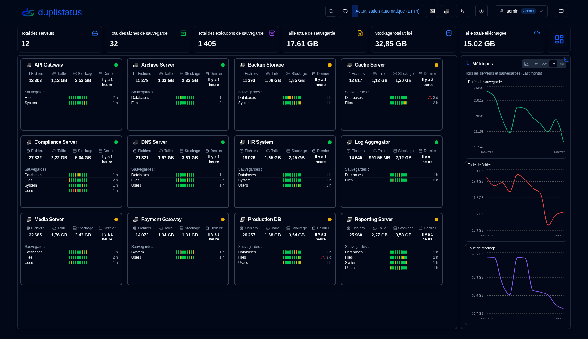
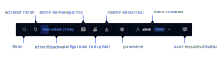
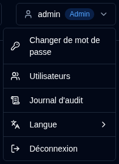
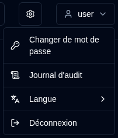

# Vue d'ensemble {#overview}

Bienvenue dans le guide utilisateur duplistatus. Ce document complet fournit des instructions détaillées pour utiliser duplistatus afin de surveiller et gérer vos opérations de sauvegarde Duplicati sur plusieurs serveurs.

## Qu'est-ce que duplistatus ? {#what-is-duplistatus}

duplistatus est un puissant tableau de bord de surveillance conçu spécifiquement pour les systèmes de sauvegarde Duplicati. Il fournit :

- Surveillance centralisée de plusieurs serveurs Duplicati depuis une seule interface
- Suivi en temps réel de l'état de toutes les opérations de sauvegarde
- Détection automatique des sauvegardes en retard avec alertes configurables
- Indicateurs complets et visualisation des performances des sauvegardes
- Système de notification flexible via NTFY et e-mail
- Prise en charge multilingue (anglais, français, allemand, espagnol et portugais brésilien).

## Installation {#installation}

Pour les prérequis et les instructions d'installation détaillées, veuillez consulter le [Guide d'installation](../installation/installation.md).

## Accès au Tableau de bord {#accessing-the-dashboard}

Après une installation réussie, accédez à l'interface web duplistatus en suivant ces étapes :

1. Ouvrez votre navigateur web préféré
2. Accédez à `http://your-server-ip:9666`
   - Remplacez `your-server-ip` par l'adresse IP ou le nom d'hôte réel de votre serveur duplistatus
   - Le port par défaut est `9666`
3. Une page de connexion s'affichera.

Utilisez ces identifiants pour la première utilisation (ou après une mise à niveau à partir de versions antérieures à 0.9.x) :
    - nom d'utilisateur : `admin`
    - mot de passe : `Duplistatus09`

Sélectionnez la langue de l'interface utilisateur dans le coin supérieur droit <IconButton icon="lucide:languages" label="Langue" />, ou dans <IconButton icon="lucide:user" label="nom d'utilisateur" /> après la connexion (voir ci-dessous).

4. Après la connexion, le tableau de bord principal s'affichera automatiquement (sans données lors de la première utilisation)

## Vue d'ensemble de l'interface utilisateur {#user-interface-overview}

duplistatus fournit un tableau de bord intuitif pour surveiller les opérations de sauvegarde Duplicati dans l'ensemble de votre infrastructure.

L'interface utilisateur est organisée en plusieurs sections clés pour offrir une expérience de surveillance claire et complète :

1. [Barre d'outils de l'application](#application-toolbar) : Accès rapide aux fonctions et configurations essentielles
2. [Résumé du tableau de bord](dashboard.md#dashboard-summary) : Statistiques générales pour tous les serveurs surveillés
3. Vue d'ensemble des serveurs : [Disposition en cartes](dashboard.md#cards-layout) ou [disposition en tableau](dashboard.md#table-layout) affichant le statut le plus récent de toutes les sauvegardes
4. [Détails du retard](dashboard.md#overdue-details) : Avertissements visuels pour les sauvegardes en retard, avec des informations détaillées au survol
5. [Versions de sauvegarde disponibles](dashboard.md#available-backup-versions) : Cliquez sur l'icône bleue pour afficher les versions de sauvegarde disponibles à la destination
6. [Indicateurs de sauvegarde](backup-metrics.md) : Graphiques interactifs affichant les performances des sauvegardes dans le temps
7. [Détails du serveur](server-details.md) : Liste complète des sauvegardes enregistrées pour des serveurs spécifiques, incluant des statistiques détaillées
8. [Détails de la sauvegarde](server-details.md#backup-details) : Informations approfondies sur des sauvegardes individuelles, incluant les journaux d'exécution, les avertissements et les erreurs

## Barre d'outils de l'application {#application-toolbar}

La barre d'outils de l'application fournit un accès pratique aux fonctions et paramètres clés, organisés pour un flux de travail efficace.

| Bouton                                                                                                                                           | Description                                                                                                                                                                                |
|--------------------------------------------------------------------------------------------------------------------------------------------------|--------------------------------------------------------------------------------------------------------------------------------------------------------------------------------------------|
| <IconButton icon="lucide:search" /> &nbsp; Filtrer                                                            | Filtrer sur le nom du serveur, l'alias ou le nom de la sauvegarde                                                                                                                          |
| <IconButton icon="lucide:rotate-ccw" /> &nbsp; Actualiser l'écran                                                                                    | Exécuter une actualisation manuelle immédiate de toutes les données                                                                                                                        |
| <IconButton label="Actualisation automatique" />                                                                                                              | Active ou désactive la fonction d'actualisation automatique. Configurez-la dans [Paramètres d'affichage](settings/display-settings.md)   _Clic droit_ pour ouvrir la page Paramètres d'affichage           |
| <SvgButton svgFilename="ntfy.svg" /> &nbsp; Ouvrir NTFY                                                                                            | Accède au site web ntfy.sh pour le sujet de notification configuré.   _Clic droit_ pour afficher un code QR permettant de configurer votre appareil afin de recevoir des notifications depuis duplistatus. |
| <SvgButton svgFilename="duplicati_logo.svg" href="duplicati-configuration" /> &nbsp; [Configuration Duplicati](duplicati-configuration.md)       | Ouvre l'interface web du serveur Duplicati sélectionné   _Clic droit_ pour ouvrir l'interface héritée Duplicati (`/ngax`) dans un nouvel onglet                                                                                                                           |
| <IconButton icon="lucide:download" href="collect-backup-logs" /> &nbsp; [Collecter les journaux](collect-backup-logs.md)                                   | Se connecte aux serveurs Duplicati et récupère les journaux des sauvegardes   _Clic droit_ pour collecter les journaux de tous les serveurs configurés                                                         |
| <IconButton icon="lucide:settings" href="settings/backup-notifications-settings" /> &nbsp; [Paramètres](settings/backup-notifications-settings.md) | Configure les notifications, la surveillance, le serveur SMTP et les modèles de notification                                                                                                 |
| <IconButton icon="lucide:user" label="nom d'utilisateur" />                                                                                               | Afficher l'utilisateur connecté, le type d'utilisateur (`Admin`, `User`), cliquer pour ouvrir le menu utilisateur (inclut la sélection de la langue). En savoir plus dans [Gestion des utilisateurs](settings/user-management-settings.md)                               |
| <IconButton icon="lucide:book-open-text" href="overview" /> &nbsp; Guide de l'utilisateur                                                                    | Ouvrir le [Guide de l'utilisateur](overview.md) à la section correspondant à la page que vous consultez actuellement. L'info-bulle affiche « Aide pour [Page Name] » pour indiquer quelle documentation sera ouverte.                                                                           |

### Menu Utilisateur {#user-menu}

Cliquer sur le bouton utilisateur ouvre un menu déroulant avec des options spécifiques à l'utilisateur. Les options de menu diffèrent selon que vous êtes connecté en tant qu'administrateur ou utilisateur standard. Les deux rôles peuvent changer la langue de l'interface via le sous-menu **Langue**. Langues prises en charge : anglais, français, allemand, espagnol et portugais brésilien.

<table>
  <tr>
    <th>Admin</th>
    <th>Utilisateur régulier</th>
  </tr>
  <tr>
    <td style={{verticalAlign: 'top'}}></td>
    <td style={{verticalAlign: 'top'}}></td>
  </tr>
</table>

## Configuration Essentielle {#essential-configuration}

1. Configurez vos [serveurs Duplicati](../installation/duplicati-server-configuration.md) pour envoyer les messages de journal de sauvegarde à duplistatus (requis).
2. Collectez les journaux de sauvegarde initiaux – utilisez la fonctionnalité [Collecter les journaux de sauvegarde](collect-backup-logs.md) pour remplir la base de données avec les données historiques de sauvegarde provenant de tous vos serveurs Duplicati. Cela met également à jour automatiquement les intervalles de surveillance des sauvegardes en fonction de la configuration de chaque serveur.
3. Configurez les paramètres du serveur – définissez des alias et des notes pour les serveurs dans [Paramètres → Serveur](settings/server-settings.md) afin de rendre votre tableau de bord plus informatif.
4. Configurez les paramètres NTFY – configurez les notifications via NTFY dans [Paramètres → NTFY](settings/ntfy-settings.md).
5. Configurez les paramètres de messagerie – configurez les notifications par courriel dans [Paramètres → E-mail](settings/email-settings.md).
6. Configurez les notifications de sauvegarde – configurez des notifications par sauvegarde ou par serveur dans [Paramètres → Notifications de sauvegarde](settings/backup-notifications-settings.md).

 

:::info[IMPORTANT]
N'oubliez pas de configurer les serveurs Duplicati pour envoyer les journaux de sauvegarde à duplistatus, comme indiqué dans la section [Configuration Duplicati](../installation/duplicati-server-configuration.md).
:::

 

:::note
Tous les noms de produits, logos et marques déposées sont la propriété de leurs propriétaires respectifs. Les icônes et les noms sont utilisés uniquement à des fins d'identification et n'impliquent aucune approbation.
:::
