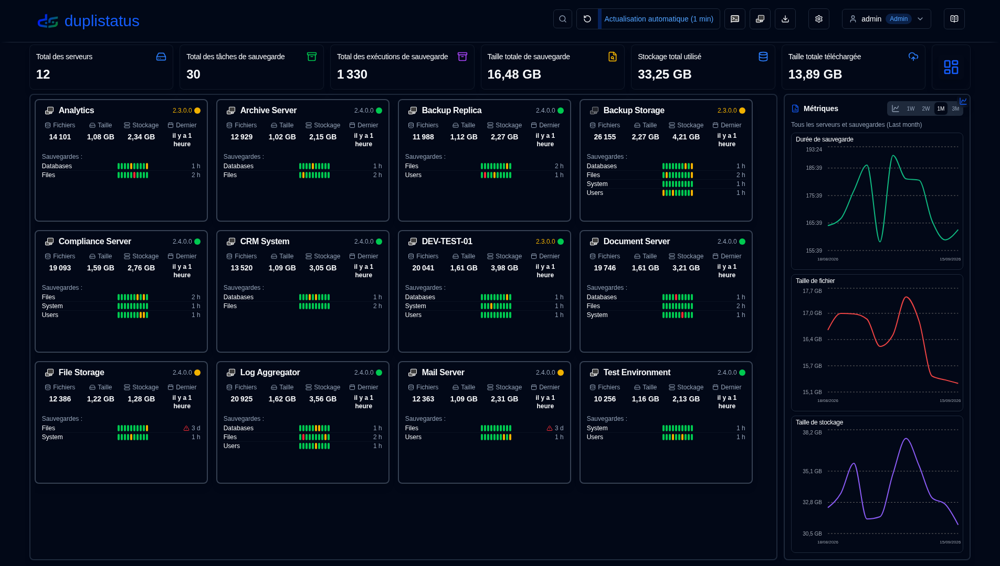
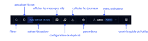
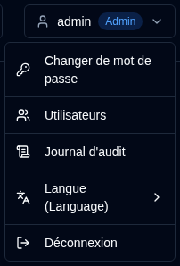
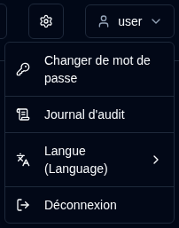

# Aperçu {/* #overview */}

Bienvenue dans le guide utilisateur de duplistatus. Ce document complet fournit des instructions détaillées pour utiliser duplistatus afin de surveiller et gérer vos opérations de sauvegarde Duplicati sur plusieurs serveurs.

## Qu'est-ce que duplistatus ? {/* #what-is-duplistatus */}

duplistatus est un puissant tableau de bord de surveillance conçu spécifiquement pour les systèmes de sauvegarde Duplicati. Il fournit :

- Surveillance centralisée de plusieurs serveurs Duplicati depuis une seule interface
- Suivi en temps réel de l'état de toutes les opérations de sauvegarde
- Détection automatisée des sauvegardes en retard avec alertes configurables
- Métriques complètes et visualisation des performances de sauvegarde
- Système de notification flexible via NTFY et e-mail
- Fonctionnalités facultatives de [durcissement de sécurité](../installation/security-hardening.md)
- Prise en charge multilingue (anglais, français, allemand, espagnol, portugais brésilien, hindi et chinois simplifié).

## Installation {/* #installation */}

Pour les prérequis et les instructions d'installation détaillées, veuillez consulter le [Guide d'installation](../installation/installation.md).

## Accéder au tableau de bord {/* #accessing-the-dashboard */}

Après une installation réussie, accédez à l'interface web de duplistatus en suivant ces étapes :

1. Ouvrez votre navigateur web préféré
2. Accédez à `http://your-server-ip:9666`
   - Remplacez `your-server-ip` par l'adresse IP ou le nom d'hôte réel de votre serveur duplistatus
   - Le port par défaut est `9666`
3. Une page de connexion s'affichera.

Utilisez ces identifiants pour la première utilisation (ou après une mise à niveau depuis les versions antérieures à 0.9.x) :
    - nom d'utilisateur : `admin`
    - mot de passe : `Duplistatus09`

Sélectionnez la langue de l'interface utilisateur dans le coin supérieur droit <IconButton icon="lucide:languages" label="Langue" />, ou dans <IconButton icon="lucide:user" label="nom d'utilisateur" /> après la connexion (voir ci-dessous).

4. Après la connexion, le tableau de bord principal s'affichera automatiquement (sans données lors de la première utilisation)

## Aperçu de l'interface utilisateur {/* #user-interface-overview */}

duplistatus fournit un tableau de bord intuitif pour surveiller les opérations de sauvegarde Duplicati sur toute votre infrastructure.

L'interface utilisateur est organisée en plusieurs sections clés pour offrir une expérience de surveillance claire et complète :

1. [Barre d'outils de l'application](#application-toolbar) : Accès rapide aux fonctions et configurations essentielles
2. [Résumé du tableau de bord](dashboard.md#dashboard-summary) : Statistiques générales pour tous les serveurs surveillés
3. Aperçu des serveurs : [Disposition en cartes](dashboard.md#cards-layout) ou [disposition en tableau](dashboard.md#table-layout) montrant le dernier statut de toutes les sauvegardes, y compris la [version du serveur Duplicati](dashboard.md#duplicati-server-version) du dernier journal de sauvegarde reçu
4. [Détails du retard](dashboard.md#overdue-details) : Avertissements visuels pour les sauvegardes en retard avec informations détaillées au survol
5. [Versions de sauvegarde disponibles](dashboard.md#available-backup-versions) : Cliquez sur l'icône bleue pour voir les versions de sauvegarde disponibles à la destination
6. [Métriques de sauvegarde](backup-metrics.md) : Graphiques interactifs affichant les performances de sauvegarde au fil du temps
7. [Détails du serveur](server-details.md) : Liste complète des sauvegardes enregistrées pour des serveurs spécifiques, y compris des statistiques détaillées
8. [Détails de la sauvegarde](server-details.md#backup-details) : Informations approfondies pour des sauvegardes individuelles, y compris les journaux d'exécution, les avertissements et les erreurs

## Barre d'outils de l'application {/* #application-toolbar */}

La barre d'outils de l'application fournit un accès pratique aux fonctions et paramètres clés, organisés pour un flux de travail efficace.

| Bouton                                                                                                                                           | Description                                                                                                                                                                                |
|--------------------------------------------------------------------------------------------------------------------------------------------------|--------------------------------------------------------------------------------------------------------------------------------------------------------------------------------------------|
| <IconButton icon="lucide:search" /> &nbsp; Filtre                                                                                            | Rechercher et filtrer les serveurs par ID, URL ou nom de tâche de sauvegarde.                                                      |
| <IconButton icon="lucide:rotate-ccw" /> &nbsp; Actualiser l'écran                                                                                    | Exécuter immédiatement un rafraîchissement manuel de tous les données                                                                                                                                     |
| <IconButton label="Rafraîchissement automatique" />                                                                                                              | Activer ou désactiver la fonctionnalité de rafraîchissement automatique. Configurer dans [Paramètres d'affichage](settings/display-settings.md)   _Clic droit_ pour ouvrir la page Paramètres d'affichage                         |
| <SvgButton svgFilename="ntfy.svg" /> &nbsp; Ouvrir NTFY                                                                                            | Accéder au site web ntfy.sh pour votre sujet de notification configuré.   _Clic droit_ pour afficher un code QR afin de configurer votre appareil pour recevoir des notifications de duplistatus.               |
| <SvgButton svgFilename="duplicati_logo.svg" href="duplicati-configuration" /> &nbsp; [Configuration de Duplicati](duplicati-configuration.md)       | Ouvrir l'interface web du serveur Duplicati sélectionné   _Clic droit_ pour ouvrir l'interface utilisateur héritée de Duplicati (`/ngax`) dans un nouvel onglet                                                              |
| <IconButton icon="lucide:download" href="collect-backup-logs" /> &nbsp; [Collecter les journaux](collect-backup-logs.md)                                   | Se connecter aux serveurs Duplicati et récupérer les journaux de sauvegarde   _Clic droit_ pour collecter les journaux de tous les serveurs configurés                                                                       |
| <IconButton icon="lucide:settings" href="settings/backup-notifications-settings" /> &nbsp; [Paramètres](settings/backup-notifications-settings.md) | Configurer les notifications, la surveillance, le serveur SMTP et les modèles de notification                                                                                                               |
| <IconButton icon="lucide:user" label="nom d'utilisateur" />                                                                                               | Afficher l'utilisateur connecté, le type d'utilisateur (`Admin`, `User`), cliquer pour ouvrir le menu utilisateur (inclut la sélection de la langue). Voir plus dans [Gestion des utilisateurs](settings/user-management-settings.md)               |
| <IconButton icon="lucide:book-open-text" href="overview" /> &nbsp; Guide de l'utilisateur                                                                    | Ouvrir le [Guide de l'utilisateur](overview.md) vers la section pertinente à la page que vous consultez actuellement. L'infobulle affiche "Aide pour [Nom de la page]" pour indiquer quelle documentation sera ouverte. |

### Menu utilisateur {/* #user-menu */}

Cliquer sur le bouton utilisateur ouvre un menu déroulant avec des options spécifiques à l'utilisateur. Les options du menu diffèrent selon que vous êtes connecté en tant qu'administrateur ou utilisateur ordinaire. Les deux rôles peuvent modifier la langue de l'interface via le sous-menu **Langue**. La langue sélectionnée est enregistrée par utilisateur sur ce navigateur (pas comme paramètre système), donc différents comptes peuvent conserver différentes langues. Langues prises en charge : anglais, français, allemand, espagnol, portugais brésilien, hindi et chinois simplifié.

<table>
  <tr>
    <th>Administrateur</th>
    <th>Utilisateur ordinaire</th>
  </tr>
  <tr>
    <td style={{verticalAlign: 'top'}}></td>
    <td style={{verticalAlign: 'top'}}></td>
  </tr>
</table>

## Configuration essentielle {/* #essential-configuration */}

1. Configurez vos [serveurs Duplicati](../installation/duplicati-server-configuration.md) pour envoyer les messages de journal de sauvegarde à duplistatus (requis).
2. Collectez les journaux de sauvegarde initiaux – utilisez la fonctionnalité [Collecter les journaux de sauvegarde](collect-backup-logs.md) pour peupler la base de données avec les données historiques de sauvegarde provenant de tous vos serveurs Duplicati. Cela met également automatiquement à jour les intervalles de surveillance des sauvegardes en fonction de la configuration de chaque serveur.
3. Configurez les paramètres du serveur – définissez des alias et des notes de serveur dans [Paramètres → Serveur](settings/server-settings.md) pour rendre votre tableau de bord plus informatif.
4. Configurez les paramètres NTFY – configurez les notifications via NTFY dans [Paramètres → NTFY](settings/ntfy-settings.md).
5. Configurez les paramètres de messagerie – configurez les notifications par e-mail dans [Paramètres → E-mail](settings/email-settings.md).
6. Configurez les notifications de sauvegarde – configurez les notifications par sauvegarde ou par serveur dans [Paramètres → Notifications de sauvegarde](settings/backup-notifications-settings.md).
7. Facultativement, restreignez l'accès – créez des [clés API](settings/api-keys-settings.md) et/ou des [listes d'autorisation IP](settings/ip-allowlist-settings.md) si vous souhaitez protéger `/api/upload` et l'interface d'administration. Les deux sont désactivés par défaut.

 

:::info[IMPORTANT]
N'oubliez pas de configurer les serveurs Duplicati pour envoyer les journaux de sauvegarde à duplistatus, comme indiqué dans la section [Configuration de Duplicati](../installation/duplicati-server-configuration.md).
:::

 

:::note
 Tous les noms de produits, logos et marques commerciales sont la propriété de leurs propriétaires respectifs. Les icônes et les noms sont utilisés à des fins d'identification uniquement et n'impliquent pas une approbation.
:::

<small>

> **Note sur les traductions de l'interface utilisateur et de la documentation :** Toutes les langues de l'interface et de la documentation autres que l'anglais (Royaume-Uni) ont été traduites avec l'IA à l'aide de [ai-i18n-tools](https://wsj-br.github.io/ai-i18n-tools/) ; la formulation peut être imprécise ou contenir des erreurs.

</small>
