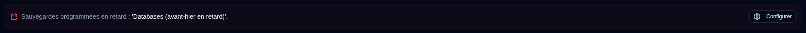
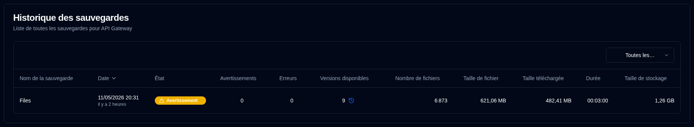

# Détails du Serveur {#server-details}

Cliquer sur un serveur du tableau de bord ouvre une page avec une liste de sauvegardes pour ce serveur. Vous pouvez afficher toutes les sauvegardes ou sélectionner une sauvegarde spécifique si le serveur a plusieurs sauvegardes configurées.

## Statistiques de serveur/sauvegarde {#serverbackup-statistics}

Cette section affiche les statistiques pour toutes les sauvegardes sur le serveur ou une sauvegarde unique sélectionnée.

- **TOTAL BACKUP JOBS** : Nombre total de tâches de sauvegarde configurées sur ce serveur.
- **TOTAL BACKUP RUNS** : Nombre total d'exécutions de sauvegarde effectuées (tel que signalé par le serveur Duplicati).
- **AVAILABLE VERSIONS** : Nombre de versions disponibles (tel que signalé par le serveur Duplicati).
- **AVG DURATION** : Durée moyenne (moyenne arithmétique) des sauvegardes enregistrées dans la base de données **duplistatus**.
- **LAST BACKUP SIZE** : Taille des fichiers source à partir du dernier journal de sauvegarde reçu.
- **TOTAL STORAGE USED** : Espace de stockage utilisé sur la destination de sauvegarde, tel que rapporté dans le dernier journal de sauvegarde.
- **TOTAL UPLOADED** : Somme de toutes les données téléchargées enregistrées dans la base de données **duplistatus**.

Si cette sauvegarde ou l'une des sauvegardes du serveur (quand **Toutes les sauvegardes** est sélectionné) est en retard, un message apparaît sous le résumé.

Cliquez sur le <IconButton icon="lucide:settings" href="settings/backup-monitoring-settings" label="Configurer"/> pour accéder à [Paramètres → Surveillance des sauvegardes](settings/backup-monitoring-settings.md). Ou cliquez sur le <SvgButton SvgButton svgFilename="duplicati_logo.svg" href="duplicati-configuration" /> dans la barre d'outils pour ouvrir l'interface web du serveur Duplicati et vérifier les journaux.

 

## Historique des sauvegardes {#backup-history}

Ce tableau répertorie les journaux de sauvegarde pour le serveur sélectionné.

- **Backup Name** : Nom de la sauvegarde sur le serveur Duplicati.
- **Date** : Horodatage de la sauvegarde et temps écoulé depuis le dernier rafraîchissement de l'écran.
- **Status** : Statut de la sauvegarde (Succès, Avertissement, Erreur, Fatal).
- **Warnings/Errors** : Nombre d'avertissements/erreurs signalés dans le journal de sauvegarde.
- **Available Versions** : Nombre de versions de sauvegarde disponibles sur la destination. Si l'icône est grisée, les informations détaillées n'ont pas été reçues.
- **File Count, File Size, Uploaded Size, Duration, Storage Size** : Valeurs telles que rapportées par le serveur Duplicati.

:::tip Tips
• Utilisez le menu déroulant dans la section **Historique des sauvegardes** pour sélectionner **Toutes les sauvegardes** ou une sauvegarde spécifique pour ce serveur.

• Vous pouvez trier n'importe quelle colonne en cliquant sur son en-tête, cliquez à nouveau pour inverser l'ordre de tri.
 
• Cliquez n'importe où sur une ligne pour afficher les [Détails de la sauvegarde](#backup-details).

:::

:::note
Quand **Toutes les sauvegardes** est sélectionné, la liste affiche toutes les sauvegardes ordonnées de la plus récente à la plus ancienne par défaut.
:::

 

## Détails de la sauvegarde {#backup-details}

Cliquer sur un badge de statut dans le tableau de bord (vue tableau) ou sur n'importe quelle ligne du tableau de l'historique des sauvegardes affiche les informations de sauvegarde détaillées.

- **Server details** : nom du serveur, alias et note.
- **Backup Information** : Horodatage de la sauvegarde et son identifiant.
- **Backup Statistics** : Résumé des compteurs, tailles et durée signalés.
- **Log Summary** : Nombre de messages signalés.
- **Available Versions** : Liste des versions disponibles (affichée uniquement si l'information a été reçue dans les journaux).
- **Messages/Warnings/Errors** : Journaux complets d'exécution. Le sous-titre indique si le journal a été tronqué par le serveur Duplicati.

 

:::note
Reportez-vous aux [instructions de Configuration Duplicati](../installation/duplicati-server-configuration.md) pour apprendre comment configurer le Serveur Duplicati afin d'envoyer les Journaux d'exécution complets et d'éviter la troncature.
:::
