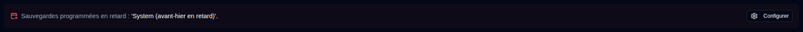
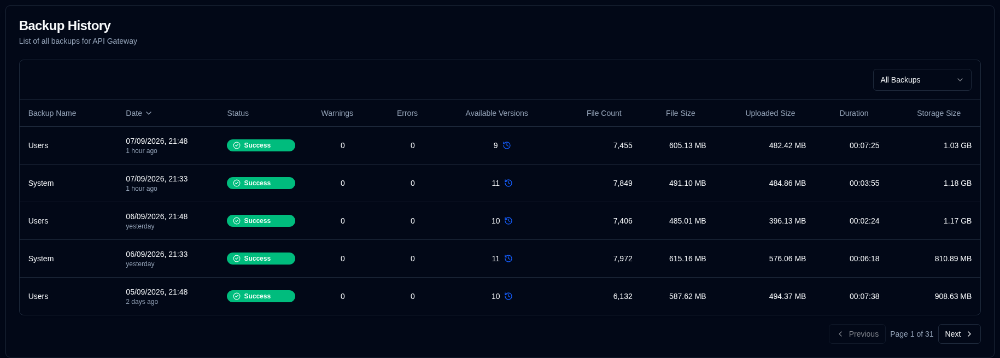

# Détails du serveur {/* #server-details */}

Cliquez sur un serveur depuis le tableau de bord pour ouvrir une page avec la liste des sauvegardes pour ce serveur. Vous pouvez afficher toutes les sauvegardes ou sélectionner une sauvegarde spécifique si le serveur a plusieurs sauvegardes configurées.

## Statistiques du serveur/sauvegarde {/* #serverbackup-statistics */}

Cette section affiche les statistiques pour toutes les sauvegardes du serveur ou une seule sauvegarde sélectionnée.

- **TOTAL DES TÂCHES DE SAUVEGARDE** : Nombre total de tâches de sauvegarde configurées sur ce serveur.
- **TOTAL DES EXÉCUTIONS DE SAUVEGARDE** : Nombre total d'exécutions de sauvegarde exécutées (comme rapporté par le serveur Duplicati).
- **VERSIONS DISPONIBLES** : Nombre de versions disponibles (comme rapporté par le serveur Duplicati).
- **DURÉE MOYENNE** : Durée moyenne (moyenne) des sauvegardes enregistrées dans la base de données **duplistatus**.
- **TAILLE DE LA DERNIÈRE SAUVEGARDE** : Taille des fichiers source de la dernière sauvegarde reçue.
- **STOCKAGE TOTAL UTILISÉ** : Stockage utilisé sur la destination de sauvegarde, comme rapporté dans le dernier journal de sauvegarde.
- **TOTAL TÉLÉCHARGÉ** : Somme de toutes les données téléchargées enregistrées dans la base de données **duplistatus**.

Si cette sauvegarde ou l'une des sauvegardes du serveur (quand **Toutes les sauvegardes** est sélectionné) est en retard, un message apparaît sous le résumé.

Cliquez sur le <IconButton icon="lucide:settings" href="settings/backup-monitoring-settings" label="Configurer"/> pour aller à [Paramètres → Surveillance des sauvegardes](settings/backup-monitoring-settings.md). Ou cliquez sur le <SvgButton SvgButton svgFilename="duplicati_logo.svg" href="duplicati-configuration" /> sur la barre d'outils pour ouvrir l'interface web du serveur Duplicati et vérifier les journaux.

 

## Historique des sauvegardes {/* #backup-history */}

Ce tableau liste les journaux de sauvegarde pour le serveur sélectionné.

- **Nom de la sauvegarde** : Le nom de la sauvegarde dans le serveur Duplicati.
- **Date** : L'horodatage de la sauvegarde et le temps écoulé depuis le dernier rafraîchissement de l'écran.
- **Statut** : Le statut de la sauvegarde (Succès, Avertissement, Erreur, Fatal).
- **Avertissements/Erreurs** : Le nombre d'avertissements/erreurs rapportés dans le journal de sauvegarde.
- **Versions disponibles** : Le nombre de versions de sauvegarde disponibles sur la destination de sauvegarde. Si l'icône est grisée, les informations détaillées n'ont pas été reçues.
- **Nombre de fichiers, Taille de fichier, Taille téléchargée, Durée, Taille de stockage** : Valeurs comme rapportées par le serveur Duplicati.

:::tip Conseils
• Utilisez le menu déroulant dans la section **Historique des sauvegardes** pour sélectionner **Toutes les sauvegardes** ou une sauvegarde spécifique pour ce serveur.

• Vous pouvez trier n'importe quelle colonne en cliquant sur son en-tête, cliquez à nouveau pour inverser l'ordre de tri.
 
• Cliquez n'importe où sur une ligne pour afficher les [Détails de la sauvegarde](#backup-details).

:::

:::note
Quand **Toutes les sauvegardes** est sélectionné, la liste affiche toutes les sauvegardes triées du plus récent au plus ancien par défaut.
:::

 

## Détails de la sauvegarde {/* #backup-details */}

Cliquez sur un badge de statut dans le tableau de bord (vue tableau) ou sur n'importe quelle ligne du tableau d'historique des sauvegardes pour afficher les informations détaillées de la sauvegarde.

- **Détails du serveur** : nom du serveur, alias et note.
- **Informations de sauvegarde** : l'horodatage de la sauvegarde et son identifiant.
- **Statistiques de sauvegarde** : un résumé des compteurs signalés, des tailles et de la durée.
- **Résumé du journal** : le nombre de messages signalés.
- **Versions disponibles** : une liste des versions disponibles (affichée uniquement si les informations ont été reçues dans les journaux).
- **Messages/Avertissements/Erreurs** : les journaux d'exécution complets. Le sous-titre indique si le journal a été tronqué par le serveur Duplicati.

 

:::note
Consultez les [instructions de configuration de Duplicati](../installation/duplicati-server-configuration.md) pour apprendre à configurer le serveur Duplicati afin d'envoyer des journaux d'exécution complets et éviter la troncature.
:::
