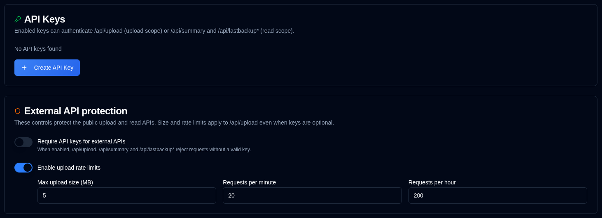

# Clés API {/* #api-keys */}

Les administrateurs peuvent créer des clés API à portée limitée pour les API HTTP externes utilisées par Duplicati et Homepage. Les clés sont optionnelles par défaut, donc les tâches Duplicati existantes continuent de fonctionner.



## N° {/* #scopes */}

| Portée | Points de terminaison |
|-------|-----------|
| Télécharger | `POST /api/upload` |
| Lire | `GET /api/summary`, `GET /api/lastbackup/:id`, `GET /api/lastbackups/:id` |

Une clé de téléchargement ne peut pas appeler les API de lecture, et une clé de lecture ne peut pas télécharger de rapports.

## Création d'une clé {/* #creating-a-key */}

1. Ouvrez **Paramètres → Clés API**.
2. Cliquez sur **Créer une clé API** en bas de la carte Clés API.
3. Entrez un nom, choisissez une portée, et définissez éventuellement une date d'expiration (`YYYY-MM-DD`).
4. Générez la clé et copiez le secret immédiatement. Il n'est affiché qu'une seule fois dans la boîte de dialogue.
5. La liste montre ensuite une empreinte digitale comme `Qk7v…3xTa` (premiers et derniers quatre caractères), la date d'expiration et l'état. La même empreinte digitale apparaît dans le journal d'audit.

### Désactiver ou supprimer {/* #disable-or-delete */}

Utilisez la case à cocher dans la colonne **Actions** pour désactiver une clé sans la supprimer. Les clés désactivées ne peuvent pas s'authentifier. Cochez à nouveau la case pour réactiver la clé. Les clés expirées ne peuvent pas être réactivées ; créez plutôt une nouvelle clé. Supprimer supprime définitivement la clé.

### Expiration {/* #expiry */}

Une date d'expiration optionnelle est le dernier jour du calendrier où la clé reste valide. Elle expire à **23:59:59 ce jour-là dans le fuseau horaire local du navigateur**, et non à minuit au début du jour.

Choisir `2026-12-01` construit `2026-12-01T23:59:59` localement, puis stocke cet instant en UTC. Pour un navigateur en UTC+1, cela donne `2026-12-01T22:59:59.000Z`. La clé reste valide jusqu'au 1er décembre et est considérée comme expirée à partir de 23:59:59 heure locale (`expires_at <= now`). Le tableau Clés API affiche la date d'expiration (ou **Jamais** si aucune n'a été définie). Après cet instant, le badge État passe à **Expiré** (gris); les clés expirées ne peuvent pas s'authentifier même si elles ont été laissées activées.

## Utilisation d'une clé {/* #using-a-key */}

Duplicati ne peut pas définir des en-têtes personnalisés. Mettez la clé dans l'URL du rapport :

```bash
--send-http-json-urls=https://your-host/api/upload?api_key=YOUR_KEY
```

Les widgets Homepage peuvent utiliser le même paramètre de requête :

```yaml
url: http://your-host/api/summary?api_key=YOUR_READ_KEY
```

Les clients qui peuvent envoyer des en-têtes peuvent utiliser `X-Api-Key` ou `Authorization: Bearer` à la place. Les clés de chaîne de requête apparaissent dans les journaux d'accès des proxys inverses.

## Clés requises {/* #require-keys */}

L'interrupteur **Exiger des clés API pour les API externes** est désactivé par défaut. Tant qu'il est désactivé, les requêtes sans clé sont autorisées. Si un client envoie tout de même une clé, une clé valide correspondant à la portée est acceptée et enregistrée ; une clé invalide, désactivée, expirée ou de portée incorrecte est ignorée et la requête est toujours autorisée. Quand vous activez l'interrupteur, les quatre API de données externes renvoient `401` sans une clé valide (et rejettent les mauvaises clés). Activez d'abord au moins une clé de téléchargement et une clé de lecture, sinon les téléchargements de Duplicati et les widgets de la page d'accueil s'arrêteront. Les modifications sont enregistrées automatiquement.

## Protection API externe {/* #external-api-protection */}

La même page peut exiger des clés API pour les API de téléchargement et de lecture publiques, et configure une taille maximale de corps (par défaut 5 Mo) et des limites de taux par IP pour `/api/upload`. Les limites de taille et de taux s'appliquent même lorsque les clés sont optionnelles et constituent la principale défense contre les inondations. Les interrupteurs et les champs de limite sont enregistrés automatiquement ; il n'y a pas de bouton Enregistrer séparé.

Voir aussi [Liste d'adresses IP autorisées](ip-allowlist-settings.md). La Liste d'adresses IP autorisées et les Clés API sont des fonctionnalités indépendantes ; vous pouvez utiliser l'une ou l'autre, ou les deux ensemble. L'activation des deux augmente la sécurité en restreignant l'accès en fonction de l'adresse IP et en nécessitant une clé API.
