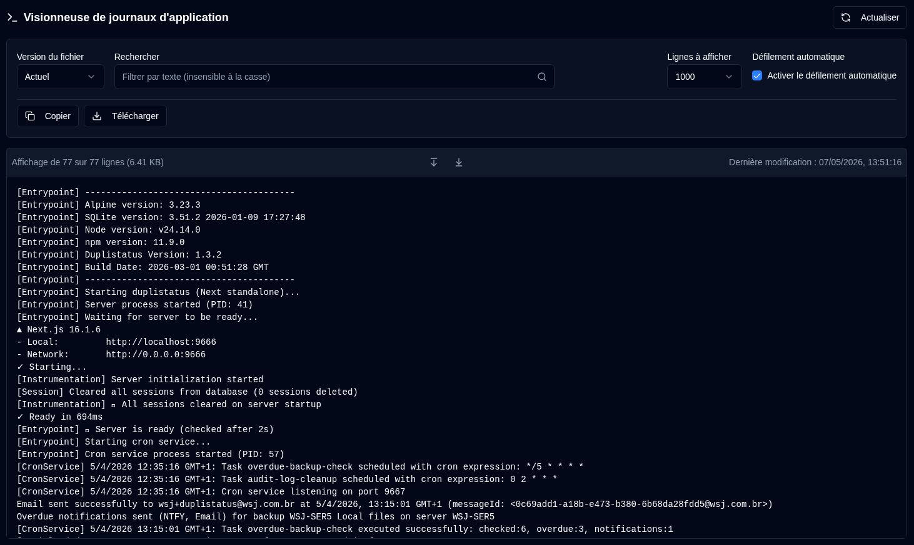

# Journaux d'application {#application-logs}

Le Visualiseur de journaux d'application permet aux administrateurs de surveiller tous les journaux d'application au même endroit, avec filtrage, export et mises à jour en temps réel directement depuis l'interface web.

 

## Actions disponibles {#available-actions}

| Bouton                                                              | Description                                                                                         |
|:--------------------------------------------------------------------|:----------------------------------------------------------------------------------------------------|
| <IconButton icon="lucide:refresh-cw" label="Actualiser" />            | Recharge manuellement les journaux à partir du fichier sélectionné. Affiche un indicateur de chargement pendant l'actualisation et réinitialise le suivi pour la détection des nouvelles lignes. |
| <IconButton icon="lucide:copy" label="Copier dans le presse-papiers" />         | Copie toutes les lignes de journal filtrées dans votre presse-papiers. Respecte le filtre de recherche actuel. Utile pour un partage rapide ou un collage dans d'autres outils. |
| <IconButton icon="lucide:download" label="Exporter" />               | Télécharge les journaux sous forme de fichier texte. Exporte à partir de la version actuelle du fichier sélectionné et applique le filtre de recherche actuel (le cas échéant). Format du nom de fichier : `duplistatus-logs-YYYY-MM-DD.txt` (date au format ISO). |
| <IconButton icon="lucide:arrow-down-from-line" />                   | Accède rapidement au début des journaux affichés. Utile lorsque le défilement automatique est désactivé ou lors de la navigation dans de longs fichiers journaux. |
| <IconButton icon="lucide:arrow-down-to-line" />                    | Accède rapidement à la fin des journaux affichés. Utile lorsque le défilement automatique est désactivé ou lors de la navigation dans de longs fichiers journaux. |

 

## Contrôles et Filtres {#controls-and-filters}

| Contrôle | Description |
|:--------|:-----------|
| **Version du fichier** | Sélectionnez le fichier journal à afficher : **Actuel** (fichier actif) ou fichiers archivés (`.1`, `.2`, etc., les numéros plus élevés correspondent à des fichiers plus anciens). |
| **Lignes à afficher** | Affiche les **100**, **500**, **1000** (par défaut), **5000** ou **10000** lignes les plus récentes du fichier sélectionné. |
| **Défilement automatique** | Lorsqu'activé (par défaut pour le fichier actuel), fait défiler automatiquement vers les nouvelles entrées de journal et actualise toutes les 2 secondes. Fonctionne uniquement pour la version de fichier **Actuel**. |
| **Rechercher** | Filtre les lignes de journal par texte (insensible à la casse). Les filtres s'appliquent aux lignes actuellement affichées. |

 

L'en-tête d'affichage du journal affiche le nombre de lignes filtrées, le nombre total de lignes, la taille des fichiers et l'horodatage de la dernière modification.

 
