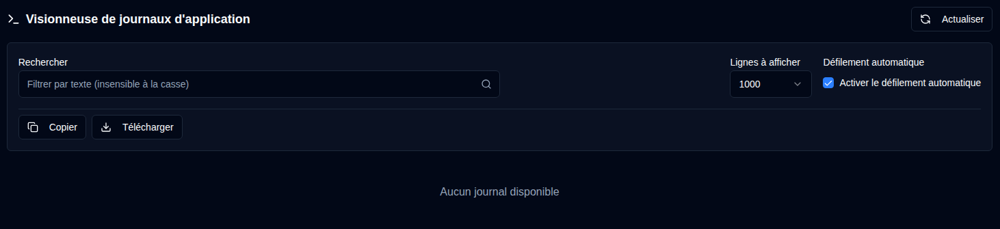

# Journaux de l'application {/* #application-logs */}

La Visionneuse de journaux d'application permet aux administrateurs de surveiller tous les journaux d'application en un seul endroit, avec filtrage, exportation et mises à jour en temps réel directement depuis l'interface web.

 

## Actions disponibles {/* #available-actions */}

| Bouton                                                              | Description                                                                                         |
|:--------------------------------------------------------------------|:----------------------------------------------------------------------------------------------------|
| <IconButton icon="lucide:refresh-cw" label="Actualiser" />            | Recharge manuellement les journaux du fichier sélectionné. Affiche un indicateur de chargement pendant le rafraîchissement et réinitialise le suivi pour la détection des nouvelles lignes. |
| <IconButton icon="lucide:copy" label="Copier dans le presse-papiers" />         | Copie toutes les lignes de journal filtrées dans votre presse-papiers. Respecte le filtre de recherche actuel. Utile pour le partage rapide ou le collage dans d'autres outils. |
| <IconButton icon="lucide:download" label="Exporter" />               | Télécharge les journaux sous forme de fichier texte. Exporte à partir de la version de fichier actuellement sélectionnée et applique le filtre de recherche actuel (le cas échéant). Format de nom de fichier : `duplistatus-logs-YYYY-MM-DD.txt` (date au format ISO). |
| <IconButton icon="lucide:arrow-down-from-line" />                   | Permet de sauter rapidement au début des journaux affichés. Utile lorsque le défilement automatique est désactivé ou lors de la navigation dans des fichiers de journaux longs. |
| <IconButton icon="lucide:arrow-down-to-line" />                    | Permet de sauter rapidement à la fin des journaux affichés. Utile lorsque le défilement automatique est désactivé ou lors de la navigation dans des fichiers de journaux longs. |

 

## Contrôles et filtres {/* #controls-and-filters */}

| Contrôle | Description |
|:--------|:-----------|
| **Version du fichier** | Sélectionnez le fichier de journal à afficher : **Actuel** (fichier actif) ou fichiers tournants (`.1`, `.2`, etc., où les numéros plus élevés sont plus anciens). |
| **Lignes à afficher** | Affiche les **100**, **500**, **1000** (par défaut), **5000** ou **10000** lignes les plus récentes du fichier sélectionné. |
| **Défilement automatique** | Lorsque c'est activé (par défaut pour le fichier actuel), défile automatiquement vers les nouvelles entrées de journal et se rafraîchit toutes les 2 secondes. Ne fonctionne que pour la version de fichier **Actuel**. |
| **Rechercher** | Filtre les lignes de journal par texte (insensible à la casse). Les filtres s'appliquent aux lignes actuellement affichées. |

 

L'en-tête d'affichage des journaux montre le nombre de lignes filtrées, le nombre total de lignes, la taille du fichier et l'horodatage de la dernière modification.

 
