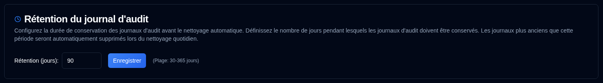

# Rétention du journal d'audit {#audit-log-retention}

Configurer la durée de conservation des journaux d'audit avant le nettoyage automatique.

| Paramètre | Description | Valeur par défaut |
|:-------|:-----------|:-------------|
| **Rétention (jours)** | Nombre de jours de conservation des journaux d'audit avant suppression automatique | **90 jours** |

## Paramètres de rétention {#retention-settings}

- **Plage** : 30 à 365 jours
- **Nettoyage automatique** : S'exécute quotidiennement à 02:00 UTC (non configurable)
- **Nettoyage manuel** : Disponible via API pour les administrateurs (voir [Nettoyage des journaux d'audit](../../api-reference/administration-apis.md#cleanup-audit-logs-apiaudit-logcleanup))
