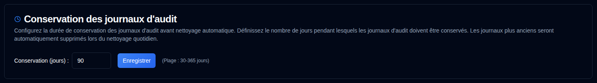

# Conservation des journaux d'audit {/* #audit-log-retention */}

Configurer la durée de conservation des journaux d'audit avant le nettoyage automatique.

| Paramètre | Description | Valeur par défaut |
|:-------|:-----------|:-------------|
| **Conservation (jours)** | Nombre de jours pendant lesquels conserver les journaux d'audit avant suppression automatique | **90 jours** |

## Paramètres de conservation {/* #retention-settings */}

- **Plage** : 30 à 365 jours
- **Nettoyage automatique** : s'exécute quotidiennement à 02h00 UTC (non configurable)
- **Nettoyage manuel** : disponible via l'API pour les administrateurs (voir [Nettoyer les journaux d'audit](../../api-reference/administration-apis.md#cleanup-audit-logs---apiaudit-logcleanup))
