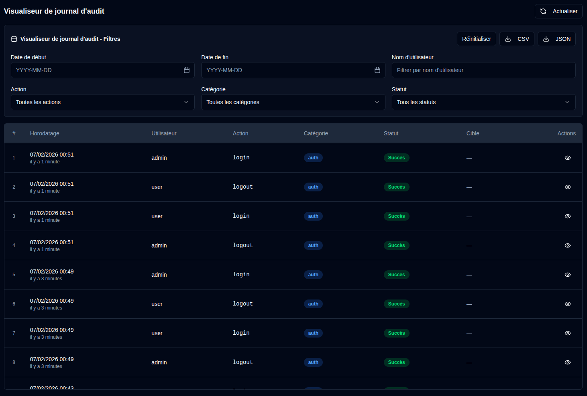

# Journaux d'audit {#audit-logs}

Le journal d'audit fournit un enregistrement complet de tous les changements système et actions utilisateur dans **duplistatus**. Cela aide à suivre les modifications de configuration, les activités des utilisateurs et les opérations système à des fins de sécurité et de dépannage.

## Visualiseur de journal d'audit {#audit-log-viewer}

Le visualiseur de journal d'audit affiche une liste chronologique de tous les événements enregistrés avec les informations suivantes :

- **Horodatage** : Quand l'événement s'est produit
- **Utilisateur** : Le nom d'utilisateur qui a effectué l'action (ou « Système » pour les actions automatisées)
- **Action** : L'action spécifique qui a été effectuée
- **Catégorie** : La catégorie de l'action (Authentification, Gestion des utilisateurs, Configuration, Opérations de sauvegarde, Gestion des serveurs, Opérations système)
- **Statut** : Si l'action a réussi ou échoué
- **Cible** : L'objet qui a été affecté (le cas échéant)
- **Détails** : Informations supplémentaires sur l'action

### Affichage des détails du journal {#viewing-log-details}

Cliquez sur l'icône <IconButton icon="lucide:eye" /> en regard de toute entrée de journal pour afficher des informations détaillées, notamment :
- Horodatage complet
- Informations utilisateur
- Détails complets de l'action (par exemple : champs modifiés, statistiques, etc.)
- Adresse IP et agent utilisateur
- Messages d'erreur (si l'action a échoué)

### Exportation des Journaux d'audit {#exporting-audit-logs}

Vous pouvez exporter les journaux d'audit filtrés dans deux formats :

| Bouton | Description |
|:------|:-----------|
| <IconButton icon="lucide:download" label="CSV"/> | Exporter les journaux en tant que fichier CSV pour l'analyse de feuille de calcul |
| <IconButton icon="lucide:download" label="JSON"/> | Exporter les journaux en tant que fichier JSON pour l'analyse programmatique |

:::note
Les exports incluent uniquement les journaux actuellement visibles en fonction de vos filtres actifs. Pour exporter tous les journaux, effacez d'abord tous les filtres.
:::
