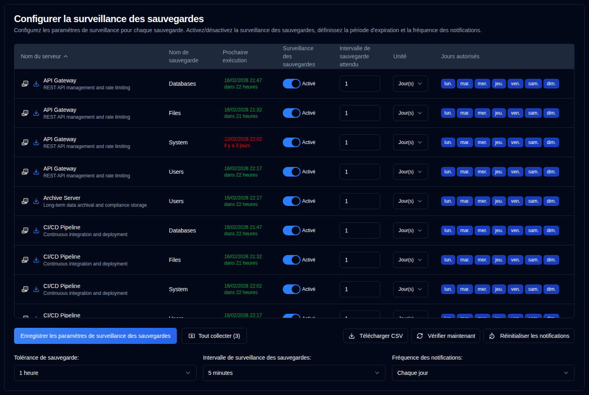

# Surveillance des sauvegardes {#backup-monitoring}

## Configurer les paramètres de surveillance par sauvegarde {#configure-per-backup-monitoring-settings}

-  **Nom du serveur** : Le nom du serveur à surveiller pour les sauvegardes en retard. 
   - Cliquez sur <SvgIcon svgFilename="duplicati_logo.svg" height="18"/> pour ouvrir l'interface web du serveur Duplicati
   - Cliquez sur <IIcon2 icon="lucide:download" height="18"/> pour collecter les journaux de sauvegarde de ce serveur.
- **Nom de sauvegarde** : Le nom de la sauvegarde à surveiller pour les sauvegardes en retard.
- **Prochaine exécution** : L'heure de la prochaine sauvegarde programmée affichée en vert si programmée dans le futur, ou en rouge si en retard. Le survol de la valeur « Prochaine exécution » affiche une infobulle montrant l'horodatage de la dernière sauvegarde de la base de données, formaté avec la date/heure complète et l'heure relative.
- **Surveillance de sauvegarde** : Activer ou désactiver la surveillance de sauvegarde pour cette sauvegarde.
- **Intervalle de sauvegarde attendu** : L'intervalle de sauvegarde attendu.
- **Unité** : L'unité de l'intervalle attendu.
- **Jours autorisés** : Les jours de la semaine autorisés pour la sauvegarde.

Si les icônes à côté du nom du serveur sont grisées, le serveur n'est pas configuré dans [Paramètres → Paramètres du serveur](/user-guide/settings/server-settings).

:::note
Lorsque vous collectez les journaux de sauvegarde d'un serveur Duplicati, **duplistatus** met automatiquement à jour les intervalles et configurations de surveillance de sauvegarde.
:::

:::tip
Pour obtenir les meilleurs résultats, collectez les journaux de sauvegarde après avoir modifié la configuration des intervalles de travaux de sauvegarde dans votre serveur Duplicati. Cela garantit que **duplistatus** reste synchronisé avec votre configuration actuelle.
:::

## Configurations globales {#global-configurations}

Ces paramètres s'appliquent à toutes les sauvegardes :

| Paramètre                         | Description                                                                                                                                                                                                                                                                                                                             |
|:--------------------------------|:----------------------------------------------------------------------------------------------------------------------------------------------------------------------------------------------------------------------------------------------------------------------------------------------------------------------------------------|
| **Tolérance de sauvegarde**            | Le délai de grâce (temps supplémentaire autorisé) ajouté à l'heure de sauvegarde attendue avant de marquer comme en retard. La valeur par défaut est **1 heure**.                                                                                                                                                                                                             |
| **Intervalle de surveillance de sauvegarde** | La fréquence à laquelle le système vérifie les sauvegardes en retard. La valeur par défaut est **5 minutes**.                                                                                                                                                                                                                                                            |
| **Fréquence des notifications**      | La fréquence d'envoi des notifications de retard :   **Une seule fois** : Envoyer **une seule** notification lorsque la sauvegarde est en retard.   `Chaque jour` : Envoyer des notifications **quotidiennes** en cas de retard (par défaut).   `Chaque semaine` : Envoyer des notifications **hebdomadaires** en cas de retard.   `Chaque mois` : Envoyer des notifications **mensuelles** en cas de retard. |

## Actions disponibles {#available-actions}

| Bouton                                                              | Description                                                                                                                           |
|:--------------------------------------------------------------------|:--------------------------------------------------------------------------------------------------------------------------------------|
| <IconButton label="Enregistrer les paramètres de surveillance de sauvegarde" />              | Enregistre les paramètres, efface les minuteurs pour les sauvegardes désactivées et exécute une vérification de retard.                                                |
| <IconButton icon="lucide:import" label="Tout collecter (#)"/>          | Collecter les journaux de sauvegarde de tous les serveurs configurés, entre crochets le nombre de serveurs à collecter.                                   |
| <IconButton icon="lucide:download" label="Télécharger CSV"/>           | Télécharge un fichier CSV contenant tous les paramètres de surveillance de sauvegarde et l'« Horodatage de la dernière sauvegarde (BD) » de la base de données.               |
| <IconButton icon="lucide:refresh-cw" label="Vérifier maintenant"/>            | Exécute la vérification de sauvegarde en retard immédiatement. Ceci est utile après modification des configurations. Cela déclenche également un recalcul de « Prochaine exécution ». |
| <IconButton icon="lucide:timer-reset" label="Réinitialiser les notifications"/> | Réinitialise la dernière notification de retard envoyée pour toutes les sauvegardes.                                                                            |
