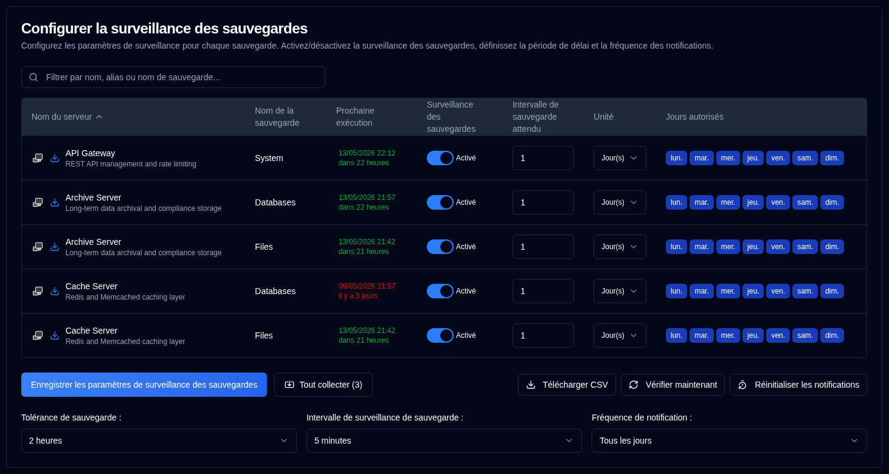

# Surveillance des sauvegardes {#backup-monitoring}

## Configurer les paramètres de surveillance par sauvegarde {#configure-per-backup-monitoring-settings}

-  **Nom du serveur** : Le nom du serveur à surveiller pour les sauvegardes en retard. 
   - Cliquez sur <SvgIcon svgFilename="duplicati_logo.svg" height="18"/> pour ouvrir l'interface web du serveur Duplicati
   - Cliquez sur <IIcon2 icon="lucide:download" height="18"/> pour collecter les journaux de sauvegarde depuis ce serveur.
- **Nom de la sauvegarde** : Le nom de la sauvegarde à surveiller pour les sauvegardes en retard.
- **Prochaine exécution** : L'heure prévue de la prochaine sauvegarde, affichée en vert si elle est prévue dans le futur, ou en rouge si elle est en retard. Passer la souris sur la valeur "Prochaine exécution" affiche une info-bulle indiquant l'horodatage de la dernière sauvegarde provenant de la base de données, formaté avec date/heure complète et temps relatif.
- **Surveillance des sauvegardes** : Activer ou désactiver la surveillance des sauvegardes pour cette sauvegarde.
- **Intervalle de sauvegarde attendu** : L'intervalle de sauvegarde attendu.
- **Unité** : L'unité de l'intervalle attendu.
- **Jours autorisés** : Les jours de la semaine autorisés pour la sauvegarde.

Si les icônes à côté du nom du serveur sont grisées, le serveur n'est pas configuré dans [Paramètres → Paramètres du serveur](/user-guide/settings/server-settings).

:::note
Lorsque vous collectez les journaux de sauvegarde d'un serveur Duplicati, **duplistatus** met automatiquement à jour les intervalles et configurations de surveillance de sauvegarde.
:::

:::tip
Pour obtenir les meilleurs résultats, collectez les journaux de sauvegarde après avoir modifié la configuration des intervalles de travaux de sauvegarde dans votre serveur Duplicati. Cela garantit que **duplistatus** reste synchronisé avec votre configuration actuelle.
:::

## Configurations globales {#global-configurations}

Ces paramètres s'appliquent à toutes les sauvegardes :

| Paramètre                         | Description                                                                                                                                                                                                                                                                                                                             |
|:--------------------------------|:----------------------------------------------------------------------------------------------------------------------------------------------------------------------------------------------------------------------------------------------------------------------------------------------------------------------------------------|
| **Tolérance de sauvegarde**            | La période de grâce (temps supplémentaire autorisé) ajoutée à l'heure de sauvegarde prévue avant de la marquer comme en retard. La valeur par défaut est **1 heure**.                                                                                                                                                                                                             |
| **Intervalle de surveillance des sauvegardes** | Fréquence à laquelle le système vérifie les sauvegardes en retard. La valeur par défaut est **5 minutes**.                                                                                                                                                                                                                                                            |
| **Fréquence des notifications**      | Fréquence d'envoi des notifications d'impayé :   **Une fois`: Send **just one** notification when the backup becomes overdue.   `Tous les jours`: Send **daily** notifications while overdue (default).   `Toutes les semaines`: Send **weekly** notifications while overdue.   `Tous les mois**: Envoyer des notifications **mensuelles** tant que la sauvegarde est en retard. |

## Actions disponibles {#available-actions}

| Bouton                                                              | Description                                                                                                                           |
|:--------------------------------------------------------------------|:--------------------------------------------------------------------------------------------------------------------------------------|
| <IconButton label="Enregistrer les paramètres de surveillance des sauvegardes" />              | Enregistre les paramètres, efface les minuteries pour les sauvegardes désactivées et effectue une vérification des retards.                                                |
| <IconButton icon="lucide:import" label="Tout collecter (#)"/>          | Collecte les journaux de sauvegarde depuis tous les serveurs configurés, avec entre parenthèses le nombre de serveurs à collecter.                                   |
| <IconButton icon="lucide:download" label="Télécharger CSV"/>           | Télécharge un fichier CSV contenant tous les paramètres de surveillance des sauvegardes et l'"Horodatage de la dernière sauvegarde (BD)" depuis la base de données.               |
| <IconButton icon="lucide:refresh-cw" label="Vérifier maintenant"/>            | Exécute immédiatement la vérification des sauvegardes en retard. Utile après avoir modifié les configurations. Déclenche également un recalcul de "Prochaine exécution". |
| <IconButton icon="lucide:timer-reset" label="Réinitialiser les notifications"/> | Réinitialise la dernière notification de retard envoyée pour toutes les sauvegardes.                                                                            |
