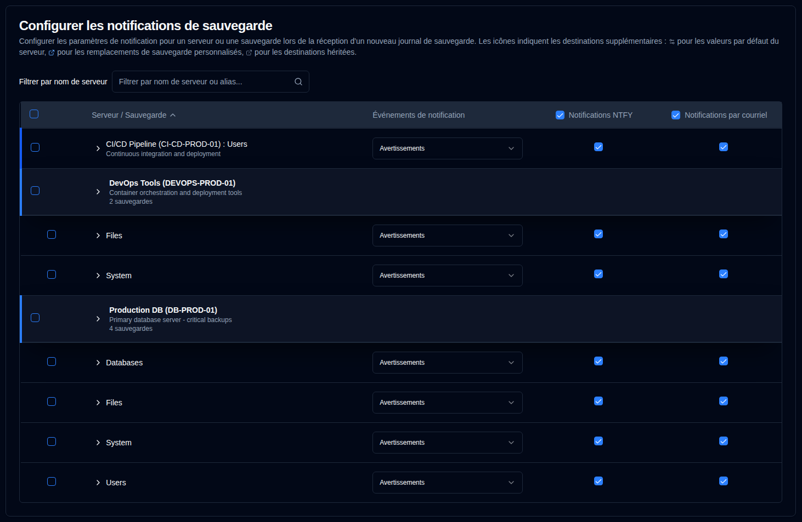
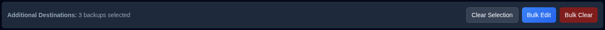

# Notifications de sauvegarde {/* #backup-notifications */}

Utilisez ces paramètres pour envoyer des notifications lorsqu'un [nouveau journal de sauvegarde est reçu](../../installation/duplicati-server-configuration.md).

Le tableau des notifications de sauvegarde est organisé par serveur. Le format d'affichage dépend du nombre de sauvegardes d'un serveur :
- **Sauvegardes multiples** : Affiche une ligne d'en-tête de serveur avec des lignes de sauvegarde individuelles en dessous. Cliquez sur l'en-tête du serveur pour développer ou réduire la liste des sauvegardes.
- **Sauvegarde unique** : Affiche une **ligne fusionnée** avec une bordure gauche bleue, indiquant :
  -  **Nom du serveur : Nom de la sauvegarde** si aucun alias du serveur n'est configuré, ou
  - **Alias du serveur (Nom du serveur) : Nom de la sauvegarde** s'il est configuré.

Cette page dispose d'une fonction d'enregistrement automatique. Toutes les modifications que vous apportez seront enregistrées automatiquement.

Quand le **Résumé quotidien** est activé, les e-mails destinés au destinataire E-mail par défaut sont supprimés. Les destinations par courriel supplémentaires sur cette page continuent de recevoir les événements correspondants. Les paramètres de cette page sont préservés et deviennent à nouveau actifs quand le Résumé quotidien est désactivé. Voir [Résumé quotidien](daily-summary-settings.md).

 

## Filtrer {/* #filter */}

Utilisez le champ **Filtrer par nom de serveur** en haut de la page pour trouver rapidement des sauvegardes spécifiques par nom de serveur ou par alias. Le tableau filtrera automatiquement pour n'afficher que les entrées correspondantes.

 

## Configurer les paramètres de notification par sauvegarde {/* #configure-per-backup-notification-settings */}

| Paramètre                     | Description                                               | Valeur par défaut |
| :---------------------------- | :-------------------------------------------------------- | :---------------- |
| **Événements de notification** | Configurer quand envoyer des notifications pour les nouveaux journaux de sauvegarde. | **Avertissements** |
| **NTFY**                      | Activer ou désactiver les notifications NTFY pour cette sauvegarde.     | **Activé**     |
| **E-mail**                     | Activer ou désactiver les notifications par courriel pour cette sauvegarde.    | **Activé**    |

**Options des Événements de notification :**

- **all** : Envoyer des notifications pour tous les événements de sauvegarde.
- **warnings** : Envoyer des notifications pour les avertissements et les erreurs uniquement (par défaut).
- **errors** : Envoyer des notifications pour les erreurs uniquement.
- **off** : Désactiver les notifications pour les nouveaux journaux de sauvegarde pour cette sauvegarde.

 

## Destinations supplémentaires {/* #additional-destinations */}

Les destinations de notification supplémentaires vous permettent d'envoyer des notifications à des adresses e-mail ou des sujets NTFY spécifiques au-delà des paramètres globaux. Le système utilise un modèle d'héritage hiérarchique où les sauvegardes peuvent hériter des paramètres par défaut de leur serveur, ou les remplacer par des valeurs spécifiques à la sauvegarde.

La configuration des destinations supplémentaires est indiquée par des icônes contextuelles à côté des noms de serveur et de sauvegarde :

- **Icône de serveur** <IconButton icon="lucide:settings-2" style={{border: 'none', padding: 0, color: 'inherit', background: 'transparent'}} /> : Apparaît à côté des noms de serveur lorsque des destinations supplémentaires par défaut sont configurées au niveau du serveur.

- **Icône de sauvegarde** <IconButton icon="lucide:external-link" style={{border: 'none', padding: 0, color: '#60a5fa', background: 'transparent'}} /> (bleue) : Apparaît à côté des noms de sauvegarde lorsque des destinations supplémentaires personnalisées sont configurées (remplaçant les paramètres par défaut du serveur).

- **Icône de sauvegarde** <IconButton icon="lucide:external-link" style={{border: 'none', padding: 0, color: '#64748b', background: 'transparent'}} /> (grise) : Apparaît à côté des noms de sauvegarde lorsque la sauvegarde hérite des destinations supplémentaires des paramètres par défaut du serveur.

Si aucune icône n'est affichée, le serveur ou la sauvegarde n'a pas de destinations supplémentaires configurées.

### Valeurs par défaut au niveau du serveur {/* #server-level-defaults */}

Vous pouvez configurer des destinations supplémentaires par défaut au niveau du serveur que toutes les sauvegardes de ce serveur hériteront automatiquement.

1. Accédez à [Paramètres → Notifications de sauvegarde](backup-notifications-settings.md).
2. Le tableau est groupé par serveur, avec des lignes d'en-tête distinctes pour chaque serveur affichant le nom du serveur, l'alias et le nombre de sauvegardes.
   - **Note**: Pour les serveurs ne contenant qu'une seule sauvegarde, une ligne fusionnée est affichée au lieu d'une ligne d'en-tête distincte. Les valeurs par défaut au niveau du serveur ne peuvent pas être configurées directement depuis les lignes fusionnées. Si vous devez configurer les valeurs par défaut du serveur pour un serveur ne contenant qu'une seule sauvegarde, vous pouvez le faire en ajoutant temporairement une autre sauvegarde à ce serveur, ou les destinations supplémentaires de la sauvegarde hériteront automatiquement de toute valeur par défaut du serveur existante.
3. Cliquez n'importe où dans une ligne de serveur pour développer la section **Destinations supplémentaires par défaut pour ce serveur**.
4. Configurez les paramètres par défaut suivants:
   - **Événement de notification**: Choisissez quels événements déclenchent les notifications vers les destinations supplémentaires (**tout**, **avertissements**, **erreurs**, ou **désactivé**).
   - **Courriels supplémentaires**: Saisissez une ou plusieurs adresses e-mail (séparées par des virgules) qui recevront les notifications pour toutes les sauvegardes de ce serveur. Cliquez sur le bouton d'icône <IconButton icon="lucide:send-horizontal" style={{border: 'none', padding: 0, color: 'inherit', background: 'transparent'}} /> pour envoyer un e-mail de test aux adresses saisies.
   - **Sujet NTFY supplémentaire**: Saisissez un nom de sujet NTFY personnalisé où les notifications seront publiées pour toutes les sauvegardes de ce serveur. Cliquez sur le bouton d'icône <IconButton icon="lucide:send-horizontal" style={{border: 'none', padding: 0, color: 'inherit', background: 'transparent'}} /> pour envoyer une notification de test au sujet, ou cliquez sur le bouton d'icône <IconButton icon="lucide:qr-code" style={{border: 'none', padding: 0, color: 'inherit', background: 'transparent'}} /> pour afficher un code QR pour le sujet afin de configurer votre appareil pour recevoir les notifications.

**Gestion des valeurs par défaut du serveur:**

- **Synchroniser à tout**: Efface toutes les surcharges de sauvegarde, faisant en sorte que toutes les sauvegardes héritent des valeurs par défaut du serveur.
- **Tout effacer**: Efface toutes les destinations supplémentaires des valeurs par défaut du serveur et de toutes les sauvegardes tout en conservant la structure d'héritage.

### Configuration par sauvegarde {/* #per-backup-configuration */}

Les sauvegardes individuelles héritent automatiquement des valeurs par défaut du serveur, mais vous pouvez les remplacer pour des tâches de sauvegarde spécifiques.

1. Cliquez n'importe où dans une ligne de sauvegarde pour développer sa section **Destinations supplémentaires**.
2. Configurez les paramètres suivants:
   - **Événement de notification**: Choisissez quels événements déclenchent les notifications vers les destinations supplémentaires (**tout**, **avertissements**, **erreurs**, ou **désactivé**).
   - **Courriels supplémentaires**: Saisissez une ou plusieurs adresses e-mail (séparées par des virgules) qui recevront les notifications en plus du destinataire global. Cliquez sur le bouton d'icône <IconButton icon="lucide:send-horizontal" style={{border: 'none', padding: 0, color: 'inherit', background: 'transparent'}} /> pour envoyer un e-mail de test aux adresses saisies.
   - **Sujet NTFY supplémentaire**: Saisissez un nom de sujet NTFY personnalisé où les notifications seront publiées en plus du sujet par défaut. Cliquez sur le bouton d'icône <IconButton icon="lucide:send-horizontal" style={{border: 'none', padding: 0, color: 'inherit', background: 'transparent'}} /> pour envoyer une notification de test au sujet, ou cliquez sur le bouton d'icône <IconButton icon="lucide:qr-code" style={{border: 'none', padding: 0, color: 'inherit', background: 'transparent'}} /> pour afficher un code QR pour le sujet afin de configurer votre appareil pour recevoir les notifications.

**Indicateurs d'héritage:**

- **Icône de lien** <IconButton icon="lucide:link" style={{border: 'none', padding: 0, color: '#3b82f6', background: 'transparent'}} /> en bleu: Indique que la valeur est héritée des valeurs par défaut du serveur. Cliquer sur le champ créera une surcharge pour l'édition.
- **Icône de lien brisé** <IconButton icon="lucide:link-2-off" style={{border: 'none', padding: 0, color: '#3b82f6', background: 'transparent'}} /> en bleu: Indique que la valeur a été surchargée. Cliquez sur l'icône pour revenir à l'héritage.

**Comportement des destinations supplémentaires:**

- Les notifications sont envoyées à la fois aux paramètres globaux et aux destinations supplémentaires lorsque celles-ci sont configurées.
- Le paramètre d'événement de notification pour les destinations supplémentaires est indépendant du paramètre d'événement de notification principal.
- Si les destinations supplémentaires sont définies sur **désactivé**, aucune notification ne sera envoyée à ces destinations, mais les notifications principales continueront de fonctionner selon les paramètres principaux.
- Les alertes **en retard** comptent comme un **avertissement** pour le filtre d'événement de notification supplémentaire: elles sont envoyées lorsque l'événement est **tout** ou **avertissements**, et non lorsque c'est **erreurs** ou **désactivé**. Le même filtre s'applique aux sujets NTFY supplémentaires.
- Lorsqu'une sauvegarde hérite des paramètres par défaut du serveur, toute modification des paramètres par défaut du serveur s'appliquera automatiquement à cette sauvegarde (sauf si elle a été remplacée).
- Lorsque [Résumé quotidien](daily-summary-settings.md) est activé, les destinations de courriel supplémentaires reçoivent toujours les événements correspondants ; seul le destinataire de courriel par défaut est supprimé.

 

## Édition groupée {/* #bulk-edit */}

Vous pouvez modifier les paramètres des destinations supplémentaires pour plusieurs sauvegardes en une seule fois à l'aide de la fonction d'édition groupée. Cela est particulièrement utile lorsque vous devez appliquer les mêmes destinations supplémentaires à de nombreuses tâches de sauvegarde.

1. Accédez à [Paramètres → Notifications de sauvegarde](backup-notifications-settings.md).
2. Utilisez les cases à cocher de la première colonne pour sélectionner les sauvegardes ou les serveurs que vous souhaitez modifier.
   - Utilisez la case à cocher de l'en-tête pour sélectionner ou désélectionner toutes les sauvegardes visibles.
   - Vous pouvez utiliser le filtre pour réduire la liste avant de sélectionner.
3. Une fois les sauvegardes sélectionnées, une barre d'action groupée apparaîtra, affichant le nombre de sauvegardes sélectionnées.
4. Cliquez sur **Édition groupée** pour ouvrir la boîte de dialogue d'édition.
5. Configurez les paramètres des destinations supplémentaires :
   - **Événement de notification** : Définissez l'événement de notification pour toutes les sauvegardes sélectionnées.
   - **Courriels supplémentaires** : Saisissez les adresses e-mail (séparées par des virgules) à appliquer à toutes les sauvegardes sélectionnées.
   - **Sujet NTFY supplémentaire** : Saisissez un nom de sujet NTFY à appliquer à toutes les sauvegardes sélectionnées.
   - Des boutons de test sont disponibles dans la boîte de dialogue d'édition groupée pour vérifier les adresses e-mail et les sujets NTFY avant de les appliquer à plusieurs sauvegardes.
6. Cliquez sur **Enregistrer** pour appliquer les paramètres à toutes les sauvegardes sélectionnées.

**Effacement groupé :**

Pour supprimer tous les paramètres des destinations supplémentaires des sauvegardes sélectionnées :

1. Sélectionnez les sauvegardes que vous souhaitez effacer.
2. Cliquez sur **Effacement groupé** dans la barre d'action groupée.
3. Confirmez l'action dans la boîte de dialogue.

Cela supprimera toutes les adresses e-mail supplémentaires, les sujets NTFY et l'événement de notification pour les sauvegardes sélectionnées. Après l'effacement, les sauvegardes reviendront à l'héritage des paramètres par défaut du serveur (le cas échéant).

 
