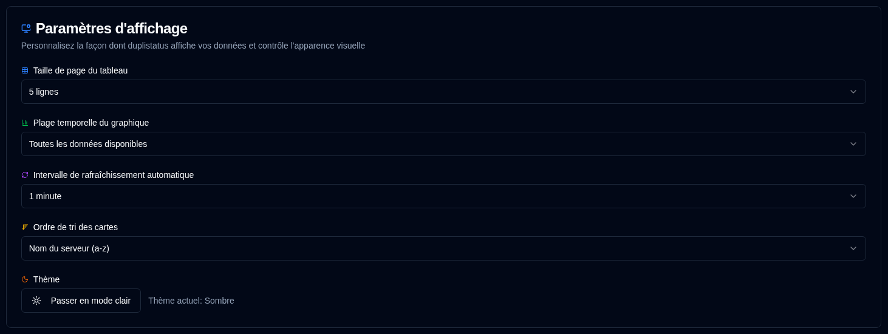

# Affichage {#display}

Configurer les préférences d'interface utilisateur et d'affichage.

 

| Paramètre                      | Description                                                    | Valeur par défaut       |
| :---------------------------- | :------------------------------------------------------------- | :---------------------- |
| **Taille du tableau**          | Nombre de lignes par page sur la page de détails du serveur.   | 5 lignes                |
| **Plage temporelle du graphique** | Intervalle de temps affiché dans les graphiques.              | Toutes les données disponibles |
| **Intervalle de rafraîchissement automatique** | Fréquence d'actualisation automatique des pages. | 1 minute                |
| **Ordre de tri des cartes**    | Mode de tri des cartes sur le tableau de bord.                | `Nom du serveur (a-z)` |
| **Thème**                      | Sélectionner le thème clair ou sombre.                         | Sombre                  |

 

:::tip
**Accès rapide** : Vous pouvez accéder rapidement à cette page en cliquant avec le bouton droit sur le bouton d'actualisation automatique dans la barre d'outils de l'application.
:::
