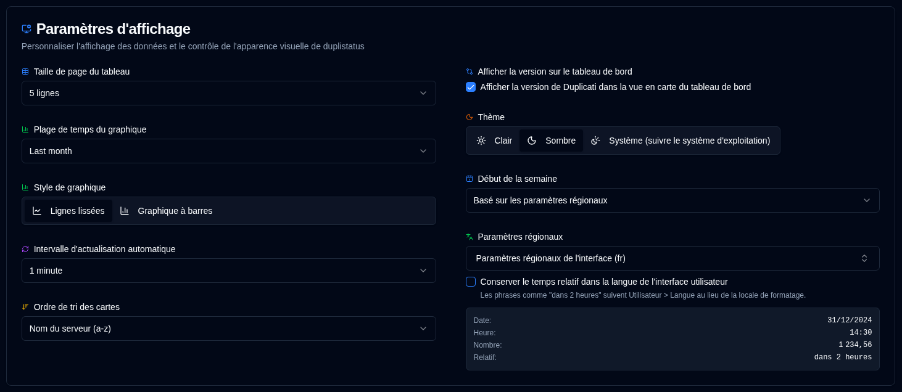

# Affichage {#display}

Configurer les préférences d'interface utilisateur et d'affichage.

 

| Paramètre                   | Description                                         | Valeur par défaut      |
|:----------------------------|:----------------------------------------------------|:-----------------------|
| **Taille du tableau**       | Nombre de lignes par page sur la page des détails du serveur. | 5 lignes             |
| **Afficher la version sur le tableau de bord** | Afficher ou masquer la version de Duplicati sur les cartes du tableau de bord. Le tableau de bord affiche toujours la colonne Version. Disponible également dans [Versions de Duplicati](duplicati-versions.md). | Sur |
| **Thème**                 | Choisissez clair, sombre ou adaptez-vous à l'apparence de votre système d'exploitation (mode clair/sombre préféré). | Suivre le système d'exploitation par défaut |
| **Plage de temps du graphique**      | Intervalle de temps affiché dans les graphiques. Options disponibles : **1W** (7 derniers jours), **2W** (14 derniers jours), **1M** (30 derniers jours), **3M** (90 derniers jours). Vous pouvez également basculer la plage de temps directement depuis les en-têtes des graphiques. | 1 mois            |
| **Style de graphique**           | Choisissez entre des graphiques en lignes lissées ou en barres. Les deux modes utilisent une agrégation par intervalles temporels pour un affichage optimal. Vous pouvez également basculer directement depuis les en-têtes des graphiques. | Lignes lissées       |
| **Paramètres régionaux**         | Sélectionnez un paramètre régional de formatage indépendant de votre langue d'interface utilisateur (416 paramètres régionaux pris en charge). Cela affecte la manière dont les dates, les heures et les nombres sont affichés. Les phrases de temps relatif (par exemple "dans 2 heures") suivent les paramètres régionaux de formatage à moins que **Conserver le temps relatif dans la langue de l'interface utilisateur** ne soit activé. Un aperçu en direct inclut un exemple de date, d'heure, de nombre et de temps relatif. Exemple : langue d'interface = Allemand, paramètres régionaux de formatage = Anglais (Royaume-Uni) → interface utilisateur en allemand avec les formats de date du Royaume-Uni. | Basé sur la langue de l'interface utilisateur |
| **Conserver le temps relatif dans la langue de l'interface utilisateur** | Lorsque cette option est activée, les phrases telles que "dans 2 heures" suivent **Utilisateur → Langue** au lieu des paramètres régionaux de formatage. Les dates, les heures et les nombres utilisent toujours les paramètres régionaux de formatage. Désactivé par défaut. | Désactivé |
| **Intervalle de rafraîchissement automatique** | Fréquence de rafraîchissement automatique des pages.              | 1 minute           |
| **Ordre de tri des cartes**      | Ordre de tri des cartes sur le tableau de bord.              | Nom du serveur (a-z)  |
| **Début de la semaine**         | Configurez à quel moment la semaine commence.                     | Basé sur les paramètres régionaux    |

 

:::tip
**Accès rapide** : Vous pouvez accéder rapidement à cette page en cliquant avec le bouton droit sur le bouton d'actualisation automatique dans la barre d'outils de l'application.
:::
