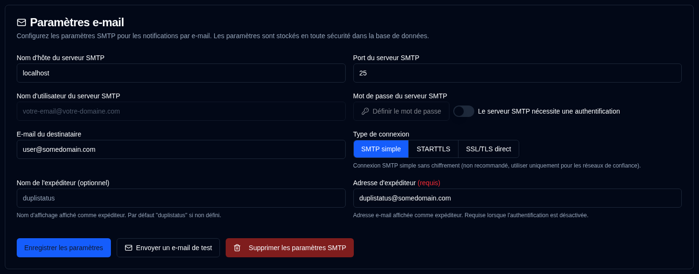

# E-mail {#email}

**duplistatus** prend en charge l'envoi de notifications par e-mail via SMTP comme alternative ou complément aux notifications NTFY. La configuration e-mail est désormais gérée via l'interface web avec stockage chiffré dans la base de données pour une sécurité renforcée.

| Paramètre                 | Description                                                      |
|:------------------------|:-----------------------------------------------------------------|
| **Hôte du serveur SMTP**    | Serveur SMTP de votre fournisseur de messagerie (par exemple, `smtp.gmail.com`).      |
| **Port du serveur SMTP**    | Numéro de port (généralement `25` pour SMTP simple, `587` pour STARTTLS, ou `465` pour SSL/TLS direct). |
| **Type de connexion**     | Sélectionner entre SMTP simple, STARTTLS, ou SSL/TLS direct. Par défaut SSL/TLS direct pour les nouvelles configurations. |
| **Authentification SMTP** | Activer ou désactiver l'authentification SMTP. Lorsque désactivée, les champs nom d'utilisateur et mot de passe ne sont pas requis. |
| **Nom d'utilisateur SMTP**       | Votre adresse e-mail ou nom d'utilisateur (requis lorsque l'authentification est activée). |
| **Mot de passe SMTP**       | Votre mot de passe e-mail ou mot de passe spécifique à l'application (requis lorsque l'authentification est activée). |
| **Nom de l'expéditeur**         | Nom d'affichage affiché comme expéditeur dans les notifications par e-mail (optionnel, par défaut « duplistatus »). |
| **Adresse d'expéditeur**        | Adresse e-mail affichée comme expéditeur. Requise pour les connexions SMTP simple ou lorsque l'authentification est désactivée. Par défaut le nom d'utilisateur SMTP lorsque l'authentification est activée. Notez que certains fournisseurs de messagerie remplaceront l'« Adresse d'expéditeur » par le « Nom d'utilisateur du serveur SMTP ». |
| **E-mail du destinataire**     | L'adresse e-mail pour recevoir les notifications. Doit être au format d'adresse e-mail valide. |

Une <IIcon2 icon="lucide:mail" color="green"/> icône verte à côté de `Email` dans la barre latérale signifie que vos paramètres sont valides. Si l'icône est <IIcon2 icon="lucide:mail" color="yellow"/> jaune, vos paramètres ne sont pas valides ou ne sont pas configurés.

L'icône s'affiche en vert quand tous les champs requis sont définis : Hôte du serveur SMTP, Port du serveur SMTP, E-mail du destinataire, et soit (Nom d'utilisateur SMTP + Mot de passe quand l'authentification est requise) soit (Adresse d'expéditeur quand l'authentification n'est pas requise).

Quand la configuration n'est pas entièrement configurée, une boîte d'alerte jaune s'affiche pour vous informer qu'aucun e-mail ne sera envoyé tant que les paramètres e-mail ne seront pas remplis correctement. Les cases à cocher E-mail dans l'onglet [`Notifications de sauvegarde`](backup-notifications-settings.md) seront également grisées et afficheront des étiquettes « (Désactivé) ».

 

## Actions disponibles {#available-actions}

| Bouton                                                           | Description                                              |
|:-----------------------------------------------------------------|:---------------------------------------------------------|
| <IconButton label="Enregistrer les paramètres" />                             | Enregistrer les modifications apportées aux paramètres NTFY.              |
| <IconButton icon="lucide:mail" label="Envoyer un e-mail de test"/>         | Envoie un message e-mail de test à l'aide de la configuration SMTP. L'e-mail de test affiche le nom d'hôte du serveur SMTP, le port, le type de connexion, le statut d'authentification, le nom d'utilisateur (le cas échéant), l'e-mail du destinataire, l'adresse d'expéditeur, le nom de l'expéditeur et l'horodatage du test. |
| <IconButton icon="lucide:trash-2" label="Supprimer les paramètres SMTP"/> | Supprimer / Effacer la configuration SMTP.                   |

 

:::info[Important]
  Vous devez utiliser le bouton <IconButton icon="lucide:mail" label="Envoyer un e-mail de test"/> pour vous assurer que votre configuration d'e-mail fonctionne avant de compter dessus pour les notifications.

 Même si vous voyez une icône verte <IIcon2 icon="lucide:mail" color="green"/> et que tout semble configuré, les e-mails peuvent ne pas être envoyés.
 
 `duplistatus` vérifie uniquement si vos paramètres SMTP sont remplis, et non si les e-mails peuvent réellement être livrés.
:::

 

## Fournisseurs SMTP courants {#common-smtp-providers}

**Gmail :**

- Hôte : `smtp.gmail.com`
- Port : `587` (STARTTLS) ou `465` (SSL/TLS direct)
- Type de connexion : STARTTLS pour le port 587, SSL/TLS direct pour le port 465
- Nom d'utilisateur : Votre adresse Gmail
- Mot de passe : Utilisez un mot de passe d'application (pas votre mot de passe habituel). Générez-en un à l'adresse https://myaccount.google.com/apppasswords
- Authentification : Requis

**Outlook/Hotmail :**

- Hôte : `smtp-mail.outlook.com`
- Port : `587`
- Type de connexion : STARTTLS
- Nom d'utilisateur : Votre adresse e-mail Outlook
- Mot de passe : Votre mot de passe de compte
- Authentification : Requis

**Yahoo Mail :**

- Hôte : `smtp.mail.yahoo.com`
- Port : `587`
- Type de connexion : STARTTLS
- Nom d'utilisateur : Votre adresse e-mail Yahoo
- Mot de passe : Utilisez un mot de passe d'application
- Authentification : Requis

### Meilleures pratiques de sécurité {#security-best-practices}

- Envisagez d'utiliser un compte e-mail dédié pour les notifications
 - Testez votre configuration en utilisant le bouton « Envoyer un e-mail de test »
 - Les paramètres sont chiffrés et stockés de manière sécurisée dans la base de données
 - **Utilisez des connexions chiffrées** - STARTTLS et SSL/TLS direct sont recommandés pour une utilisation en production
 - Les connexions SMTP simple (port 25) sont disponibles pour les réseaux locaux de confiance, mais ne sont pas recommandées pour une utilisation en production sur des réseaux non fiables
