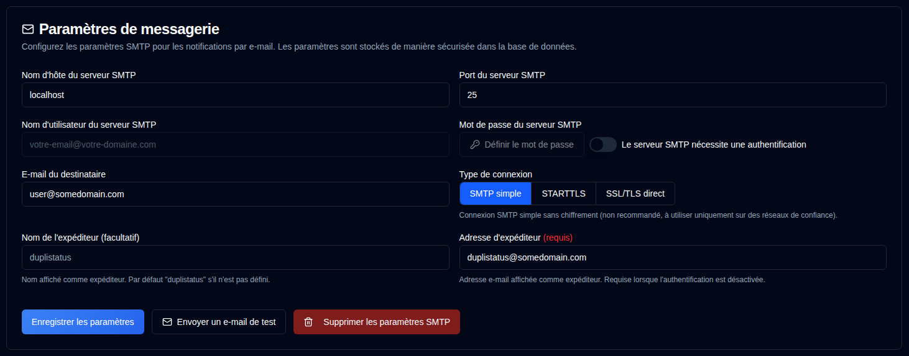

# E-mail {/* #email */}

**duplistatus** prend en charge l'envoi de notifications par e-mail via SMTP comme alternative ou complément aux notifications NTFY. La configuration de l'e-mail est maintenant gérée via l'interface web avec un stockage chiffré dans la base de données pour une sécurité renforcée.

| Paramètre               | Description                                                      |
|:------------------------|:-----------------------------------------------------------------|
| **Serveur SMTP**    | Le serveur SMTP de votre fournisseur d'e-mail (par exemple, `smtp.gmail.com`).      |
| **Port du serveur SMTP**    | Numéro de port (généralement `25` pour SMTP simple, `587` pour STARTTLS, ou `465` pour SSL/TLS direct). |
| **Type de connexion**     | Choisissez entre SMTP simple, STARTTLS ou SSL/TLS direct. Par défaut, SSL/TLS direct pour les nouvelles configurations. |
| **Authentification SMTP** | Activez ou désactivez l'authentification SMTP. Lorsque l'authentification est désactivée, les champs de nom d'utilisateur et de mot de passe ne sont pas requis. |
| **Nom d'utilisateur SMTP**       | Votre adresse e-mail ou nom d'utilisateur (requis lorsque l'authentification est activée). |
| **Mot de passe SMTP**       | Votre mot de passe e-mail ou mot de passe spécifique à l'application (requis lorsque l'authentification est activée). |
| **Nom de l'expéditeur**         | Nom d'affichage montré comme expéditeur dans les notifications par e-mail (optionnel, par défaut "duplistatus"). |
| **Adresse d'expéditeur**        | Adresse e-mail affichée comme expéditeur. Requis pour les connexions SMTP simples ou lorsque l'authentification est désactivée. Par défaut, le nom d'utilisateur SMTP lorsque l'authentification est activée. Notez que certains fournisseurs d'e-mail peuvent remplacer le `From Address` par le `SMTP Server Username`. |
| **E-mail du destinataire**     | L'adresse e-mail pour recevoir les notifications. Doit être au format d'une adresse e-mail valide. |

Une icône verte <IIcon2 icon="lucide:mail" color="green"/> à côté de **E-mail** dans la barre latérale signifie que vos paramètres sont valides. Si l'icône est <IIcon2 icon="lucide:mail" color="yellow"/> jaune, vos paramètres ne sont pas valides ou ne sont pas configurés.

L'icône devient verte lorsque tous les champs requis sont définis : Serveur SMTP, Port du serveur SMTP, E-mail du destinataire, et soit (Nom d'utilisateur SMTP + Mot de passe lorsque l'authentification est requise) ou (Adresse d'expéditeur lorsque l'authentification n'est pas requise).

Lorsque la configuration n'est pas complètement configurée, une boîte d'alerte jaune est affichée vous informant que aucun e-mail ne sera envoyé jusqu'à ce que les paramètres d'e-mail soient correctement remplis. Les cases à cocher E-mail dans l'onglet [Notifications de sauvegarde](backup-notifications-settings.md) seront également grisées et afficheront des étiquettes "(désactivé)".

 

## Actions disponibles {/* #available-actions */}

| Bouton                                                           | Description                                              |
|:-----------------------------------------------------------------|:---------------------------------------------------------|
| <IconButton label="Enregistrer les paramètres" />                             | Enregistrer les modifications apportées aux paramètres NTFY.              |
| <IconButton icon="lucide:mail" label="Envoyer un e-mail de test"/>         | Envoie un e-mail de test en utilisant la configuration SMTP. L'e-mail de test affiche le nom d'hôte du serveur SMTP, le port, le type de connexion, le statut d'authentification, le nom d'utilisateur (le cas échéant), l'e-mail du destinataire, l'adresse d'expéditeur, le nom de l'expéditeur et l'horodatage du test. |
| <IconButton icon="lucide:trash-2" label="Supprimer les paramètres SMTP"/> | Supprimer / Effacer la configuration SMTP. Désactivé lorsque [Résumé quotidien](daily-summary-settings.md) est activé, car ce mode nécessite un e-mail. |

 

:::info[IMPORTANT]
  Vous devez utiliser le bouton <IconButton icon="lucide:mail" label="Envoyer un e-mail de test"/> pour vous assurer que votre configuration d'e-mail fonctionne avant de vous en servir pour les notifications.

 Même si vous voyez une icône <IIcon2 icon="lucide:mail" color="green"/> verte et que tout semble configuré, les e-mails peuvent ne pas être envoyés.
 
 **duplistatus** vérifie uniquement si vos paramètres SMTP sont remplis, pas si les e-mails peuvent effectivement être livrés.
:::

 

## Fournisseurs SMTP courants {/* #common-smtp-providers */}

**Gmail:**

- Hôte : `smtp.gmail.com`
- Port : `587` (STARTTLS) ou `465` (SSL/TLS direct)
- Type de connexion : STARTTLS pour le port 587, SSL/TLS direct pour le port 465
- Nom d'utilisateur : Votre adresse Gmail
- Mot de passe : Utilisez un mot de passe d'application (pas votre mot de passe habituel). Générez-en un sur https://myaccount.google.com/apppasswords
- Authentification : Obligatoire

**Outlook/Hotmail:**

- Hôte : `smtp-mail.outlook.com`
- Port : `587`
- Type de connexion : STARTTLS
- Nom d'utilisateur : Votre adresse e-mail Outlook
- Mot de passe : Votre mot de passe de compte
- Authentification : Obligatoire

**Yahoo Mail:**

- Hôte : `smtp.mail.yahoo.com`
- Port : `587`
- Type de connexion : STARTTLS
- Nom d'utilisateur : Votre adresse e-mail Yahoo
- Mot de passe : Utilisez un mot de passe d'application
- Authentification : Obligatoire

### Bonnes pratiques de sécurité {/* #security-best-practices */}

- Pensez à utiliser un compte e-mail dédié pour les notifications
- Testez votre configuration à l'aide du bouton "Envoyer un e-mail de test"
- Les paramètres sont chiffrés et stockés en toute sécurité dans la base de données
- **Utilisez des connexions chiffrées** - STARTTLS et SSL/TLS direct sont recommandés pour une utilisation en production
- Les connexions SMTP simples (port 25) sont disponibles pour les réseaux locaux de confiance mais ne sont pas recommandées pour une utilisation en production sur des réseaux non fiables
