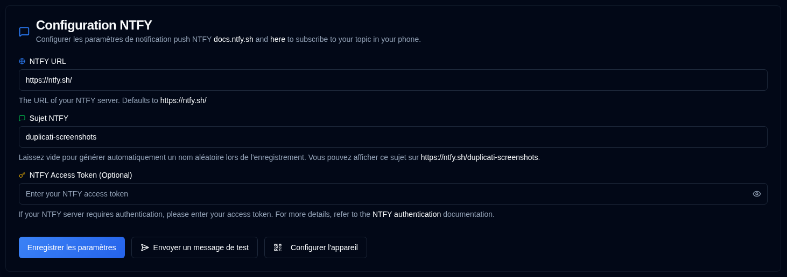

# NTFY {#ntfy}

[NTFY](https://github.com/binwiederhier/ntfy) est un service de notification simple qui peut envoyer des notifications push à votre téléphone ou ordinateur de bureau. Cette section vous permet de configurer votre connexion au serveur de notification et l'authentification.

| Paramètre             | Description                                                                                                                                   |
|:----------------------|:----------------------------------------------------------------------------------------------------------------------------------------------|
| **URL NTFY**          | L'URL de votre serveur NTFY (par défaut le serveur public `https://ntfy.sh/`).                                                                      |
| **Sujet NTFY**        | Un identifiant unique pour vos notifications. Le système générera automatiquement un sujet aléatoire s'il est laissé vide, ou vous pouvez spécifier le vôtre. |
| **Jeton d'accès NTFY** | Un jeton d'accès optionnel pour les serveurs NTFY authentifiés. Laissez ce champ vide si votre serveur ne nécessite pas d'authentification.               |

 

Une icône <IIcon2 icon="lucide:message-square" color="green"/> verte à côté de **NTFY** dans la barre latérale signifie que vos paramètres sont valides. Si l'icône est <IIcon2 icon="lucide:message-square" color="yellow"/> jaune, vos paramètres ne sont pas valides.
Quand la configuration n'est pas valide, les cases à cocher NTFY dans l'onglet [`Notifications de sauvegarde`](backup-notifications-settings.md) seront également désactivées.

## Actions disponibles {#available-actions}

| Bouton                                                                | Description                                                                                                  |
|:----------------------------------------------------------------------|:-------------------------------------------------------------------------------------------------------------|
| <IconButton label="Enregistrer les paramètres" />                                  | Enregistrez les modifications apportées aux paramètres NTFY.                                                                  |
| <IconButton icon="lucide:send-horizontal" label="Envoyer un message de test"/> | Envoyez un message de test à votre serveur NTFY pour vérifier votre configuration.                                         |
| <IconButton icon="lucide:qr-code" label="Configurer l'appareil"/>          | Affiche un code QR qui vous permet de configurer rapidement votre appareil mobile ou ordinateur de bureau pour les notifications NTFY. |

## Configuration de l'appareil {#device-configuration}

Vous devez installer l'application NTFY sur votre appareil avant de le configurer ([voir ici](https://ntfy.sh/)). En cliquant sur le bouton <IconButton icon="lucide:qr-code" label="Configurer l'appareil"/>, ou en cliquant avec le bouton droit sur l'icône <SvgButton svgFilename="ntfy.svg" /> dans la barre d'outils de l'application, un code QR s'affichera. La numérisation de ce code QR configurera automatiquement votre appareil avec le sujet NTFY correct pour les notifications.

 

 

:::caution
Si vous utilisez le serveur public **ntfy.sh** sans jeton d'accès, quiconque connaissant le nom de votre sujet peut afficher vos notifications.

Pour offrir un certain degré de confidentialité, un sujet aléatoire de 12 caractères est généré, offrant plus de 3 sextillions (3 000 000 000 000 000 000 000) de combinaisons possibles, ce qui rend difficile la devinette.

Pour une sécurité améliorée, envisagez d'utiliser [l'authentification par jeton d'accès](https://docs.ntfy.sh/config/#access-tokens) et [les listes de contrôle d'accès](https://docs.ntfy.sh/config/#access-control-list-acl) pour protéger vos sujets, ou [auto-héberger NTFY](https://docs.ntfy.sh/install/#docker) pour un contrôle total.

⚠️ **Vous êtes responsable de la sécurisation de vos sujets NTFY. Veuillez utiliser ce service à votre discrétion.**
:::

 
 

:::note
Tous les noms de produits, logos et marques déposées sont la propriété de leurs propriétaires respectifs. Les icônes et les noms sont utilisés uniquement à des fins d'identification et n'impliquent aucune approbation.
:::
