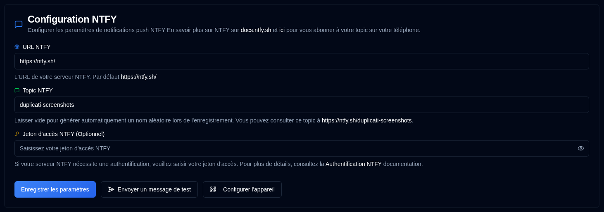

# NTFY {/* #ntfy */}

[NTFY](https://github.com/binwiederhier/ntfy) est un service de notification simple qui peut envoyer des notifications push sur votre téléphone ou votre ordinateur. Cette section vous permet de configurer la connexion à votre serveur de notification et l'authentification.

| Paramètre             | Description                                                                                                                                   |
|:----------------------|:----------------------------------------------------------------------------------------------------------------------------------------------|
| **URL NTFY**          | L'URL de votre serveur NTFY (par défaut le serveur public `https://ntfy.sh/`).                                                                      |
| **Topic NTFY**        | Un identifiant unique pour vos notifications. Le système générera automatiquement un topic aléatoire si ce champ est vide, ou vous pouvez spécifier le vôtre. |
| **Jeton d'accès NTFY** | Un jeton d'accès facultatif pour les serveurs NTFY authentifiés. Laissez ce champ vide si votre serveur ne nécessite pas d'authentification.               |

 

Une icône <IIcon2 icon="lucide:message-square" color="green"/> verte à côté de **NTFY** dans la barre latérale signifie que vos paramètres sont valides. Si l'icône est <IIcon2 icon="lucide:message-square" color="yellow"/> jaune, vos paramètres ne sont pas valides.
Lorsque la configuration n'est pas valide, les cases à cocher NTFY dans l'onglet [`Backup Notifications`](backup-notifications-settings.md) seront également grisées.

## Actions disponibles {/* #available-actions */}

| Bouton                                                                | Description                                                                                                  |
|:----------------------------------------------------------------------|:-------------------------------------------------------------------------------------------------------------|
| <IconButton label="Enregistrer les paramètres" />                                  | Enregistrer toutes les modifications apportées aux paramètres NTFY.                                                                  |
| <IconButton icon="lucide:send-horizontal" label="Envoyer un message de test"/> | Envoyer un message de test à votre serveur NTFY pour vérifier votre configuration.                                         |
| <IconButton icon="lucide:qr-code" label="Configurer l'appareil"/>          | Afficher un code QR qui vous permet de configurer rapidement votre appareil mobile ou votre ordinateur pour les notifications NTFY. |

Si une livraison ntfy ultérieure échoue, les administrateurs voient une sirène rouge dans la barre d'outils. Voir [Échecs de livraison](../overview.md#delivery-failures).

## Configuration de l'appareil {/* #device-configuration */}

Vous devez installer l'application NTFY sur votre appareil avant de la configurer ([voir ici](https://ntfy.sh/)). Cliquer sur le bouton <IconButton icon="lucide:qr-code" label="Configurer l'appareil"/>, ou faire un clic droit sur l'icône <SvgButton svgFilename="ntfy.svg" /> dans la barre d'outils de l'application, affichera un code QR. La numérisation de ce code QR configurera automatiquement votre appareil avec le topic NTFY correct pour les notifications.

 

 

:::caution
Si vous utilisez le serveur public **ntfy.sh** sans jeton d'accès, toute personne disposant de votre nom de topic peut consulter vos
notifications. 
 
Pour assurer un certain niveau de confidentialité, un topic aléatoire de 12 caractères est généré, offrant plus de
3 sextillions (3 000 000 000 000 000 000 000) de combinaisons possibles, ce qui le rend difficile à deviner.

Pour une sécurité améliorée, envisagez d'utiliser [l'authentification par jeton d'accès](https://docs.ntfy.sh/config/#access-tokens) et [les listes de contrôle d'accès](https://docs.ntfy.sh/config/#access-control-list-acl) pour protéger vos topics, ou [hébergez NTFY vous-même](https://docs.ntfy.sh/install/#docker) pour un contrôle total.

⚠️ **Vous êtes responsable de la sécurisation de vos topics NTFY. Veuillez utiliser ce service à vos propres risques.**
:::

 
 

:::note
 Tous les noms de produits, logos et marques commerciales sont la propriété de leurs propriétaires respectifs. Les icônes et les noms sont utilisés à des fins d'identification uniquement et n'impliquent pas une approbation.
:::
