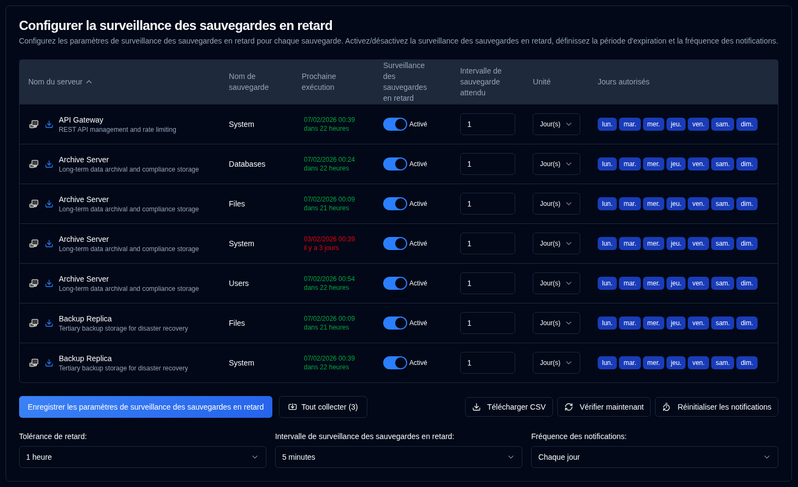

# Notifications en retard {#overdue-notifications}

## Configurer les paramètres de sauvegarde en retard par sauvegarde {#configure-per-backup-overdue-settings}

-  **Nom du serveur** : Nom du serveur à surveiller pour les sauvegardes en retard.
   - Cliquez sur <SvgIcon svgFilename="duplicati_logo.svg" height="18"/> pour ouvrir l'interface web du serveur Duplicati
   - Cliquez sur <IIcon2 icon="lucide:download" height="18"/> pour collecter les journaux de sauvegarde de ce serveur.
- **Nom de sauvegarde** : Nom de la sauvegarde à surveiller pour les sauvegardes en retard.
- **Prochaine exécution** : Heure de la prochaine sauvegarde programmée affichée en vert si programmée dans le futur, ou en rouge si en retard. Le survol de la valeur « Prochaine exécution » affiche une infobulle montrant l'horodatage de la dernière sauvegarde de la base de données, formaté avec la date/heure complète et l'heure relative.
- **Surveillance des sauvegardes en retard** : Activer ou désactiver la surveillance des sauvegardes en retard pour cette sauvegarde.
- **Intervalle de sauvegarde attendu** : Intervalle de sauvegarde attendu.
- **Unité** : Unité de l'intervalle attendu.
- **Jours autorisés** : Jours de la semaine autorisés pour la sauvegarde.

Si les icônes à côté du nom du serveur sont grisées, le serveur n'est pas configuré dans les [`Paramètres → Paramètres du serveur`](server-settings.md).

:::note
Quand vous collectez les journaux de sauvegarde à partir d'un serveur Duplicati, **duplistatus** met automatiquement à jour les intervalles de surveillance en retard et les configurations.
:::

:::tip
Pour obtenir les meilleurs résultats, collectez les journaux de sauvegarde après avoir modifié la configuration des intervalles de travaux de sauvegarde dans votre serveur Duplicati. Cela garantit que **duplistatus** reste synchronisé avec votre configuration actuelle.
:::

## Configurations globales {#global-configurations}

Ces paramètres s'appliquent à toutes les sauvegardes :

| Paramètre                       | Description                                                                                                                                                                                                                                                                                           |
|:--------------------------------|:------------------------------------------------------------------------------------------------------------------------------------------------------------------------------------------------------------------------------------------------------------------------------------------------------|
| **Tolérance de retard**           | La période de grâce (temps supplémentaire autorisé) ajoutée à l'heure de sauvegarde attendue avant de marquer comme en retard. Par défaut : `1 heure`.                                                                                                                                                                           |
| **Intervalle de surveillance des sauvegardes en retard** | Fréquence à laquelle le système vérifie les sauvegardes en retard. Par défaut : `5 minutes`.                                                                                                                                                                                                                          |
| **Fréquence des notifications**      | Fréquence d'envoi des notifications de retard :   `Une seule fois` : Envoyer **une seule** notification quand la sauvegarde devient en retard.   `Chaque jour` : Envoyer des notifications **quotidiennes** en cas de retard (par défaut).   `Chaque semaine` : Envoyer des notifications **hebdomadaires** en cas de retard.   `Chaque mois` : Envoyer des notifications **mensuelles** en cas de retard. |

## Actions disponibles {#available-actions}

| Bouton                                                              | Description                                                                                         |
|:--------------------------------------------------------------------|:----------------------------------------------------------------------------------------------------|
| <IconButton label="Enregistrer les paramètres de surveillance des sauvegardes en retard" />             | Enregistre les paramètres, efface les minuteurs pour toutes les sauvegardes désactivées et exécute une vérification des sauvegardes en retard.              |
| <IconButton icon="lucide:import" label="Tout collecter (#)"/>          | Collecte les journaux de sauvegarde de tous les serveurs configurés, entre parenthèses le nombre de serveurs à collecter. |
| <IconButton icon="lucide:download" label="Télécharger CSV"/>            | Télécharge un fichier CSV contenant tous les paramètres de surveillance des sauvegardes en retard et l'« Horodatage de la dernière sauvegarde (DB) » de la base de données. |
| <IconButton icon="lucide:refresh-cw" label="Vérifier maintenant"/>            | Exécute la vérification des sauvegardes en retard immédiatement. Ceci est utile après modification des configurations. Cela déclenche également un recalcul de la « Prochaine exécution ». |
| <IconButton icon="lucide:timer-reset" label="Réinitialiser les notifications"/> | Réinitialise la dernière notification de sauvegarde en retard envoyée pour toutes les sauvegardes.                                          |
