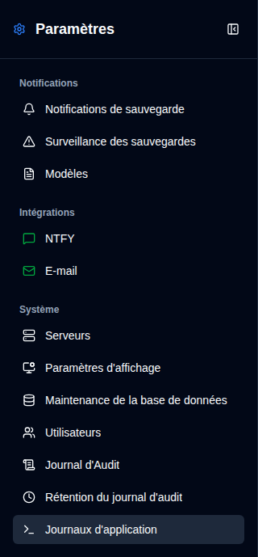
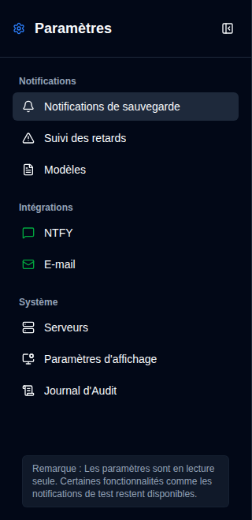

# Vue d'ensemble {#overview}

La page Paramètres offre une interface unifiée pour configurer tous les aspects de **duplistatus**. Vous pouvez y accéder en cliquant sur le bouton <IconButton icon="lucide:settings" /> `Paramètres` dans la [Barre d'outils de l'application](../overview#application-toolbar). Notez que les utilisateurs ordinaires verront un menu simplifié avec moins d'options par rapport aux administrateurs.

## Afficher Administrateur {#administrator-view}

Les administrateurs voient tous les paramètres disponibles.

<table>
  <tr>
    <td>
      
    </td>
    <td>
      <ul>
        <li>
          <strong>Notifications</strong>
          <ul>
            <li><a href="backup-notifications-settings.md">Notifications de sauvegarde</a> : Configurer les paramètres de notification par sauvegarde</li>
            <li><a href="overdue-settings.md">Surveillance des sauvegardes en retard</a> : Configurer la détection et les alertes de sauvegarde en retard</li>
            <li><a href="notification-templates.md">Modèles</a> : Personnaliser les modèles de messages de notification</li>
          </ul>
        </li> 
        <li>
          <strong>Intégrations</strong>
          <ul>
            <li><a href="ntfy-settings.md">NTFY</a> : Configurer le service de notification push NTFY</li>
            <li><a href="email-settings.md">E-mail</a> : Configurer les notifications par e-mail SMTP</li>
          </ul>
        </li> 
        <li>
          <strong id="system">Système</strong>
          <ul>
            <li><a href="server-settings.md">Serveurs</a> : Gérer les configurations du serveur Duplicati</li>
            <li><a href="display-settings.md">Affichage</a> : Configurer les préférences d'affichage</li>
            <li><a href="database-maintenance.md">Maintenance de la base de données</a> : Effectuer le nettoyage de la base de données (admin uniquement)</li>
            <li><a href="user-management-settings.md">Utilisateurs</a> : Gérer les comptes utilisateur (admin uniquement)</li>
            <li><a href="audit-logs-viewer.md">Journal d'audit</a> : Afficher les journaux d'audit du système</li>
            <li><a href="audit-logs-retention.md">Rétention du journal d'audit</a> : Configurer la rétention du journal d'audit (admin uniquement)</li>
            <li><a href="application-logs-settings.md">Journaux d'application</a> : Afficher et exporter les journaux d'application (admin uniquement)</li>
          </ul>
        </li>
      </ul>
    </td>
  </tr>
</table>

## Affichage non-administrateur {#non-administrator-view}

Les utilisateurs réguliers voient un ensemble limité de paramètres.

<table>
  <tr>
    <td>
      
    </td>
    <td>
      <ul>
        <li>
          <strong>Notifications</strong>
          <ul>
            <li><a href="backup-notifications-settings.md">Notifications de sauvegarde</a> : Afficher les paramètres de notification par sauvegarde (lecture seule)</li>
            <li><a href="overdue-settings.md">Surveillance des retards</a> : Afficher les paramètres de sauvegarde en retard (lecture seule)</li>
            <li><a href="notification-templates.md">Modèles</a> : Afficher les modèles de notification (lecture seule)</li>
          </ul>
        </li> 
        <li>
          <strong>Intégrations</strong>
          <ul>
            <li><a href="ntfy-settings.md">NTFY</a> : Afficher les paramètres NTFY (lecture seule)</li>
            <li><a href="email-settings.md">E-mail</a> : Afficher les paramètres e-mail (lecture seule)</li>
          </ul>
        </li> 
        <li>
          <strong id="system">Système</strong>
          <ul>
            <li><a href="server-settings.md">Serveurs</a> : Afficher les configurations de serveur (lecture seule)</li>
            <li><a href="display-settings.md">Affichage</a> : Configurer les préférences d'affichage</li>
            <li><a href="audit-logs-viewer.md">Journal d'audit</a> : Afficher les journaux d'audit système (lecture seule)</li>
          </ul>
        </li>
      </ul>
    </td>
  </tr>
</table>

## Icônes de Statut {#status-icons}

La barre latérale affiche des icônes de statut à côté des paramètres d'intégration **NTFY** et **E-mail** :
- <IIcon2 icon="lucide:message-square" color="green"/> <IIcon2 icon="lucide:mail" color="green"/> **Icône verte** : Vos paramètres sont valides et configurés correctement
- <IIcon2 icon="lucide:message-square" color="yellow"/> <IIcon2 icon="lucide:mail" color="yellow"/> **Icône jaune** : Vos paramètres ne sont pas valides ou ne sont pas configurés

Quand la configuration est invalide, les cases à cocher correspondantes dans l'onglet [`Notifications de sauvegarde`](backup-notifications-settings.md) seront grisées et désactivées. Pour plus de détails, consultez les pages [Paramètres NTFY](ntfy-settings.md) et [Paramètres e-mail](email-settings.md).

 

:::important
Une icône verte ne signifie pas nécessairement que les notifications fonctionnent correctement. Utilisez toujours les fonctionnalités de test disponibles pour confirmer que vos notifications fonctionnent avant de vous y fier.
:::

 
