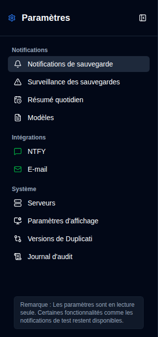

# Vue d'ensemble {#overview}

La page Paramètres offre une interface unifiée pour configurer tous les aspects de **duplistatus**. Vous pouvez y accéder en cliquant sur le bouton <IconButton icon="lucide:settings" /> **Paramètres** dans la [Barre d'outils de l'application](../overview.md#application-toolbar). Notez que les utilisateurs réguliers verront un menu simplifié avec moins d'options que les administrateurs.

## Vue Administrateur {#administrator-view}

Les administrateurs voient tous les paramètres disponibles.

<table>
  <tr>
    <td>
      
    </td>
    <td>
      <ul>
        <li>
          <strong>Notifications</strong>
          <ul>
            <li><a href="backup-notifications-settings.md">Notifications de sauvegarde</a>: Configurer les paramètres de notification par sauvegarde</li>
            <li><a href="backup-monitoring-settings.md">Surveillance des sauvegardes</a>: Configurer la détection des sauvegardes en retard et les alertes</li>
            <li><a href="daily-summary-settings.md">Résumé quotidien</a>: Snapshot quotidien facultatif qui remplace les notifications de sauvegarde et de retard</li>
            <li><a href="notification-templates.md">Modèles</a>: Personnaliser les modèles de messages de notification</li>
          </ul>
        </li> 
        <li>
          <strong>Intégrations</strong>
          <ul>
            <li><a href="ntfy-settings.md">NTFY</a>: Configurer le service de notification push NTFY</li>
            <li><a href="email-settings.md">E-mail</a>: Configurer les notifications par e-mail SMTP</li>
          </ul>
        </li> 
        <li>
          <strong id="system">Système</strong>
          <ul>
            <li><a href="server-settings.md">Serveurs</a>: Gérer les configurations des serveurs Duplicati</li>
            <li><a href="display-settings.md">Paramètres d'affichage</a>: Configurer le thème, la plage de temps du graphique, le style du graphique, les paramètres régionaux, l'intervalle d'actualisation automatique, l'ordre de tri des cartes et le début de la semaine</li>
            <li><a href="duplicati-versions.md">Versions de Duplicati</a>: Afficher les versions de Duplicati en cache et configurer l'horaire de vérification des versions</li>
            <li><a href="database-maintenance.md">Maintenance de la base de données</a>: Effectuer le nettoyage de la base de données (uniquement pour les administrateurs)</li>
            <li><a href="api-keys-settings.md">Clés API</a>: Gérer les clés étendues et la protection des API externes (uniquement pour les administrateurs)</li>
            <li><a href="ip-allowlist-settings.md">Liste d'adresses IP autorisées</a>: Restreindre l'interface d'administration et les API externes (uniquement pour les administrateurs)</li>
            <li><a href="user-management-settings.md">Utilisateurs</a>: Gérer les comptes utilisateur (uniquement pour les administrateurs)</li>
            <li><a href="audit-logs-viewer.md">Journal d'audit</a>: Afficher les journaux d'audit du système</li>
            <li><a href="audit-logs-retention.md">Conservation des journaux d'audit</a>: Configurer la conservation des journaux d'audit (uniquement pour les administrateurs)</li>
            <li><a href="application-logs-settings.md">Journaux de l'application</a>: Afficher et exporter les journaux de l'application (uniquement pour les administrateurs)</li>
          </ul>
        </li>
      </ul>
    </td>
  </tr>
</table>

## Vue Non-Administrateur {#non-administrator-view}

Les utilisateurs standard voient un ensemble limité de paramètres.

<table>
  <tr>
    <td>
      
    </td>
    <td>
      <ul>
        <li>
          <strong>Notifications</strong>
          <ul>
            <li><a href="backup-notifications-settings.md">Notifications de sauvegarde</a>: Afficher les paramètres de notification par sauvegarde (lecture seule)</li>
            <li><a href="backup-monitoring-settings.md">Surveillance des sauvegardes</a>: Afficher les paramètres de sauvegarde en retard (lecture seule)</li>
            <li><a href="daily-summary-settings.md">Résumé quotidien</a>: Afficher les paramètres de résumé quotidien (lecture seule)</li>
            <li><a href="notification-templates.md">Modèles</a>: Afficher les modèles de notification (lecture seule)</li>
          </ul>
        </li> 
        <li>
          <strong>Intégrations</strong>
          <ul>
            <li><a href="ntfy-settings.md">NTFY</a>: Afficher les paramètres NTFY (lecture seule)</li>
            <li><a href="email-settings.md">E-mail</a>: Afficher les paramètres d'e-mail (lecture seule)</li>
          </ul>
        </li> 
        <li>
          <strong id="system">Système</strong>
          <ul>
            <li><a href="server-settings.md">Serveurs</a>: Afficher les configurations de serveur (lecture seule)</li>
            <li><a href="display-settings.md">Affichage</a>: Configurer le thème, la plage de temps du graphique, le style de graphique, les paramètres régionaux, l'intervalle d'actualisation automatique, l'ordre de tri des cartes et le début de la semaine</li>
            <li><a href="duplicati-versions.md">Versions de Duplicati</a>: Afficher les versions de Duplicati en cache (les modifications de planification sont réservées aux administrateurs)</li>
            <li><a href="audit-logs-viewer.md">Journal d'audit</a>: Afficher les journaux d'audit du système (lecture seule)</li>
          </ul>
        </li>
      </ul>
    </td>
  </tr>
</table>

## Icônes de statut {#status-icons}

La barre latérale affiche des icônes de statut à côté des paramètres d'intégration **NTFY** et **E-mail** :
- <IIcon2 icon="lucide:message-square" color="green"/> <IIcon2 icon="lucide:mail" color="green"/> **Icône verte** : Vos paramètres sont valides et correctement configurés
- <IIcon2 icon="lucide:message-square" color="yellow"/> <IIcon2 icon="lucide:mail" color="yellow"/> **Icône jaune** : Vos paramètres ne sont pas valides ou ne sont pas configurés

Quand la configuration est invalide, les cases à cocher correspondantes dans l'onglet [Notifications de sauvegarde](backup-notifications-settings.md) seront grisées et désactivées. Pour plus de détails, consultez les pages [Paramètres NTFY](ntfy-settings.md) et [Paramètres e-mail](email-settings.md).

 

:::important
Une icône verte ne signifie pas nécessairement que les notifications fonctionnent correctement. Utilisez toujours les fonctionnalités de test disponibles pour confirmer que vos notifications fonctionnent avant de vous y fier.
:::

 
