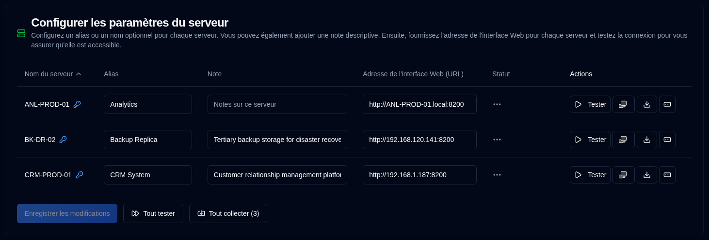

# Serveur {#server}

Vous pouvez configurer un nom alternatif (alias) pour vos serveurs, une note pour décrire sa fonction et les adresses web de vos serveurs Duplicati ici.

| Paramètre                       | Description                                                                                                                                                                                  |
|:--------------------------------|:---------------------------------------------------------------------------------------------------------------------------------------------------------------------------------------------|
| **Nom du serveur**                 | Nom du serveur configuré dans le serveur Duplicati. Une <IIcon2 icon="lucide:key-round" color="#42A5F5"/> apparaîtra si un mot de passe est défini pour le serveur.                                         |
| **Alias**                       | Un surnom ou un nom lisible de votre serveur. Quand vous survolez un alias, il affichera son nom ; dans certains cas, pour clarifier, il affichera l'alias et le nom entre crochets. |
| **Note**                        | Texte libre pour décrire la fonctionnalité du serveur, le lieu d'installation ou toute autre information. Quand configurée, elle s'affichera à côté du nom ou de l'alias du serveur.                 |
| **Adresse de l'interface Web (URL)** | Configurez l'URL pour accéder à l'interface utilisateur du serveur Duplicati. Les URL `HTTP` et `HTTPS` sont toutes deux prises en charge.                                                                                           |
| **Statut**                      | Affiche les résultats des journaux de sauvegarde de test ou de collecte                                                                                                                                              |
| **Actions**                     | Vous pouvez tester, ouvrir l'interface Duplicati, collecter les journaux et définir un mot de passe, voir ci-dessous pour plus de détails.                                                                                         |

 

:::note
Si l'Adresse de l'interface Web (URL) n'est pas configurée, le bouton <SvgIcon svgFilename="duplicati_logo.svg" /> 
sera désactivé sur toutes les pages et le serveur ne s'affichera pas dans la liste [Configuration Duplicati](../duplicati-configuration.md) <SvgButton svgFilename="duplicati_logo.svg" href="../duplicati-configuration"/>.
:::

 

## Actions disponibles pour chaque serveur {#available-actions-for-each-server}

| Bouton                                                                                                      | Description                                                             |
|:------------------------------------------------------------------------------------------------------------|:------------------------------------------------------------------------|
| <IconButton icon="lucide:play" label="Test"/>                                                               | Tester la connexion au serveur Duplicati.                            |
| <SvgButton svgFilename="duplicati_logo.svg" />                                                              | Ouvrir l'interface web du serveur Duplicati dans un nouvel onglet du navigateur.         |
| <IconButton icon="lucide:download" />                                                                       | Collecter les journaux de sauvegarde du serveur Duplicati.                          |
| <IconButton icon="lucide:rectangle-ellipsis" /> &nbsp; or <IIcon2 icon="lucide:key-round" color="#42A5F5"/> | Modifier ou définir un mot de passe pour le serveur Duplicati afin de collecter les sauvegardes. |

 

:::info[IMPORTANT]

Pour protéger votre sécurité, vous pouvez uniquement effectuer les actions suivantes :
- Définir un mot de passe pour le serveur
- Supprimer (supprimer) le mot de passe entièrement
 
Le mot de passe est stocké chiffré dans la base de données et n'est jamais affiché dans l'interface utilisateur.
:::

 

## Actions disponibles pour tous les serveurs {#available-actions-for-all-servers}

| Bouton                                                     | Description                                     |
|:-----------------------------------------------------------|:------------------------------------------------|
| <IconButton label="Enregistrer les modifications" />                        | Enregistrer les modifications apportées aux paramètres du serveur.   |
| <IconButton icon="lucide:fast-forward" label="Tout tester"/>  | Tester la connexion à tous les serveurs Duplicati.   |
| <IconButton icon="lucide:import" label="Tout collecter (#)"/> | Collecter les journaux de sauvegarde de tous les serveurs Duplicati. |

 
